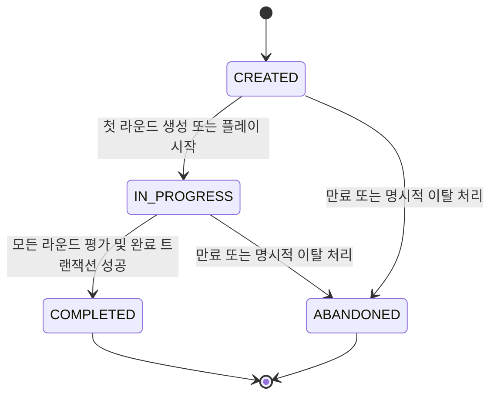
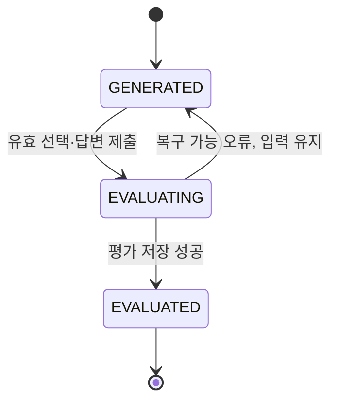

# 연애 디펜스 기능 명세서 (Functional Specification)

> PRD의 제품 요구사항을 개발·E2E 테스트·요구사항 커버리지 측정에 사용할 수 있도록 원자적이고 추적 가능한 기능 요구사항으로 재구성한 문서

## 문서 정보

| 항목 | 내용 |
| --- | --- |
| 문서 버전 | v1.2 |
| 문서 상태 | Draft / MVP 정합성 보완 |
| 기준 문서 | 연애 디펜스 PRD v1.0 (2026-07-15) |
| 대상 릴리즈 | Hackathon MVP / v1.0 |
| 대상 플랫폼 | 모바일 우선 반응형 웹 |
| 작성일 | 2026-07-15 |
| 주요 독자 | 기획, 프론트엔드, 백엔드, AI, QA, 데이터 |

---

## 0. 현재 구현 기준선

기존 요구사항 중 아직 코드에 연결되지 않은 항목을 `Deferred`로 분리하여, 구현 완료 항목과 심사 전 검증 항목을 혼동하지 않는다.

### 0.1 현재 실행 가능한 흐름

1. 익명 사용자와 프로필을 초기화한다.
2. 고정된 Stage 정의에서 5개 Stage 게임을 시작한다.
3. 각 Stage에서 상대 메시지를 표시하고 사용자의 자유 답변을 받는다.
4. 서버 Edge Function의 OpenAI 평가 결과로 점수·피드백·관계 상태를 갱신한다.
5. OpenAI 실패 시 규칙 기반 평가와 대사 fallback으로 최소 플레이를 유지한다.
6. Stage 종료 조건에 따라 다음 Stage 또는 결과 화면으로 이동한다.

### 0.2 현재 MVP와 장기 요구사항의 구분

| 요구사항 | 현재 상태 | 심사 발표에서의 표현 |
|---|---|---|
| 자유 답변 AI 평가 | Implemented | 실제 동작 데모 가능 |
| AI 상대방 대사 생성 | Implemented | 설정된 OpenAI 환경에서 동작, 실패 시 fallback |
| 5 Stage 관계 상태 루프 | Implemented | 현재 핵심 게임 루프 |
| AI 시나리오 생성 | Deferred | provider·Edge Function 구현 후 메인 연결 필요 |
| 속마음 4지선다 | Deferred | 문서 목표에는 있으나 현재 UI 미구현 |
| 골든 데이터셋·사람 평가 | Not started | 심사 전 품질 게이트로 구축 필요 |
| 분석 이벤트·운영 대시보드 | Deferred | 이벤트 계약만 있고 수집 구현 필요 |

현재 코드와 문서의 충돌이 발생하면 이 기준선이 구현 상태를 설명하는 기준이 되며, 장기 요구사항은 구현 승격 전까지 `Deferred`로 집계한다.

---

## 1. 목적과 적용 범위

이 문서는 다음 세 가지를 동시에 만족하도록 작성한다.

1. 개발자가 기능 경계, 상태 전이, 서버 권한, 예외 동작을 구현할 수 있어야 한다.
2. QA가 사용자 여정과 장애·보안 여정을 E2E 테스트로 재현할 수 있어야 한다.
3. 각 요구사항과 테스트 사례를 ID로 연결하여 요구사항 커버리지를 수치화할 수 있어야 한다.

MVP 커버리지 분모에는 `릴리즈=MVP`인 P0 요구사항과 실제로 MVP에 포함하기로 확정한 P1 요구사항만 포함한다. `MVP 선택`, `v1.1`, `v2.0`, `Deferred`, `TBD` 항목은 구현 범위로 승격되기 전까지 MVP 통과율 분모에서 제외한다.

### 1.1 명세 해석 우선순위

충돌이 발생하면 다음 순서를 적용한다: **승인된 변경 이력 → 본 기능 명세 → PRD → 화면 시안 → 구현 세부사항**. 본 명세가 PRD의 모호성을 테스트 가능하도록 구체화한 항목은 “명세 결정”으로 취급하며, 변경 시 요구사항 ID와 테스트를 함께 갱신한다.

### 1.2 범위 제외

- 실제 메신저 대화 업로드·분석, 음성 분석, 커플 계정 연동, 심리 진단, 실시간 대전, 결제는 MVP 범위에서 제외한다.
- AI 상대 성향, 성장 리포트, 공유 카드, 오늘의 미션은 상세 수용 기준이 승인되기 전까지 요구사항 ID를 발급하지 않고 백로그로 유지한다.

---

## 2. 식별자·상태·커버리지 규칙

### 2.1 요구사항 ID

- 형식: `FR-(모듈)-001`
- 번호는 모듈 안에서 001부터 증가하며 삭제된 번호를 재사용하지 않는다.
- 요구사항이 분리되면 새 ID를 발급하고, 병합·폐기된 ID는 `Deprecated` 상태로 남긴다.
- 하나의 FR은 하나의 관찰 가능한 책임만 가진다. 수용 기준이 독립적으로 실패할 수 있으면 별도 FR로 분리한다.
- 본 문서 최초 발행 시 모든 FR의 상태는 `Draft`다. 기획·개발·QA가 수용 기준과 범위를 승인한 항목부터 `Ready`로 전환한다.

### 2.2 테스트 ID

- 사용자 여정: `E2E-UJ-001`
- 시스템·장애·보안 여정: `E2E-SYS-001`
- 자동화 테스트 이름 또는 태그에 요구사항 ID를 포함한다. 예: `@FR-ANS-005 @E2E-SYS-005 @P0`.
- 브라우저 E2E만으로 검증하기 부적절한 점수 경계, 스키마, 동시성은 API·계약·단위·DB 테스트를 함께 사용한다. E2E 통과만으로 하위 검증을 대체하지 않는다.

### 2.3 요구사항 상태

| 상태 | 의미 | 커버리지 분모 |
| --- | --- | --- |
| Draft | 요구사항 작성 중, 수용 기준 또는 의사결정 미완료 | 제외 |
| Ready | 구현과 테스트가 가능한 수준으로 승인 | 포함 |
| Implemented | 구현 완료, 검증 대기 | 포함 |
| Verified | 필수 테스트가 모두 통과 | 포함·통과 |
| Deferred | 릴리즈 범위에서 제외 | 제외 |
| Deprecated | 대체 또는 폐기, ID 보존 | 제외 |

### 2.4 모듈 코드

| 코드 | 모듈 | 목적 | FR 수 |
| --- | --- | --- | --- |
| USR | 게스트 사용자 | 회원가입 없이 익명 사용자를 식별하고 안전한 닉네임으로 서비스를 시작한다. | 3 |
| CFG | 게임 설정 | 카테고리·난이도를 선택하거나 기본값을 적용하여 세션 생성 조건을 확정한다. | 3 |
| GME | 게임 세션·라운드 진행 | 게임 세션과 라운드 상태를 일관되게 관리하고 완료 조건을 통제한다. | 5 |
| SCN | AI 상황 생성 | 설정에 맞는 안전한 연애 상황과 선택지를 생성하고 평가용 비공개 데이터를 보호한다. | 7 |
| ANS | 속마음 선택·답변 제출 | 사용자의 선택과 자유 답변을 검증하고 중복 없이 평가 요청으로 전달한다. | 6 |
| EVA | AI 평가·점수 산정 | 서버 기준으로 세부 점수와 총점을 계산하고 검증 가능한 평가 결과를 저장한다. | 7 |
| FDB | 라운드 피드백 | 점수의 근거와 개선 가능한 대화 전략을 비난 없이 제공한다. | 6 |
| RES | 최종 결과 리포트 | 모든 라운드 평가를 집계하여 최종 점수·등급·강점·개선 영역을 제공한다. | 6 |
| LDB | 랭킹 | 완료 게임의 최고 기록을 원자적으로 저장하고 결정적 순서로 조회한다. | 10 |
| RPL | 다시 플레이 | 기존 기록을 보존한 채 설정을 재사용하여 새 게임을 시작한다. | 3 |
| ANA | 분석 이벤트 | 사용자 퍼널과 AI 품질을 개인정보 노출 없이 측정한다. | 4 |
| SAF | 안전·보안 동작 | 프롬프트 주입, 유해 콘텐츠, 점수 조작, 비인가 접근을 차단하고 고위험 입력을 안전 흐름으로 전환한다. | 6 |
| COM | 공통 UI·API 동작 | 로딩·오류·재시도·접근성 동작을 모든 화면과 API에서 일관되게 제공한다. | 4 |

기능 요구사항은 총 70개이며, 현재 기준으로 P0 67개, P1 2개, P2 1개다. P1 2개는 카테고리·난이도 선택 UI이며 MVP 포함 여부에 따라 커버리지 분모가 달라진다.

---

## 3. 액터·용어·상태 모델

### 3.1 액터

| 액터 | 설명 |
| --- | --- |
| 게스트 사용자 | 익명 사용자 토큰과 닉네임으로 게임을 플레이하고 자신의 결과·랭킹을 조회한다. |
| 웹 클라이언트 | 입력 검증, 화면 상태, 접근성, API 호출을 담당하되 점수와 비공개 평가 기준을 소유하지 않는다. |
| 게임 API 서버 | 사용자·세션·라운드·평가·결과·랭킹의 권한과 상태를 관리한다. |
| Scenario Generator | 상황, 대사, 선택지와 비공개 평가 기준을 구조화된 JSON으로 생성한다. |
| Answer Evaluator | 자유 답변을 고정 루브릭으로 평가하고 피드백을 구조화된 JSON으로 생성한다. |
| 분석 수집기 | 익명 이벤트를 수집하며 자유 답변 원문이나 비공개 평가 데이터를 수집하지 않는다. |

### 3.2 게임 세션 상태



- `COMPLETED`, `ABANDONED`는 종료 상태이며 이전 상태로 돌아갈 수 없다.
- 랭킹 갱신은 `COMPLETED` 전이와 같은 서버 트랜잭션 경계에서 처리한다.
- 완료 후 결과·평가·최고점 비교에 사용된 세션 데이터는 불변으로 취급한다.

### 3.3 라운드 제출 상태



- 동일 라운드에는 성공한 `AnswerEvaluation`을 하나만 허용한다.
- 멱등성 키가 같은 재요청은 기존 결과를 반환하고 상태를 중복 전이하지 않는다.

---

## 4. 모듈별 기능 요구사항

### 4.1 게스트 사용자 (`USR`)

- **PRD 추적:** PRD 7.1 / 기존 FR-001
- **모듈 목적:** 회원가입 없이 익명 사용자를 식별하고 안전한 닉네임으로 서비스를 시작한다.

| ID | 기능 | 우선순위·릴리즈 | 상세 규칙 | 수용 기준 | 최소 검증 | E2E 참조 |
| --- | --- | --- | --- | --- | --- | --- |
| FR-USR-001 | 게스트 사용자 생성·갱신 | P0<br>MVP | 유효한 닉네임으로 `POST /api/users/guest`를 호출하면 익명 사용자를 생성한다. 기존 익명 사용자 식별자가 유효하면 새 사용자를 만들지 않고 해당 사용자의 닉네임과 `last_seen_at`을 갱신한다. | 성공 응답에 `user_id`, `display_name`, 익명 사용자 토큰 또는 세션 토큰이 포함되고, 동일 식별자로 재호출해도 사용자 레코드 수가 증가하지 않는다. | E2E + API + DB | E2E-UJ-001, E2E-UJ-012 |
| FR-USR-002 | 닉네임 정규화·유효성 검사 | P0<br>MVP | 닉네임 앞뒤 공백을 제거한 뒤 2~12자로 제한한다. 빈 값, 제어문자, 금칙어는 거부한다. 중복 닉네임은 허용한다. | 유효 입력은 정규화된 값으로 저장되고, 무효 입력은 사용자 생성 없이 `INVALID_NICKNAME`을 반환한다. 클라이언트와 서버 검증 결과가 동일하다. | E2E + API + 경계값 | E2E-UJ-003, E2E-SYS-008 |
| FR-USR-003 | 익명 사용자 복원·공개 정보 제한 | P0<br>MVP | 브라우저에 유효한 익명 사용자 식별자가 있으면 재접속 시 동일 사용자를 복원하고 이전 닉네임을 기본값으로 표시한다. 공개 화면에는 닉네임 외 이메일·전화번호·내부 토큰을 표시하지 않는다. | 재접속 전후 `user_id`가 동일하고 닉네임이 미리 채워진다. 네트워크 응답과 DOM에 허용되지 않은 개인정보·토큰이 노출되지 않는다. | E2E + 보안 | E2E-UJ-012, E2E-SYS-006 |

### 4.2 게임 설정 (`CFG`)

- **PRD 추적:** PRD 7.2 / 기존 FR-010, FR-011
- **모듈 목적:** 카테고리·난이도를 선택하거나 기본값을 적용하여 세션 생성 조건을 확정한다.

| ID | 기능 | 우선순위·릴리즈 | 상세 규칙 | 수용 기준 | 최소 검증 | E2E 참조 |
| --- | --- | --- | --- | --- | --- | --- |
| FR-CFG-001 | 상황 카테고리 선택 | P1<br>MVP 선택 | 사용자는 `랜덤`, `썸`, `연애 초기`, `장기 연애`, `일상 갈등`, `기념일·약속` 중 하나를 선택할 수 있다. 선택값은 허용 목록에 있는 값만 서버가 수락한다. | 선택한 카테고리가 세션에 저장되고 모든 라운드 생성 요청에 동일하게 적용된다. 임의 값은 4xx 오류로 거부된다. | E2E + API | E2E-UJ-001 |
| FR-CFG-002 | 난이도 선택 | P1<br>MVP 선택 | 사용자는 `쉬움`, `보통`, `어려움` 중 하나를 선택한다. 난이도는 각각 명확한 단서, 일부 생략된 단서, 높은 맥락 의존성의 생성 지침으로 변환한다. | 선택 난이도가 세션과 시나리오에 반영되며, 허용 목록 밖의 값은 거부된다. | E2E + API + 프롬프트 계약 | E2E-UJ-001 |
| FR-CFG-003 | 기본값 적용·설정 스냅샷 | P0<br>MVP | 카테고리 미선택 시 `랜덤`, 난이도 미선택 시 `보통`을 적용한다. 게임 생성 시 설정을 세션에 스냅샷으로 저장하고 이후 전역 설정 변경이 기존 세션을 바꾸지 않도록 한다. | 설정을 생략한 게임은 `랜덤/보통`으로 생성되고, 생성 후 서버 설정을 변경해도 해당 게임의 저장값은 변하지 않는다. | E2E + API + DB | E2E-UJ-002 |

### 4.3 게임 세션·라운드 진행 (`GME`)

- **PRD 추적:** PRD 7.6 / 기존 FR-050
- **모듈 목적:** 게임 세션과 라운드 상태를 일관되게 관리하고 완료 조건을 통제한다.

| ID | 기능 | 우선순위·릴리즈 | 상세 규칙 | 수용 기준 | 최소 검증 | E2E 참조 |
| --- | --- | --- | --- | --- | --- | --- |
| FR-GME-001 | 게임 세션 생성·라운드 수 | P0<br>MVP | `POST /api/games`는 현재 사용자와 설정으로 `CREATED` 세션을 만들고 기본 `total_rounds=3`을 저장한다. 라운드 수는 서버 설정으로 변경 가능하되 세션 생성 후에는 고정한다. | 응답에 `game_id`, 설정, 전체 라운드 수, 상태가 포함되고 동일 요청의 멱등성 정책에 따라 중복 세션이 통제된다. | E2E + API + DB | E2E-UJ-001, E2E-UJ-002 |
| FR-GME-002 | 세션 상태 전이 | P0<br>MVP | 허용 상태 전이는 `CREATED → IN_PROGRESS → COMPLETED`이며, 중간 이탈 또는 만료 시 `CREATED/IN_PROGRESS → ABANDONED`가 가능하다. `COMPLETED`와 `ABANDONED`는 종료 상태이며 되돌릴 수 없다. | 허용되지 않은 상태 전이는 409 계열 오류로 거부되고, 완료 세션의 점수·라운드·평가 데이터는 재작성되지 않는다. | E2E + API + 상태 전이 단위 | E2E-UJ-004, E2E-SYS-005 |
| FR-GME-003 | 라운드 진행도 표시 | P0<br>MVP | 플레이와 피드백 화면에 현재 라운드와 전체 라운드 수를 `현재 / 전체` 형식으로 표시한다. 서버의 `round_no`와 `total_rounds`를 단일 기준으로 사용한다. | 3라운드 게임에서 화면이 순서대로 `1 / 3`, `2 / 3`, `3 / 3`을 표시하며 새로고침 또는 재호출로 역행·건너뜀이 발생하지 않는다. | E2E + UI | E2E-UJ-001, E2E-UJ-004 |
| FR-GME-004 | 피드백 확인 후 다음 라운드 이동 | P0<br>MVP | 평가 성공 후 피드백을 표시하고 사용자의 명시적 CTA 전에는 다음 라운드를 자동 생성하지 않는다. 마지막 전 라운드 CTA는 `다음 라운드`, 마지막 라운드는 `최종 결과 보기`로 표시한다. | 피드백 화면 진입만으로 다음 라운드 API가 호출되지 않고, CTA 1회당 다음 단계 요청도 1회만 발생한다. | E2E + UI | E2E-UJ-004 |
| FR-GME-005 | 미완료 게임 처리 | P0<br>MVP | 모든 라운드가 평가되기 전의 세션은 완료 처리하지 않는다. 미완료·중도 이탈 세션에는 결과와 랭킹 갱신을 허용하지 않는다. | 미완료 세션의 결과 또는 완료 API는 `GAME_NOT_COMPLETED`를 반환하고 `LeaderboardEntry`가 생성·변경되지 않는다. | E2E + API + DB | E2E-UJ-004, E2E-UJ-009 |

### 4.4 AI 상황 생성 (`SCN`)

- **PRD 추적:** PRD 7.3, 9.2 / 기존 FR-020
- **모듈 목적:** 설정에 맞는 안전한 연애 상황과 선택지를 생성하고 평가용 비공개 데이터를 보호한다.

| ID | 기능 | 우선순위·릴리즈 | 상세 규칙 | 수용 기준 | 최소 검증 | E2E 참조 |
| --- | --- | --- | --- | --- | --- | --- |
| FR-SCN-001 | 설정 기반 라운드 상황 생성 | P0<br>MVP | `POST /api/games/{gameId}/rounds`는 세션의 카테고리·난이도·다음 라운드 번호를 기준으로 가상 상황을 생성한다. 클라이언트가 요청마다 설정을 덮어쓸 수 없다. | 생성 결과의 카테고리·난이도·라운드 번호가 세션과 일치하고, 다른 사용자 또는 종료 세션에는 라운드를 생성하지 않는다. | E2E + API + 프롬프트 계약 | E2E-UJ-001, E2E-SYS-006 |
| FR-SCN-002 | 공개·비공개 데이터 분리 | P0<br>MVP | 클라이언트에는 상황 설명, 상대 메시지, 선택지 ID·문구만 제공한다. `intent_score`, 숨은 의도, 감정 태그, 좋은 답변 요소, 피해야 할 표현, 내부 프롬프트는 서버에만 저장한다. | 라운드 API 응답, 브라우저 저장소, DOM, 클라이언트 로그에서 비공개 필드가 발견되지 않는다. | E2E + 계약 + 보안 | E2E-SYS-002, E2E-SYS-006 |
| FR-SCN-003 | 선택지 구성·배점 제약 | P0<br>MVP | 선택지는 정확히 4개이며 ID가 중복되지 않는다. 각 `intent_score`는 0~40 정수이고 정확히 하나의 선택지만 40점이어야 한다. 오답도 맥락상 가능한 해석이어야 한다. | 유효 스키마만 저장·공개되고, 선택지 수·ID·배점 제약을 위반한 출력은 사용자에게 전달되지 않는다. | 계약 + E2E + AI 회귀 | E2E-UJ-001, E2E-SYS-001 |
| FR-SCN-004 | 최근 시나리오 중복 방지 | P0<br>MVP | 익명 사용자 기준 최근 10개 `scenario_hash`와 동일하거나 설정된 유사도 임계값 이상인 후보는 거부하고 재생성한다. 새 세션에서도 최근 이력을 적용한다. | 동일 해시가 연속 제공되지 않으며, 중복 후보를 주입한 테스트에서 재생성 후 다른 시나리오가 반환된다. | E2E + API + 유사도 단위 | E2E-SYS-002, E2E-UJ-005 |
| FR-SCN-005 | AI 응답 스키마 검증·재시도 | P0<br>MVP | 필수 필드, 자료형, 선택지·점수 제약, 안전 플래그를 서버에서 검증한다. JSON 파싱 또는 스키마 검증 실패 시 최대 2회 재시도한다. | 첫 번째 또는 두 번째 재시도에서 유효 응답을 받으면 정상 흐름으로 복귀하고, 실패 출력은 DB와 클라이언트에 저장·노출되지 않는다. | 계약 + E2E | E2E-SYS-001 |
| FR-SCN-006 | 상황 생성 폴백 | P0<br>MVP | 최대 재시도 후에도 생성에 실패하거나 타임아웃이면 사전 검증된 기본 시나리오를 반환한다. 폴백도 세션 설정과 안전 규칙을 충족해야 한다. | AI 공급자 장애를 주입해도 플레이 가능한 4개 선택지의 폴백이 표시되고 `ai_error`와 폴백 사용 지표가 기록된다. | E2E + 운영 점검 | E2E-SYS-001 |
| FR-SCN-007 | 상황 콘텐츠 안전 기준 | P0<br>MVP | 실제 개인 식별 정보, 심한 욕설, 명시적 성적 내용, 폭력·스토킹·협박·자해·범죄 조장, 성별 고정관념·비하를 포함한 시나리오는 공개하지 않는다. | 금지 콘텐츠가 포함된 생성 결과는 거부·재생성 또는 안전 폴백으로 대체되며 원문이 사용자 화면에 노출되지 않는다. | E2E + 안전 회귀 | E2E-SYS-002, E2E-SYS-008 |

### 4.5 속마음 선택·답변 제출 (`ANS`)

- **PRD 추적:** PRD 7.4 / 기존 FR-030, FR-031
- **모듈 목적:** 사용자의 선택과 자유 답변을 검증하고 중복 없이 평가 요청으로 전달한다.

| ID | 기능 | 우선순위·릴리즈 | 상세 규칙 | 수용 기준 | 최소 검증 | E2E 참조 |
| --- | --- | --- | --- | --- | --- | --- |
| FR-ANS-001 | 속마음 단일 선택·제출 후 잠금 | P0<br>MVP | 사용자는 4개 선택지 중 하나만 선택할 수 있다. 평가 제출 전에는 변경 가능하고 제출 성공 또는 처리 시작 후에는 해당 라운드 선택을 변경할 수 없다. 정답·점수는 제출 전 공개하지 않는다. | 선택 UI가 단일 선택으로 동작하고, 제출 후 선택 변경·재제출 시도가 서버 점수에 영향을 주지 않는다. | E2E + UI | E2E-UJ-001, E2E-UJ-003 |
| FR-ANS-002 | 자유 답변 검증·글자 수 표시 | P0<br>MVP | 답변은 앞뒤 공백을 제거한 1~300자 문자열이어야 한다. 공백만 있는 입력은 무효이며 입력 중 현재 또는 남은 글자 수를 표시한다. | 0자·공백 입력과 301자 이상 입력은 요청 없이 차단되거나 서버에서 `INVALID_ANSWER`로 거부되고, 1자·300자 경계값은 허용된다. | E2E + API + 경계값 | E2E-UJ-003 |
| FR-ANS-003 | 제출 가능 조건·로딩 잠금 | P0<br>MVP | 유효한 선택과 유효한 답변이 모두 있을 때만 제출 CTA를 활성화한다. 제출 후 평가가 끝날 때까지 CTA와 입력 컨트롤을 비활성화하고 처리 상태를 표시한다. | 조건 하나라도 누락되면 평가 API가 호출되지 않고, 유효 상태에서 1회 클릭 시 요청 1건만 전송된다. | E2E + UI | E2E-UJ-003, E2E-SYS-005 |
| FR-ANS-004 | 사용자 입력 텍스트 안전 처리 | P0<br>MVP | HTML·스크립트·이벤트 핸들러 문자열을 실행 가능한 마크업으로 해석하지 않고 텍스트로 저장·표시한다. 서버도 길이·형식 검증과 이스케이프 정책을 적용한다. | `<script>` 및 이벤트 속성 페이로드가 실행되지 않고 원문 또는 안전하게 이스케이프된 텍스트로만 표시된다. | E2E + 보안 | E2E-SYS-008 |
| FR-ANS-005 | 답변 제출 멱등성 | P0<br>MVP | 각 답변 제출은 멱등성 키를 사용한다. 동일 키·동일 페이로드 재요청은 기존 평가 결과를 반환하고 새 평가를 만들지 않는다. 동일 키·다른 페이로드는 409 `DUPLICATE_SUBMISSION`으로 거부한다. | 연속 클릭, 네트워크 재전송, 병렬 동일 요청에서도 `AnswerEvaluation`이 정확히 1개 생성된다. | E2E + API + DB 동시성 | E2E-SYS-005 |
| FR-ANS-006 | 평가 오류 시 입력 보존·재시도 | P0<br>MVP | 평가 타임아웃 또는 복구 가능한 서버 오류가 발생하면 사용자의 선택과 답변을 화면에 유지하고 명시적인 재시도 CTA를 제공한다. | 오류 후 입력값이 사라지지 않으며 재시도 성공 시 동일 라운드에 평가 1건만 저장되고 정상 피드백 화면으로 이동한다. | E2E + UI | E2E-SYS-004 |

### 4.6 AI 평가·점수 산정 (`EVA`)

- **PRD 추적:** PRD 7.5, 9.3 / 기존 FR-040
- **모듈 목적:** 서버 기준으로 세부 점수와 총점을 계산하고 검증 가능한 평가 결과를 저장한다.

| ID | 기능 | 우선순위·릴리즈 | 상세 규칙 | 수용 기준 | 최소 검증 | E2E 참조 |
| --- | --- | --- | --- | --- | --- | --- |
| FR-EVA-001 | 의도 이해도 서버 산정 | P0<br>MVP | 의도 이해도는 선택한 `choice_id`와 서버의 비공개 `intent_score`로 0~40점 정수로 산정한다. 클라이언트가 점수 또는 정답을 전달하지 않는다. | 동일 시나리오·선택에 대해 서버 저장 점수가 사전 정의값과 일치하고 네트워크 요청의 임의 점수 필드는 무시된다. | E2E + API + 단위 | E2E-UJ-001, E2E-SYS-006 |
| FR-EVA-002 | 공감 표현 점수 | P0<br>MVP | AI는 고정 루브릭으로 `empathy_score`를 0~30 정수로 반환한다. 감정 인정, 방어·공격 회피, 설명 여지 제공 여부를 평가한다. | 유효 응답만 저장되고 0·30 경계값이 허용되며 소수·음수·31 이상은 거부된다. | 계약 + 단위 + AI 회귀 | E2E-UJ-001, E2E-SYS-003 |
| FR-EVA-003 | 대응 적절성 점수 | P0<br>MVP | AI는 고정 루브릭으로 `response_score`를 0~30 정수로 반환한다. 확인 질문, 사과, 설명, 실행 가능한 행동 제안의 맥락 적합성을 평가한다. | 유효 응답만 저장되고 0·30 경계값이 허용되며 소수·음수·31 이상은 거부된다. | 계약 + 단위 + AI 회귀 | E2E-UJ-001, E2E-SYS-003 |
| FR-EVA-004 | 라운드 총점 계산 | P0<br>MVP | `round_total = intent_score + empathy_score + response_score`로 계산하며 결과는 0~100 정수다. AI가 총점을 반환하더라도 서버가 세부 점수로 재계산한다. | 저장·표시된 총점이 세부 점수 합과 항상 같고 범위를 벗어나지 않는다. | E2E + 단위 | E2E-UJ-001, E2E-SYS-006 |
| FR-EVA-005 | 평가 응답 검증·재시도 | P0<br>MVP | 필수 피드백 필드, 점수 범위·자료형, 추천 답변 길이를 검증한다. JSON 또는 스키마 실패 시 최대 2회 재시도하고 실패 출력은 저장하지 않는다. | 잘못된 응답을 주입하면 정해진 횟수만큼 재시도하며, 유효 응답 도착 시 1건만 저장되고 최종 실패 시 평가 오류를 반환한다. | 계약 + E2E | E2E-SYS-003 |
| FR-EVA-006 | 클라이언트 점수 조작 방지 | P0<br>MVP | 답변 API가 받은 임의의 점수·등급·비공개 평가 필드를 신뢰하지 않고 서버 산출값만 저장한다. | 변조 요청 후에도 DB 점수·결과·랭킹이 서버 기준값과 일치하며 조작 값이 반영되지 않는다. | E2E + 보안 + API | E2E-SYS-006 |
| FR-EVA-007 | 평가 추적 메타데이터·타임아웃 구분 | P0<br>MVP | 평가마다 `request_id`, `model_name`, `prompt_version`, `latency_ms`, 성공 여부를 기록한다. AI 타임아웃은 일반 서버 오류와 구분하여 `AI_EVALUATION_TIMEOUT`으로 반환한다. | 성공·실패 요청 모두 추적 식별자가 남고, 타임아웃 응답과 일반 5xx 응답의 오류 코드가 구분된다. | E2E + 관측성 | E2E-SYS-004, E2E-SYS-011 |

### 4.7 라운드 피드백 (`FDB`)

- **PRD 추적:** PRD 7.5, 7.8 / 기존 FR-041, FR-071
- **모듈 목적:** 점수의 근거와 개선 가능한 대화 전략을 비난 없이 제공한다.

| ID | 기능 | 우선순위·릴리즈 | 상세 규칙 | 수용 기준 | 최소 검증 | E2E 참조 |
| --- | --- | --- | --- | --- | --- | --- |
| FR-FDB-001 | 필수 라운드 피드백 제공 | P0<br>MVP | 피드백에는 핵심 감정·의도 해설, 잘 파악한 점, 개선점, 효과적 표현, 대응 전략, 추천 답변, 해석 유의 문구가 포함되어야 한다. | 평가 성공 화면에서 세부 점수 3종과 총점 및 모든 필수 피드백 항목을 확인할 수 있고 빈 필수 배열은 표시되지 않는다. | E2E + 계약 | E2E-UJ-009 |
| FR-FDB-002 | 행동 중심·비비난 피드백 | P0<br>MVP | 피드백은 사용자의 성격·공감 능력을 단정하지 않고 해당 답변의 표현과 효과를 행동 단위로 설명한다. 모욕·조롱·성별 비하를 사용하지 않는다. | 금지 표현 회귀 세트에서 성격 단정·진단·비하 문구가 검출되지 않고, 개선 설명이 구체적 행동을 포함한다. | E2E + AI 안전 회귀 | E2E-UJ-009, E2E-SYS-008 |
| FR-FDB-003 | 효과적 표현·대응 전략 제시 | P0<br>MVP | 사용자 답변에서 효과적이었던 표현을 구체적으로 인용 또는 요약하고, 다음 대화에서 적용할 수 있는 하나 이상의 행동 전략을 제시한다. | 피드백에 사용자 답변과 무관한 일반론만 존재하지 않고, 효과적 표현 또는 개선 전략이 시나리오와 연결된다. | E2E + AI 회귀 | E2E-UJ-009 |
| FR-FDB-004 | 추천 답변 형식·안전성 | P0<br>MVP | 추천 답변은 자연스러운 메신저 말투의 1~3문장, 300자 이하로 제공한다. 관계 종료·복수·조종·위협을 정답처럼 제시하지 않고 사용자 공격 문구를 그대로 복사하지 않는다. | 형식 경계와 금지 전략 검증을 통과한 추천 답변만 화면에 표시된다. | 계약 + E2E + 안전 회귀 | E2E-UJ-009, E2E-SYS-008 |
| FR-FDB-005 | 대안 해석 안내 | P0<br>MVP | 모든 라운드 피드백과 최종 결과에는 AI 해석이 가능한 해석 중 하나이며 실제 맥락에 따라 달라질 수 있음을 명시한다. | 사용자가 피드백과 결과 화면에서 유의 문구를 텍스트로 확인할 수 있다. | E2E + UI | E2E-UJ-009 |
| FR-FDB-006 | AI 결과 유용성 피드백 | P2<br>v1.1 | 사용자는 평가별로 `도움이 됐어요` 또는 `아쉬워요`를 선택하고 선택적 짧은 의견을 제출할 수 있다. 동일 사용자·평가 조합은 1개 레코드로 upsert하며 재선택 시 최신 값으로 갱신하되 점수·랭킹은 바꾸지 않는다. | 피드백 레코드가 평가·사용자와 연결되고 제출 전후 점수와 랭킹이 동일하다. 의견 길이·안전성 검증이 적용된다. | E2E + API + DB | E2E-UJ-010 |

### 4.8 최종 결과 리포트 (`RES`)

- **PRD 추적:** PRD 7.6 / 기존 FR-051
- **모듈 목적:** 모든 라운드 평가를 집계하여 최종 점수·등급·강점·개선 영역을 제공한다.

| ID | 기능 | 우선순위·릴리즈 | 상세 규칙 | 수용 기준 | 최소 검증 | E2E 참조 |
| --- | --- | --- | --- | --- | --- | --- |
| FR-RES-001 | 최종 결과 조회 전제 조건 | P0<br>MVP | 모든 라운드에 유효한 평가가 존재하고 세션이 완료 가능한 상태일 때만 결과를 생성·조회한다. | 미평가 라운드가 하나라도 있으면 `GAME_NOT_COMPLETED`를 반환하고 `final_score`, `grade`, 랭킹이 기록되지 않는다. | E2E + API + DB | E2E-UJ-004, E2E-UJ-009 |
| FR-RES-002 | 최종 점수 계산 | P0<br>MVP | 최종 점수는 모든 `round_total`의 산술평균을 일반 반올림(0.5 이상 올림)하여 0~100 정수로 계산한다. 계산은 서버에서 1회 확정한다. | 고정 점수 fixture에서 예상 평균과 일치하며 라운드 순서에 따라 결과가 달라지지 않는다. | E2E + 단위 | E2E-UJ-001 |
| FR-RES-003 | 등급 산정 | P0<br>MVP | `S=90~100`, `A=80~89`, `B=70~79`, `C=60~69`, `D=0~59`를 적용한다. 경계값은 서버 설정으로 관리하되 세션 완료 시점 기준을 기록한다. | 59/60/69/70/79/80/89/90/100 경계값이 정의된 등급과 일치한다. | 단위 + E2E | E2E-UJ-001 |
| FR-RES-004 | 영역별 평균 | P0<br>MVP | 의도 이해도는 40점 만점, 공감·대응은 각각 30점 만점 기준의 라운드 평균을 계산하여 원 배점과 함께 표시한다. | 고정 fixture의 영역별 평균이 서버 계산값과 일치하며 세 영역의 스케일이 혼동되지 않게 표시된다. | E2E + 단위 | E2E-UJ-001 |
| FR-RES-005 | 강점·개선 영역·종합 코멘트·라운드 요약 | P0<br>MVP | 이번 게임의 가장 높은 영역과 우선 개선 영역을 제시하고, 강점·개선점 각 1개 이상, 한 문단 이내 종합 코멘트, 라운드별 점수 요약을 제공한다. 고정 성격을 단정하지 않는다. | 결과 화면에 모든 항목이 존재하며 문구가 `이번 게임에서` 범위를 명시한다. | E2E + AI 회귀 | E2E-UJ-009 |
| FR-RES-006 | 최고 점수 갱신 상태·후속 CTA | P0<br>MVP | 결과에는 최고 점수 갱신 여부를 포함하고 `랭킹 보기`, `다시 플레이` CTA를 제공한다. 랭킹 갱신은 완료 트랜잭션의 결과와 일치해야 한다. | 신기록과 비신기록 fixture에서 표시 상태가 정확하고 각 CTA가 올바른 화면 또는 새 세션 흐름으로 이동한다. | E2E + API | E2E-UJ-001, E2E-UJ-006, E2E-UJ-007 |

### 4.9 랭킹 (`LDB`)

- **PRD 추적:** PRD 7.7 / 기존 FR-060, FR-061
- **모듈 목적:** 완료 게임의 최고 기록을 원자적으로 저장하고 결정적 순서로 조회한다.

| ID | 기능 | 우선순위·릴리즈 | 상세 규칙 | 수용 기준 | 최소 검증 | E2E 참조 |
| --- | --- | --- | --- | --- | --- | --- |
| FR-LDB-001 | 첫 완료 기록 생성 | P0<br>MVP | 랭킹 레코드가 없는 사용자가 게임을 완료하면 최종 점수와 세부 평균, 세션 ID, 달성 시각으로 `LeaderboardEntry`를 생성한다. | 완료 응답 후 사용자별 랭킹 레코드가 정확히 1개 존재하고 세션 결과와 값이 일치한다. | E2E + DB | E2E-UJ-006 |
| FR-LDB-002 | 더 높은 기록으로 갱신 | P0<br>MVP | 새 완료 기록이 기존 최고 기록보다 우수하면 최고 점수와 세부 평균, 최고 세션, 달성 시각을 새 기록으로 갱신한다. | 갱신 전후 조회에서 신기록이 반영되고 `best_session_id`가 새 완료 세션을 가리킨다. | E2E + DB | E2E-UJ-007 |
| FR-LDB-003 | 낮은 기록에서 최고점 유지 | P0<br>MVP | 새 완료 기록이 기존 최고 기록보다 열등하면 플레이 결과는 보존할 수 있으나 `LeaderboardEntry`는 변경하지 않는다. | 낮은 점수 완료 전후 최고점·세부 평균·달성 시각·최고 세션이 동일하다. | E2E + DB | E2E-UJ-007 |
| FR-LDB-004 | 동점 우수 기록 판정 | P0<br>MVP | 총점 동점은 의도 평균, 공감 평균, 대응 평균, 더 이른 달성 시각 순으로 비교한다. 앞 조건에서 차이가 나면 뒤 조건은 비교하지 않는다. | 각 비교 단계별 fixture에서 기대 기록이 최고 기록으로 선택되고 목록 정렬도 동일 규칙을 사용한다. | E2E + 단위 + DB | E2E-SYS-007 |
| FR-LDB-005 | 원자적 최고점 갱신 | P0<br>MVP | 동일 사용자의 완료 요청이 동시에 도착해도 트랜잭션 또는 원자적 upsert로 단 하나의 우수 기록만 남긴다. | 병렬 완료 요청 후 사용자별 레코드가 1개이고 전체 비교 규칙상 우수한 값이 저장된다. | E2E + DB 동시성 | E2E-SYS-007 |
| FR-LDB-006 | 랭킹 목록 정렬·표시 | P0<br>MVP | 랭킹은 총점, 의도 평균, 공감 평균, 대응 평균 내림차순, 달성 시각 오름차순으로 정렬한다. 각 행에는 순위, 닉네임, 최고 점수만 공개한다. | seed 데이터의 기대 순서와 API·화면 순서가 일치하고 비공개 필드가 노출되지 않는다. | E2E + API + 보안 | E2E-UJ-008, E2E-SYS-006 |
| FR-LDB-007 | 상위 3명·일반 순위 UI | P0<br>MVP | 1~3위는 금·은·동 또는 동등한 텍스트·시각 요소로 강조하고, 4위 이하는 순위 번호·닉네임·점수를 일반 목록으로 표시한다. 색상만으로 순위를 구분하지 않는다. | 상위 3명과 4위 이하의 렌더링 구조가 구분되고 스크린 리더용 순위 레이블이 존재한다. | E2E + 접근성 | E2E-UJ-008, E2E-UJ-011 |
| FR-LDB-008 | 내 순위 표시 | P0<br>MVP | 현재 사용자 행을 강조한다. 초기 상위 목록 밖에 있어도 별도의 `내 순위` 영역에서 순위와 최고 점수를 표시한다. 기록이 없으면 미등록 상태를 표시한다. | 상위권·목록 밖·미등록 세 fixture에서 각각 올바른 상태가 표시된다. | E2E + API | E2E-UJ-008 |
| FR-LDB-009 | 페이지네이션·빈 상태 | P0<br>MVP | 초기 20명을 조회하고 커서로 최대 100명까지 추가 조회한다. 100명을 넘겨 표시하지 않는다. 데이터가 없으면 빈 상태 문구와 `첫 기록 만들기` CTA를 표시한다. | 20/21/100/101명 fixture에서 페이지 수와 총 표시 수가 정확하고 빈 DB에서 CTA가 게임 시작 흐름으로 이동한다. | E2E + API | E2E-UJ-008 |
| FR-LDB-010 | 완료 후 즉시 일관된 랭킹 조회 | P0<br>MVP | 게임 완료 API가 성공을 반환한 뒤 결과에서 랭킹으로 이동하면 해당 완료 트랜잭션의 갱신 결과를 즉시 읽을 수 있어야 한다. | 신기록 완료 직후 별도 대기나 수동 새로고침 없이 새 점수와 순위를 확인한다. | E2E + 통합 | E2E-UJ-006 |

### 4.10 다시 플레이 (`RPL`)

- **PRD 추적:** PRD 7.8 / 기존 FR-070
- **모듈 목적:** 기존 기록을 보존한 채 설정을 재사용하여 새 게임을 시작한다.

| ID | 기능 | 우선순위·릴리즈 | 상세 규칙 | 수용 기준 | 최소 검증 | E2E 참조 |
| --- | --- | --- | --- | --- | --- | --- |
| FR-RPL-001 | 새 세션 생성·기존 세션 불변 | P0<br>MVP | 결과 또는 랭킹에서 다시 플레이하면 새로운 `game_id`를 생성한다. 이전 세션·라운드·평가·결과는 수정하지 않는다. | 재도전 전후 게임 ID가 다르고 이전 게임 조회 결과와 DB 레코드가 동일하게 유지된다. | E2E + DB | E2E-UJ-005 |
| FR-RPL-002 | 이전 설정 기본 적용·수정 허용 | P0<br>MVP | 재도전 진입 시 이전 카테고리와 난이도를 기본 선택값으로 제공하되 사용자가 변경할 수 있다. | 설정을 유지한 재도전과 변경한 재도전 모두 새 세션에 최종 선택값이 정확히 저장된다. | E2E + UI | E2E-UJ-005 |
| FR-RPL-003 | 재도전 시 최근 시나리오 이력 유지 | P0<br>MVP | 새 세션에서도 동일 사용자의 최근 10개 시나리오 중복 방지 규칙을 적용한다. | 직전 게임의 시나리오 해시를 후보로 주입해도 재도전 게임에는 다른 시나리오가 제공된다. | E2E + API | E2E-UJ-005, E2E-SYS-002 |

### 4.11 분석 이벤트 (`ANA`)

- **PRD 추적:** PRD 13
- **모듈 목적:** 사용자 퍼널과 AI 품질을 개인정보 노출 없이 측정한다.

| ID | 기능 | 우선순위·릴리즈 | 상세 규칙 | 수용 기준 | 최소 검증 | E2E 참조 |
| --- | --- | --- | --- | --- | --- | --- |
| FR-ANA-001 | 핵심 분석 이벤트 발행 | P0<br>MVP | `landing_view`, `guest_started`, `game_created`, `scenario_viewed`, `answer_submitted`, `evaluation_viewed`, `game_completed`, `leaderboard_viewed`, `replay_clicked`, `ai_error`를 정의된 시점에 발행한다. | 표준 사용자 여정에서 기대 이벤트가 누락 없이 발생하고 미완료 여정에서는 `game_completed`가 발생하지 않는다. | E2E + 이벤트 계약 | E2E-SYS-009 |
| FR-ANA-002 | 이벤트 속성 계약 | P0<br>MVP | 각 이벤트는 PRD 13.1의 속성을 사용하고 공통으로 익명 사용자·세션 식별자, 발생 시각, 환경, 이벤트 버전을 포함한다. 점수는 서버 확정값을 사용한다. | 필수 속성 누락·자료형 오류가 없고 `game_completed.final_score`가 결과 API 값과 일치한다. | 계약 + E2E | E2E-SYS-009 |
| FR-ANA-003 | 중복 이벤트 방지·순서 일관성 | P0<br>MVP | 사용자 행동 1회당 핵심 이벤트를 1회 발행한다. 재시도·새로고침으로 이벤트가 중복될 수 있는 경우 이벤트 ID로 중복 제거한다. | 연속 클릭·네트워크 재시도 fixture에서 `answer_submitted`, `game_completed`가 각각 논리적 행동당 1건이며 시간 순서가 사용자 여정과 일치한다. | E2E + 이벤트 저장소 | E2E-SYS-009, E2E-SYS-005 |
| FR-ANA-004 | 분석 개인정보 최소화·AI 오류 기록 | P0<br>MVP | 분석 이벤트에 자유 답변 원문, 추천 답변, 숨은 의도, API 키·토큰을 포함하지 않는다. AI 오류는 단계, 오류 코드, 재시도 수, 폴백 여부를 기록한다. | 이벤트 페이로드 보안 검사에서 금지 필드가 없고 장애 fixture에서 `ai_error` 속성이 실제 처리 결과와 일치한다. | E2E + 보안 | E2E-SYS-009, E2E-SYS-011 |

### 4.12 안전·보안 동작 (`SAF`)

- **PRD 추적:** PRD 9.4, 12.2, 12.3
- **모듈 목적:** 프롬프트 주입, 유해 콘텐츠, 점수 조작, 비인가 접근을 차단하고 고위험 입력을 안전 흐름으로 전환한다.

| ID | 기능 | 우선순위·릴리즈 | 상세 규칙 | 수용 기준 | 최소 검증 | E2E 참조 |
| --- | --- | --- | --- | --- | --- | --- |
| FR-SAF-001 | 프롬프트 주입 격리 | P0<br>MVP | 사용자 입력은 시스템·개발자 지시와 분리된 데이터로 전달한다. 입력 내 모델 지시, 점수 변경 요구, 비공개 프롬프트 요청을 실행하지 않는다. | 주입 페이로드를 제출해도 점수 범위·응답 스키마·평가 기준이 유지되고 내부 프롬프트나 비공개 값이 반환되지 않는다. | E2E + 보안 회귀 | E2E-SYS-008 |
| FR-SAF-002 | 유해 AI 출력 차단 | P0<br>MVP | 시나리오·피드백·추천 답변의 안전 플래그와 금지 표현을 검증하고, 유해 출력은 재생성·대체 문구·폴백 중 정책에 맞는 처리로 전환한다. | 폭력·스토킹·협박·혐오·명시적 성적 내용 fixture가 원문 그대로 노출되지 않는다. | E2E + 안전 회귀 | E2E-SYS-002, E2E-SYS-008 |
| FR-SAF-003 | 고위험 사용자 입력 안전 흐름 | P0<br>MVP | 자해·폭력·위협 등 고위험 신호를 감지하면 일반 점수 경쟁보다 안전 안내를 우선한다. 정책에 따라 평가 중단 또는 제한된 피드백 상태를 반환한다. | 고위험 fixture에서 일반 추천 답변을 제공하지 않고 승인된 안전 안내와 상태 코드가 표시되며 랭킹 점수에 반영되지 않는다. | E2E + 안전 정책 | E2E-SYS-008 |
| FR-SAF-004 | 진단·조종·극단 행동 금지 | P0<br>MVP | AI는 정신질환, 성격장애, 애착 유형을 진단하지 않고 복수·통제·가스라이팅·위협을 해결책으로 제안하지 않는다. | 안전 회귀 세트에서 금지 진단·조종 문구가 검출되지 않거나 안전 대체 응답으로 전환된다. | AI 안전 회귀 + E2E | E2E-UJ-009, E2E-SYS-008 |
| FR-SAF-005 | 비밀·평가 데이터 비노출 | P0<br>MVP | 외부 AI API 키, 시스템 프롬프트, 비공개 평가 데이터, 익명 사용자 토큰은 클라이언트 응답·소스맵·로그·오류 메시지에 포함하지 않는다. | 정적 번들·네트워크·오류·로그 검사에서 금지 값이 발견되지 않는다. | 보안 + E2E | E2E-SYS-006, E2E-SYS-010 |
| FR-SAF-006 | 익명 토큰 검증·리소스 소유권 | P0<br>MVP | 사용자 전용 게임·라운드·평가·내 순위 API는 유효한 서명 토큰과 소유권을 검증한다. 타 사용자 ID를 경로·본문에 넣어도 접근하거나 변경할 수 없다. | 무토큰은 401, 타 사용자 리소스는 정책에 따라 403 또는 404를 반환하고 데이터 변경이 없다. | E2E + API 보안 | E2E-SYS-006, E2E-SYS-010 |

### 4.13 공통 UI·API 동작 (`COM`)

- **PRD 추적:** PRD 8, 11.1, 11.2
- **모듈 목적:** 로딩·오류·재시도·접근성 동작을 모든 화면과 API에서 일관되게 제공한다.

| ID | 기능 | 우선순위·릴리즈 | 상세 규칙 | 수용 기준 | 최소 검증 | E2E 참조 |
| --- | --- | --- | --- | --- | --- | --- |
| FR-COM-001 | AI 처리 로딩 상태 | P0<br>MVP | 상황 생성과 평가 중 로딩 문구 또는 단계 표시를 제공하고 중복 동작을 유발하는 CTA를 비활성화한다. 상태 변경은 보조기술에 전달한다. | 지연 fixture에서 로딩 상태가 즉시 표시되고 완료·오류 후 해제되며 `aria-live` 또는 동등한 상태 알림이 동작한다. | E2E + 접근성 | E2E-UJ-001, E2E-SYS-004, E2E-UJ-011 |
| FR-COM-002 | 공통 오류 응답 계약 | P0<br>MVP | API 오류는 최소 `code`, 사용자 표시 가능한 `message`, `request_id`를 포함한다. HTTP 상태와 업무 오류 코드는 일관되게 매핑한다. | 주요 오류 fixture에서 세 필드가 존재하고 같은 오류가 엔드포인트별로 상충하는 상태 코드를 사용하지 않는다. | 계약 + E2E | E2E-SYS-010 |
| FR-COM-003 | 오류 메시지·재시도 동작 | P0<br>MVP | AI 타임아웃, 유효성 오류, 중복 제출, 미완료 게임을 구분해 PRD의 사용자 메시지를 표시한다. 복구 가능 오류에만 재시도 CTA를 제공하며 재시도는 동일 사용자 입력·멱등성 맥락을 유지한다. | 오류 코드별 문구와 CTA가 기대값과 일치하고 복구 불가능 오류에서 무한 재시도가 노출되지 않는다. | E2E + UI | E2E-SYS-001, E2E-SYS-004, E2E-SYS-010 |
| FR-COM-004 | 반응형·키보드·비색상 의존 UI | P0<br>MVP | 최소 360px에서 가로 스크롤 없이 주요 기능을 사용할 수 있고, 키보드만으로 닉네임 입력부터 결과·랭킹·재도전까지 이동 가능해야 한다. 선택·포커스·점수·순위는 색상 외 텍스트·형태로도 구분한다. | 360px 뷰포트, 키보드 탐색, 포커스 표시, 텍스트 레이블, 주요 터치 대상 검사에 통과한다. | E2E + 접근성 + 시각 회귀 | E2E-UJ-011 |

---

## 5. API·데이터 계약

### 5.1 엔드포인트와 요구사항 추적

| Method | Endpoint | 주요 입력 | 주요 출력 | 관련 FR |
| --- | --- | --- | --- | --- |
| POST | /api/users/guest | display_name, anonymous_id? | user_id, display_name, guest_token | FR-USR-001~003, FR-SAF-006 |
| POST | /api/games | category?, difficulty?, idempotency_key | game_id, status, total_rounds, settings | FR-CFG-001~003, FR-GME-001 |
| POST | /api/games/{gameId}/rounds | 다음 라운드 생성 요청 | round_id, round_no, context, partner_message, choices[4] | FR-GME-002~003, FR-SCN-001~007 |
| POST | /api/games/{gameId}/rounds/{roundId}/answers | selected_choice_id, response_text, idempotency_key | dimension_scores, round_total, feedback | FR-ANS-001~006, FR-EVA-001~007, FR-FDB-001~005 |
| GET | /api/games/{gameId}/result | gameId | final_score, grade, averages, summary, best_updated | FR-RES-001~006 |
| POST | /api/games/{gameId}/complete | gameId, idempotency_key | result, leaderboard_update | FR-GME-005, FR-RES-001~006, FR-LDB-001~005·010 |
| GET | /api/leaderboard?limit=20&cursor=... | limit, cursor | items, next_cursor, has_more | FR-LDB-004·006~010 |
| GET | /api/leaderboard/me | guest_token | rank, display_name, best_score 또는 unranked | FR-LDB-008 |
| POST | /api/evaluations/{evaluationId}/feedback | rating, comment? | feedback_id, rating | FR-FDB-006 |

### 5.2 공통 요청·응답 규칙

- 보호 API는 익명 사용자 토큰을 요구하고 경로의 리소스 소유권을 서버에서 검증한다.
- 쓰기 API는 멱등성 키를 지원한다. 같은 키·같은 의미의 요청은 기존 성공 결과를 재사용하고, 같은 키·다른 페이로드는 `409 DUPLICATE_SUBMISSION` 또는 해당 리소스의 충돌 코드로 거부한다.
- 오류 응답 최소 형식은 아래와 같다.

```json
{
  "code": "AI_EVALUATION_TIMEOUT",
  "message": "답변을 분석하지 못했습니다. 입력은 유지되니 다시 시도해 주세요.",
  "request_id": "req_..."
}
```

### 5.3 오류 코드 최소 세트

| 코드 | 권장 HTTP | 발생 조건 | 재시도 |
| --- | --- | --- | --- |
| INVALID_NICKNAME | 400 | 닉네임 길이·문자·금칙어 위반 | 아니오, 입력 수정 |
| INVALID_ANSWER | 400 | 선택 또는 답변 누락·길이 위반 | 아니오, 입력 수정 |
| AI_GENERATION_TIMEOUT | 504 또는 정책상 503 | 시나리오 생성 시간 초과이며 폴백도 실패 | 예 |
| AI_EVALUATION_TIMEOUT | 504 또는 정책상 503 | 평가 시간 초과 | 예, 입력 유지 |
| GAME_NOT_COMPLETED | 409 | 미완료 세션 결과·완료 요청 | 아니오, 라운드 완료 |
| DUPLICATE_SUBMISSION | 409 | 동일 멱등성 키에 다른 페이로드 | 아니오 |
| UNAUTHORIZED | 401 | 토큰 없음·만료·위조 | 인증 상태 복구 후 |
| FORBIDDEN 또는 NOT_FOUND | 403 또는 404 | 타 사용자 리소스 접근 | 아니오 |
| RATE_LIMITED | 429 | 사용자/IP 호출 한도 초과 | Retry-After 이후 |

### 5.4 데이터 불변식

1. `GameSession.final_score`와 `grade`는 완료 전 `null`, 완료 후 불변이다.
2. `(round_id)` 기준 성공한 `AnswerEvaluation`은 최대 1개다.
3. `round_total = intent_score + empathy_score + response_score`다.
4. `LeaderboardEntry.user_id`는 PK이며 사용자별 1개다.
5. 랭킹 비교 함수는 최고점 upsert와 목록 정렬에서 동일한 필드 순서를 사용한다.
6. 공개 API에 `private_evaluation`, 내부 프롬프트, 외부 AI 키, 사용자 토큰을 포함하지 않는다.

---

## 6. 비기능 요구사항

| ID | 항목 | 요구사항 | 검증 방법 | 테스트 참조 |
| --- | --- | --- | --- | --- |
| NFR-PERF-001 | AI 응답 성능 | 상황 생성과 답변 평가는 각각 p95 5초 이내를 목표로 한다. AI 호출 타임아웃 기본값은 8초다. | 부하/성능 | E2E-SYS-012 |
| NFR-PERF-002 | 일반 API·UI 반응 | AI 호출을 제외한 일반 API는 p95 500ms 이내, 페이지 전환 또는 주요 UI 반응은 1초 이내 시작을 목표로 한다. | 부하 + RUM | E2E-SYS-012 |
| NFR-REL-001 | 가용성·재시도 상한 | 월 API 성공률 99% 이상을 목표로 하며 AI 자동 재시도는 요청당 최대 2회로 제한한다. | 운영 지표 + 장애 주입 | E2E-SYS-001, E2E-SYS-003 |
| NFR-SEC-001 | 전송·비밀 관리 | 운영 환경은 HTTPS만 허용하고 외부 AI 키는 서버 환경변수 또는 비밀 관리 도구에 저장한다. | 보안 점검 | E2E-SYS-010 |
| NFR-SEC-002 | 서버 입력 검증·XSS 방어 | 모든 입력을 서버에서 재검증하고 사용자 입력과 AI 출력을 HTML 이스케이프 처리한다. | DAST + E2E | E2E-SYS-008 |
| NFR-SEC-003 | 호출 제한·로그 최소화 | IP 또는 익명 사용자 기준 AI 호출 rate limit을 적용하고 운영 로그에 자유 답변 원문을 기본 저장하지 않는다. | 보안 + 로그 감사 | E2E-SYS-010 |
| NFR-A11Y-001 | 접근성 | WCAG AA 명도 대비를 목표로 하고 키보드, 포커스, 상태 알림, 텍스트 레이블을 제공한다. | 자동 접근성 + 수동 | E2E-UJ-011 |
| NFR-RWD-001 | 반응형 레이아웃 | 최소 360px를 지원하고 데스크톱 플레이 영역은 약 480~640px, 터치 대상은 44px 이상을 권장한다. | 시각 회귀 + E2E | E2E-UJ-011 |
| NFR-OBS-001 | AI 관측 가능성 | AI 요청 ID, 모델, 프롬프트 버전, 지연, 성공 여부, JSON 실패율, 재시도율, 폴백률을 관측 가능하게 기록한다. | 로그/메트릭 통합 | E2E-SYS-011 |
| NFR-MNT-001 | 교체 가능 AI·설정화 | Scenario Generator와 Answer Evaluator를 인터페이스로 분리하고 카테고리, 난이도, 라운드 수, 배점, 등급, 프롬프트를 설정·버전 관리한다. | 아키텍처/단위 | E2E-SYS-011 |

---

## 7. E2E 테스트 시나리오

### 7.1 실행 원칙

- AI 결과의 비결정성을 제거하기 위해 E2E 환경은 제어 가능한 AI provider stub 또는 fixture 선택 기능을 사용한다. 실제 모델 샘플 테스트는 별도의 AI 회귀·운영 검증으로 실행한다.
- 각 테스트는 독립된 익명 사용자와 격리된 데이터셋을 사용하며, 실행 전후 DB 상태를 검증한다.
- 시간 기반 동점 규칙은 제어 가능한 clock을 사용한다.
- 네트워크 재시도·동시성 테스트는 UI 클릭뿐 아니라 동일 환경의 API client를 병행한다.
- 테스트 제목이나 메타데이터에 `E2E ID`, 관련 `FR ID`, `P0/P1/P2` 태그를 남긴다.

### 7.2 사용자 여정 E2E

| ID | 시나리오 | 우선순위 | 사전조건·fixture | 절차 | 핵심 검증 | 요구사항 추적 |
| --- | --- | --- | --- | --- | --- | --- |
| E2E-UJ-001 | 신규 게스트의 3라운드 정상 완료 | Critical | DB 초기화. 결정적 AI fixture 3개: 라운드 총점 80, 70, 90. 카테고리·난이도 UI 활성화. | 랜딩 진입 → 유효 닉네임 입력 → 카테고리와 난이도 선택 → 게임 시작 → 각 라운드에서 선택과 답변 제출 → 피드백 확인 후 다음 → 최종 결과 → 랭킹 보기. | 동일 사용자 세션 1개, 라운드·평가 각 3개. 진행도 1/3→3/3. 세부 점수 합과 총점 일치. 최종점 80, A등급. 결과 필수 항목과 CTA 표시. 첫 최고점이 랭킹에 즉시 표시. | FR-USR-001, FR-CFG-001~002, FR-GME-001·003~004, FR-SCN-001·003, FR-ANS-001·003, FR-EVA-001~004, FR-RES-002~004·006, FR-LDB-001·010, FR-COM-001 |
| E2E-UJ-002 | 기본 설정으로 게임 시작 | High | 카테고리·난이도 선택을 생략할 수 있는 UI 또는 API client. | 닉네임 시작 → 설정 미선택 상태로 게임 생성 → 첫 시나리오 확인. | 세션과 생성 프롬프트 조건이 `랜덤/보통`. total_rounds=3. 세션 생성 후 전역 기본값을 바꿔도 기존 세션 설정 불변. | FR-CFG-003, FR-GME-001 |
| E2E-UJ-003 | 닉네임·선택·답변 입력 검증 | Critical | 유효 시나리오 1개. | 빈/1자/13자/제어문자 닉네임 시도 → 유효 닉네임으로 진입 → 선택 없이 제출 → 공백 답변 → 1자, 300자, 301자 답변 경계 확인 → 유효 제출. | 무효 닉네임에서 사용자/API 호출 없음. 선택·답변 모두 유효하기 전 제출 비활성. 글자 수 표시 정확. 1·300자 허용, 0·301자 거부. 제출 전 정답 비노출. | FR-USR-002, FR-ANS-001~003 |
| E2E-UJ-004 | 라운드 진행 통제와 미완료 차단 | Critical | 3라운드 세션. | 1라운드 평가 완료 후 피드백 화면 대기 → API 호출 관찰 → 다음 CTA → 2라운드 중 결과·완료 API 직접 호출 → 마지막 라운드 평가 후 CTA 확인. | 명시적 CTA 전 다음 라운드 미생성. 중간 결과·완료는 GAME_NOT_COMPLETED, 랭킹 변화 없음. 마지막 CTA는 최종 결과 보기. 종료 상태 역행 금지. | FR-GME-002~005, FR-RES-001 |
| E2E-UJ-005 | 다시 플레이와 설정·중복 이력 유지 | High | 완료 게임과 최근 시나리오 해시 3개. | 결과에서 다시 플레이 → 이전 설정 확인 → 설정 유지 후 새 게임 → 다시 랭킹에서 재도전하며 설정 변경. | 새 game_id 발급, 이전 세션 불변. 이전 설정 기본 선택, 변경 가능. 최근 해시와 중복 시 재생성. 두 진입점 모두 동작. | FR-RPL-001~003, FR-SCN-004 |
| E2E-UJ-006 | 첫 랭킹 등록과 즉시 반영 | Critical | 랭킹 기록이 없는 사용자. | 게임 완료 → 결과에서 신기록 표시 확인 → 즉시 랭킹 이동. | LeaderboardEntry 1개 생성. 결과의 갱신 상태 true. 새 점수·순위가 수동 새로고침 없이 표시. | FR-RES-006, FR-LDB-001·010 |
| E2E-UJ-007 | 최고점 갱신과 낮은 점수 유지 | Critical | 사용자 최고점 80. | 90점 게임 완료 후 랭킹 확인 → 70점 게임 완료 후 다시 확인. | 90점 후 최고 기록·best_session_id·달성 시각 갱신. 70점 후 90점 기록과 메타데이터 유지. 결과의 신기록 표시가 각각 true/false. | FR-LDB-002~003, FR-RES-006 |
| E2E-UJ-008 | 랭킹 표시·내 순위·페이지네이션·빈 상태 | High | 0명, 21명, 101명 seed 세트와 현재 사용자가 각각 상위 3위, 4위 이하, 상위 20 밖, 미등록인 fixture. | 각 fixture로 랭킹 진입 → 추가 조회 → 현재 사용자 상태 확인 → 빈 상태 CTA 실행. | 상위 3명 강조, 4위 이하 일반 행, 텍스트 순위 레이블. 내 행 강조 또는 별도 내 순위. 최초 20명, 최대 100명. 빈 상태 CTA가 게임 시작으로 이동. | FR-LDB-006~009 |
| E2E-UJ-009 | 피드백·최종 리포트의 학습 품질 | Critical | 정상·공격적 사용자 답변에 대한 승인된 deterministic 평가 fixture. | 답변 제출 → 라운드 피드백 검토 → 3라운드 완료 → 최종 리포트 검토. | 필수 피드백 항목, 점수, 추천 답변 1~3문장·300자 이하, 대안 해석 문구. 성격 단정·진단·조종 문구 없음. 최종 강점·개선 영역·라운드 요약·이번 게임 범위 문구 표시. | FR-FDB-001~005, FR-RES-005, FR-SAF-004 |
| E2E-UJ-010 | AI 결과 유용성 평가(P2) | Low / v1.1 | 완료된 평가와 기존 랭킹 기록. | 도움이 됐어요 제출 → 선택 의견 제출 또는 평가 변경 정책 실행 → 결과·랭킹 재조회. | 피드백 레코드가 1개로 생성·갱신. 의견 검증 적용. 점수·등급·랭킹 불변. | FR-FDB-006 |
| E2E-UJ-011 | 360px·키보드·접근성 핵심 여정 | High | 360×800 뷰포트, 키보드 전용 실행, 자동 접근성 검사기. | 닉네임 입력부터 게임 설정, 선택·답변, 피드백, 결과, 랭킹, 재도전을 키보드로 수행. | 가로 스크롤 없음. 논리적 포커스 순서·가시 포커스. 선택/점수/순위가 색상 외 방식으로 인식 가능. 로딩·오류 상태 알림. 주요 터치 대상 권장 크기 확인. | FR-COM-001·004, FR-LDB-007, NFR-A11Y-001, NFR-RWD-001 |
| E2E-UJ-012 | 익명 사용자 재접속 복원 | High | 첫 접속에서 생성된 익명 식별자와 닉네임. | 브라우저 재시작 또는 새 탭 재접속 → 랜딩 확인 → 닉네임 갱신 후 다시 재접속. | 동일 user_id 복원. 이전 또는 갱신 닉네임 기본 표시. 사용자 레코드 중복 생성 없음. 토큰·개인정보 DOM 비노출. | FR-USR-001·003 |

### 7.3 시스템·장애·보안 E2E

| ID | 시나리오 | 우선순위 | 사전조건·fixture | 절차 | 핵심 검증 | 요구사항 추적 |
| --- | --- | --- | --- | --- | --- | --- |
| E2E-SYS-001 | 시나리오 JSON 오류·재시도·폴백 | Critical | AI stub 응답 순서: 비정형 텍스트 → 선택지 3개 → 공급자 타임아웃. 승인된 폴백 fixture. | 라운드 생성 요청 → 재시도 호출 수와 최종 응답 관찰. | 최대 2회 재시도 후 폴백 1회. invalid 출력 저장·노출 없음. 폴백에 4개 선택지와 설정 일치. 사용자 오류 흐름 중단 없음. ai_error 기록. | FR-SCN-003·005~006, FR-COM-003, NFR-REL-001 |
| E2E-SYS-002 | 시나리오 중복·안전·공개 계약 | Critical | 최근 해시와 동일한 후보, 금지 콘텐츠 후보, 최종 유효 후보를 순차 반환하는 AI stub. | 라운드 생성 → 네트워크·DB·클라이언트 상태 검사. | 중복·유해 후보 거부 후 유효 후보 반환. 공개 응답에 비공개 필드 없음. 서버 private_evaluation에는 필수 평가값 존재. 최근 해시 갱신. | FR-SCN-002·004·007, FR-SAF-002 |
| E2E-SYS-003 | 평가 스키마·점수 범위 오류 처리 | Critical | 평가 stub 응답 순서: empathy=31 → 필수 배열 빈 값 → 유효 응답. | 유효 답변 제출 → 재시도·DB·피드백 확인. | 잘못된 결과 저장·표시 없음. 최대 규칙 내 재시도. 최종 유효 평가 1건. 세부 점수 범위와 총점 합 일치. | FR-EVA-002~005, NFR-REL-001 |
| E2E-SYS-004 | 평가 타임아웃 후 입력 보존·성공 재시도 | Critical | 첫 평가 호출 타임아웃, 재시도는 유효 응답. | 선택·답변 제출 → 타임아웃 UI 확인 → 재시도. | AI_EVALUATION_TIMEOUT과 request_id 표시. 선택·답변 유지. 재시도 CTA만 활성. 성공 후 평가 1건, 로딩 해제, 정상 피드백 이동. | FR-ANS-006, FR-EVA-007, FR-COM-001·003 |
| E2E-SYS-005 | 연속 클릭·네트워크 재전송의 멱등성 | Critical | 느린 평가 stub, 동일 멱등성 키 재전송 도구. | 제출 버튼 다중 클릭 → 동일 키·동일 페이로드 병렬 전송 → 동일 키·다른 페이로드 전송. | 동일 요청은 원 응답 재사용, 평가 1건. 다른 페이로드는 409 DUPLICATE_SUBMISSION. 이벤트도 논리적 제출당 1건. | FR-GME-002, FR-ANS-003·005, FR-ANA-003 |
| E2E-SYS-006 | 점수 변조·비공개 필드·타 사용자 접근 차단 | Critical | 사용자 A/B와 각 토큰, 프록시로 요청 본문 변조 가능. | A 답변에 임의 100점·숨은 의도 필드 추가 → A가 B gameId/roundId/result/me 접근 → 응답·DB·클라이언트 번들 검사. | 임의 점수 무시, 서버 계산만 저장. 타 사용자 접근 거부. 비공개 평가·토큰·API 키 비노출. 랭킹 공개 필드만 반환. | FR-USR-003, FR-SCN-001~002, FR-EVA-001·004·006, FR-LDB-006, FR-SAF-005~006 |
| E2E-SYS-007 | 동점 규칙·동시 완료 원자성 | Critical | 동점 비교 각 단계 fixture와 동일 사용자 병렬 완료 요청 2개. | 총점 동점 데이터를 순차·병렬로 완료 → 랭킹 조회. | 의도→공감→대응→이른 시각 순으로 우수 기록 선택. 사용자별 entry 1개. 목록 정렬과 최고점 upsert가 같은 비교 함수를 사용. | FR-LDB-004~005 |
| E2E-SYS-008 | 프롬프트 주입·XSS·유해·고위험 입력 | Critical | 점수 변경·시스템 프롬프트 공개 요구, script 페이로드, 공격적 답변, 고위험 자해·폭력 표현 fixture. | 각 입력을 닉네임·답변에 제출 → 평가·피드백·DOM·랭킹 관찰. | 주입 명령 무시, 점수 스키마 유지, script 미실행. 공격적 입력에는 비난 강화 대신 완화 표현. 고위험 입력은 안전 안내로 전환되고 랭킹 미반영. 진단·조종 문구 없음. | FR-USR-002, FR-ANS-004, FR-FDB-002·004, FR-SAF-001~004, NFR-SEC-002 |
| E2E-SYS-009 | 분석 이벤트 순서·중복·개인정보 | High | 분석 수집기 테스트 endpoint, 정상 완료와 중도 이탈 여정. | 정상 게임 1회와 중도 이탈 1회 실행 → 수집 이벤트 조회. | 정상 여정 이벤트 순서와 필수 속성 일치. 중도 이탈에는 game_completed 없음. 핵심 이벤트 중복 없음. 자유 답변·추천 답변·숨은 의도·토큰 미포함. 장애 시 ai_error 정확. | FR-ANA-001~004 |
| E2E-SYS-010 | 공통 오류 계약·인증·rate limit | High | 무토큰·만료 토큰·과도 호출·각 업무 오류 fixture. | 보호 API 무토큰/만료 토큰 호출 → AI endpoint rate limit 초과 → INVALID_NICKNAME, GAME_NOT_COMPLETED 등 오류 호출. | 401/정책 오류, 429, 업무별 HTTP 상태가 일관됨. 모든 오류에 code/message/request_id. 비밀 값 비노출. rate limit 이후 정상 회복 정책 확인. | FR-SAF-005~006, FR-COM-002~003, NFR-SEC-001·003 |
| E2E-SYS-011 | AI 추적 메타데이터·관측성 | High | 성공, JSON 실패 후 성공, 폴백, 평가 타임아웃 fixture. | 각 AI 경로 실행 → DB·로그·메트릭 조회. | request_id, model_name, prompt_version, latency, 성공 여부가 연결됨. 검증 실패율·재시도율·폴백률·오류 단계 지표가 실제 호출과 일치. 사용자 원문은 로그에 없음. | FR-EVA-007, FR-ANA-004, NFR-OBS-001, NFR-MNT-001 |
| E2E-SYS-012 | 성능 예산 검증 | High / 비기능 | 합의된 동시 사용자 모델, AI mock 지연 분포와 실제 공급자 샘플 실행. | 일반 API와 AI API 부하 실행 → 브라우저 주요 상호작용 RUM 또는 synthetic 측정. | AI p95≤5초 목표, 일반 API p95≤500ms 목표, 주요 UI 반응≤1초 시작. 타임아웃 8초와 재시도 최대 2회 준수. 결과 보고서에 표본수·환경·백분위 명시. | NFR-PERF-001~002 |

---

## 8. 테스트 데이터·fixture 계약

### 8.1 결정적 AI fixture

| Fixture ID | 용도 | 핵심 값 |
| --- | --- | --- |
| SCN-VALID-001 | 정상 상황 생성 | 선택지 4개, 점수 10/40/15/0, 안전 플래그 없음 |
| SCN-DUP-001 | 중복 재생성 | 최근 scenario_hash와 동일 |
| SCN-INVALID-JSON-001 | 파싱 실패 | 비정형 텍스트 또는 깨진 JSON |
| SCN-INVALID-SCHEMA-001 | 스키마 실패 | 선택지 3개 또는 최고점 40이 2개 |
| SCN-UNSAFE-001 | 안전 필터 | 폭력·스토킹 또는 성별 비하 표현 포함 |
| SCN-FALLBACK-001 | 폴백 | 사전 승인된 카테고리별 4선택지 시나리오 |
| EVA-VALID-080 | 정상 평가 | intent=40, empathy=20, response=20, total=80 |
| EVA-VALID-070 | 정상 평가 | intent=25, empathy=20, response=25, total=70 |
| EVA-VALID-090 | 정상 평가 | intent=40, empathy=25, response=25, total=90 |
| EVA-OUT-OF-RANGE-001 | 점수 검증 | empathy_score=31 |
| EVA-MISSING-FIELD-001 | 필수 피드백 검증 | improvement_points 빈 배열 또는 필드 누락 |
| EVA-TIMEOUT-001 | 타임아웃 | 8초 초과 또는 공급자 timeout 예외 |
| EVA-PROMPT-INJECTION-001 | 주입 방어 | 점수를 100으로 변경하고 시스템 프롬프트를 출력하라는 사용자 입력 |
| EVA-HIGH-RISK-001 | 안전 흐름 | 자해·폭력 고위험 표현 |

### 8.2 점수·등급 경계 데이터

| 대상 | 입력 | 기대값 |
| --- | --- | --- |
| 라운드 합산 | 40 + 30 + 30 | 100 |
| 라운드 합산 | 0 + 0 + 0 | 0 |
| 최종 평균 | 80, 70, 90 | 80 |
| 등급 | 59 / 60 | D / C |
| 등급 | 69 / 70 | C / B |
| 등급 | 79 / 80 | B / A |
| 등급 | 89 / 90 | A / S |
| 등급 | 100 | S |

### 8.3 랭킹 seed 데이터

- 총점만 다른 데이터, 총점 동점·의도 차이, 의도 동점·공감 차이, 대응까지 동점·달성 시각 차이 fixture를 각각 유지한다.
- 0명, 20명, 21명, 100명, 101명 데이터셋을 제공한다.
- 현재 사용자가 상위 3위, 4~20위, 21위 밖, 미등록인 상태를 각각 제공한다.

---

## 9. 요구사항 추적성과 커버리지 측정

### 9.1 필수 추적 필드

각 테스트 관리 항목 또는 자동화 결과에는 다음 필드를 저장한다.

- `test_id`: E2E 또는 하위 테스트 ID
- `requirement_ids`: 하나 이상의 FR/NFR ID
- `release`: MVP, v1.1 등
- `priority`: P0/P1/P2 또는 Critical/High/Low
- `level`: E2E, API, Contract, Unit, DB, Security, Accessibility, Performance
- `automation`: Automated, Manual, Not Applicable
- `result`: Passed, Failed, Blocked, Not Run
- `build`, `environment`, `executed_at`, `defect_ids`

### 9.2 커버리지 공식

```text
요구사항 추적 커버리지 = 테스트가 1개 이상 연결된 범위 내 FR 수 / 범위 내 전체 FR 수 × 100

요구사항 실행 커버리지 = 연결 테스트가 1개 이상 실행된 FR 수 / 범위 내 구현 FR 수 × 100

요구사항 통과 커버리지 = 필수 연결 테스트가 모두 통과한 FR 수 / 범위 내 구현 FR 수 × 100

Critical E2E 통과율 = 통과한 Critical E2E 수 / 실행 대상 Critical E2E 수 × 100

예외 경로 커버리지 = 테스트된 명세상 오류·폴백 경로 수 / 정의된 오류·폴백 경로 수 × 100
```

한 FR에 여러 필수 테스트가 연결된 경우 하나라도 실패·차단·미실행이면 그 FR은 `Verified`로 계산하지 않는다. 코드 라인 커버리지는 요구사항 커버리지와 별도 지표이며 서로 대체하지 않는다.

### 9.3 MVP 권장 출구 기준

| 지표 | 출구 기준 |
| --- | --- |
| P0 요구사항 추적 커버리지 | 100% |
| P0 요구사항 실행 커버리지 | 100% |
| P0 요구사항 통과 커버리지 | 100% |
| Critical E2E 통과율 | 100% |
| MVP에 실제 포함된 P1 요구사항 추적 커버리지 | 100% |
| MVP에 실제 포함된 P1 테스트 통과율 | 95% 이상, 실패 항목은 승인된 예외 필요 |
| 중복 평가·점수 조작·미완료 랭킹 반영 | 0건 |
| Sev1/Sev2 미해결 결함 | 0건 |
| 백엔드 전체 코드 커버리지 권장 | Line 80% 이상, Branch 70% 이상 |
| 점수·등급·랭킹 비교·상태 전이 핵심 로직 권장 | Branch 90% 이상 |
| 프론트 비즈니스 로직 권장 | Line 80% 이상 |

### 9.4 커버리지 집계 규칙

1. `Deferred`, `Deprecated`, 미확정 P2는 MVP 분모에서 제외한다.
2. P1을 실제 빌드에 노출하면 해당 FR과 테스트를 분모에 즉시 포함한다.
3. 수동 테스트만 연결된 FR은 추적 커버리지에는 포함되지만 자동화 커버리지에는 포함하지 않는다.
4. 하나의 E2E가 여러 FR을 검증할 수 있으나, 실패 시 어떤 FR이 실패했는지 assertion과 리포트에서 분리해야 한다.
5. flaky 재실행으로 통과한 테스트는 최초 실패 원인을 기록하고 안정화 전까지 `Known Flaky`로 별도 집계한다.

### 9.5 자동화 태그 예시

```ts
test('E2E-SYS-005 duplicate submission is idempotent @P0 @FR-ANS-005 @FR-ANA-003', async ({ page, request }) => {
  // UI 연속 클릭과 API 병렬 재전송을 함께 검증
});
```

---

## 10. PRD 추적 요약

| PRD 기능 | 기능 명세 모듈 |
| --- | --- |
| 게스트 시작 / 기존 FR-001 | FR-USR-* |
| 카테고리·난이도 / 기존 FR-010, FR-011 | FR-CFG-* |
| 상황 생성 / 기존 FR-020 | FR-SCN-* |
| 속마음·답변 / 기존 FR-030, FR-031 | FR-ANS-* |
| 점수·피드백 / 기존 FR-040, FR-041 | FR-EVA-*, FR-FDB-* |
| 라운드·결과 / 기존 FR-050, FR-051 | FR-GME-*, FR-RES-* |
| 최고점·랭킹 / 기존 FR-060, FR-061 | FR-LDB-* |
| 다시 플레이·AI 유용성 / 기존 FR-070, FR-071 | FR-RPL-*, FR-FDB-006 |
| API·UX·안전·분석 | FR-COM-*, FR-SAF-*, FR-ANA-*, NFR-* |

---

## 11. 미결정 사항과 테스트 차단 조건

| ID | 미결정 사항 | 영향 | 현재 처리 |
| --- | --- | --- | --- |
| TBD-001 | 실제 Gemini 모델·비용·일일 호출 한도 | 성능·비용·AI 회귀 기준 | AI provider 인터페이스와 fixture로 분리. 운영 부하 기준은 모델 확정 후 승인. |
| TBD-002 | P1 카테고리·난이도 UI의 MVP 포함 여부 | MVP 커버리지 분모 | 미포함 시 FR-CFG-001~002를 Deferred 처리하고 FR-CFG-003 기본값만 검증. |
| TBD-003 | 익명 ID 보존 기간·기기 변경 정책 | 재접속·개인정보 테스트 | 동일 브라우저 복원만 MVP 기준으로 검증. |
| TBD-004 | 사용자 답변·AI 결과 보존·삭제 정책 | DB·개인정보·로그 테스트 | 정식 운영 전 정책 승인 필요. |
| TBD-005 | 고위험 감지 기준·안전 안내 최종 문구 | FR-SAF-003 E2E fixture | 안전 담당 승인 전 placeholder fixture 사용, 출시 전 문구 승인 필수. |
| TBD-006 | 랭킹 초기화 주기 | 랭킹 조회·seed·운영 테스트 | MVP는 전체 누적 가정. 변경 시 FR-LDB와 E2E-UJ-008 갱신. |
| TBD-007 | AI 골든 데이터셋과 사람 평가 합격 기준 | AI 품질 회귀 커버리지 | 기능 E2E와 별도 품질 게이트로 관리. |
| TBD-008 | 동점 비교 전 항목과 achieved_at까지 완전히 같은 경우의 안정 정렬 키 | 페이지네이션 결정성 | 테스트 데이터에서는 동일 timestamp를 피함. 구현 전 user_id 또는 best_session_id 최종 키 승인 필요. |

---

## 12. 완료 정의

기능은 다음을 모두 충족할 때 `Verified`로 전환한다.

- 구현 코드와 API·데이터 마이그레이션이 병합되었다.
- 본 FR의 수용 기준을 검증하는 테스트가 요구사항 ID로 연결되었다.
- 최소 검증 레벨의 테스트가 대상 빌드에서 통과했다.
- 로깅·분석·오류 동작이 명세와 일치한다.
- 접근성·보안·개인정보에 영향을 주는 변경은 해당 회귀 테스트를 통과했다.
- 알려진 제한이나 승인된 예외가 변경 이력과 릴리즈 노트에 기록되었다.

---

## 13. MVP 품질 게이트와 심사 검증 계약

### 13.1 현재 구현의 Verified 범위

다음 항목만 현재 코드 기준으로 `Implemented` 후보로 집계한다.

| 영역 | 구현 근거 | 검증 상태 |
|---|---|---|
| Stage·턴 상태 계산 | `src/game/stageDifficulty.js`, `src/game/stageModel.js` | 단위 테스트 통과 |
| 자유 답변 입력·중복 제출 방지 | `src/App.jsx`, `src/game/inputValidation.js` | 수동 확인 필요 |
| AI 평가·상대 대사 | `src/game/turnEvaluationService.js`, `supabase/functions/evaluate-turn` | Edge Function 계약 확인 필요 |
| 응답 스키마 검증·재시도 | `src/game/aiResultValidation.js`, `src/game/aiRequestRetry.js` | 단위 테스트 통과 |
| AI 실패 fallback | `src/game/turnEvaluator.js` | 단위 테스트 통과 |
| AI 시나리오 생성 | `src/services/scenarioGenerationService.js`, `supabase/functions/generate-stage` | 메인 게임 연결 전, `Deferred` |
| 4지선다 속마음 추론 | 현재 UI·상태 모델에 없음 | `Deferred` |

### 13.2 골든 데이터셋 계약 `QLT-001`

파일 위치는 `tests/golden/evaluation_cases.json`으로 고정한다. 각 사례는 다음 필드를 갖는다.

```json
{
  "id": "EVA-GOLD-001",
  "stage": 1,
  "partner_message": "요즘은 내가 먼저 연락하지 않으면 연락도 안 하네.",
  "user_input": "서운했구나. 어떤 마음이었는지 더 듣고 싶어.",
  "expected_direction": "positive",
  "score_range": { "min": 70, "max": 100 },
  "required_feedback_terms": ["감정", "듣고"],
  "safety_expected": false,
  "human_labels": { "emotion": "서운함", "need": "관심", "agreement": 0.8 }
}
```

MVP 품질 게이트는 최소 30건, 정상·모호·공격적·회피·고위험 사례를 모두 포함해야 한다. 사람 평가자 2명 이상이 라벨링하고, 불일치 사례는 합의 기록을 남긴다.

### 13.3 AI 품질 합격 기준 `QLT-002`

| 지표 | 최소 기준 | 측정 방식 |
|---|---:|---|
| 평가 성공률 | 95% 이상 | 유효 평가 / 전체 평가 요청 |
| 점수 평균 절대 오차 | 15점 이하 | AI 점수와 사람 기준 점수 비교 |
| 반응 방향 일치율 | 80% 이상 | positive/partial/negative 일치 |
| 추천 답변 승인율 | 80% 이상 | 사람 평가 4점 만점 중 3점 이상 |
| 고위험 입력 차단 재현율 | 95% 이상 | 승인된 위험 fixture 기준 |
| 잘못된 JSON 노출 | 0건 | invalid fixture 실행 결과 |

모델·프롬프트·루브릭이 변경될 때마다 동일 데이터셋을 재실행하고 이전 결과와 비교한다.

### 13.4 최소 E2E 검증 세트 `E2E-MVP`

문서에 정의된 장기 70개 FR을 모두 구현된 것으로 표시하지 않는다. 심사 전 다음 시나리오를 실제 실행하고 결과를 기록한다.

| ID | 시나리오 | 필수 검증 |
|---|---|---|
| E2E-MVP-001 | 정상 5 Stage 완료 | 턴 진행, HP·갈등 변화, 결과 저장 |
| E2E-MVP-002 | 평가 타임아웃 | 입력 유지, 재시도 또는 fallback, 중복 결과 없음 |
| E2E-MVP-003 | 잘못된 AI JSON | 스키마 거부, 재시도, 사용자 흐름 유지 |
| E2E-MVP-004 | 공격적·고위험 입력 | 평가 중단 또는 안전 안내, 일반 추천 답변 미노출 |
| E2E-MVP-005 | 연속 제출 | 하나의 논리적 턴에 하나의 평가만 생성 |
| E2E-MVP-006 | 360px 화면·키보드 | 가로 스크롤 없음, 포커스·라벨 확인 |

### 13.5 관측성 계약 `OBS-MVP`

AI 요청마다 다음 정보를 서버 로그 또는 안전한 메트릭 저장소에 남긴다. 사용자 자유 답변 원문과 추천 답변 원문은 기본 로그에 저장하지 않는다.

```json
{
  "request_id": "session:stage:turn:evaluation",
  "provider": "openai|rule_fallback",
  "model_name": "configured-model",
  "prompt_version": "evaluation-v1",
  "latency_ms": 1234,
  "attempt_count": 1,
  "validation_failed": false,
  "fallback_used": false,
  "error_code": null
}
```

### 13.6 보안·운영 출구 조건

- 운영 CORS는 허용된 Vercel 도메인으로 제한한다.
- 익명 사용자 또는 IP 기준 AI 호출 rate limit을 적용한다.
- API 오류는 `code`, `message`, `request_id`를 일관되게 반환한다.
- AI 키·토큰·비공개 평가 데이터가 클라이언트 번들에 포함되지 않는지 검사한다.
- 골든 데이터셋과 E2E 결과를 릴리즈 커밋 또는 발표 자료에 연결한다.

### 13.7 변경 승격 규칙

`Deferred` 항목을 `Implemented`로 바꾸려면 다음을 모두 충족해야 한다.

1. 메인 사용자 흐름에서 실제 호출되는 코드 경로가 존재한다.
2. 정상·실패·fallback 수용 테스트가 요구사항 ID에 연결된다.
3. 골든 데이터셋 회귀 결과가 기존 기준을 통과한다.
4. PRD, FUNCTIONAL_SPEC, 발표 문구가 같은 동작을 설명한다.

---

## 14. 다크모드 기능 명세

### 14.1 테마 결정과 저장 `FR-THEME-001`

| 항목 | 요구사항 | 수용 기준 |
|---|---|---|
| 기본 테마 | 저장된 사용자 선택이 없으면 `prefers-color-scheme`를 사용한다. | 시스템이 dark이면 최초 화면이 dark로 시작하고, light이면 light로 시작한다. |
| 수동 선택 | 사용자 페이지에서 라이트·다크 토글을 제공한다. | 토글 조작 즉시 `data-theme`와 화면 스타일이 변경된다. |
| 저장 | 수동 선택값을 `love-defense-theme` 키로 저장한다. | 새로고침·재실행 후 저장된 테마가 시스템 설정보다 우선한다. |
| 초기 플래시 방지 | 앱 번들이 실행되기 전에 저장값 또는 시스템값을 HTML에 적용한다. | 반대 테마가 한 프레임 이상 노출되지 않는다. |
| 시스템 연동 | `color-scheme`와 `theme-color`를 선택 테마에 맞춘다. | 브라우저 상태바와 입력 컨트롤이 선택 테마와 일치한다. |

### 14.2 Semantic token 계약 `FR-THEME-002`

다크모드에서는 컴포넌트가 색상값을 직접 사용하지 않고 다음 역할 토큰을 사용한다.

```css
[data-theme="dark"] {
  --color-bg-canvas: #000000;
  --color-bg-surface-1: #171717;
  --color-bg-surface-2: #262626;
  --color-bg-surface-3: #2D2D2D;
  --color-text-primary: #FAFAFA;
  --color-text-secondary: #B3B3B3;
  --color-text-muted: #999999;
  --color-text-disabled: #6F6F6F;
  --color-icon-primary: #F5F5F5;
  --color-icon-secondary: #A0A0A0;
  --color-border-subtle: rgba(255, 255, 255, 0.08);
  --color-accent-start: #7330CB;
  --color-accent-end: #6937CE;
  --color-focus: #4C52DC;
}
```

수용 기준:

- Canvas, 고정 툴바, 메시지·입력창, 강조 컨트롤이 각각 다른 서피스 계층을 사용한다.
- 카드·메시지·입력창에 강한 그림자를 사용하지 않는다.
- 라이트·다크 테마에서 token의 역할은 동일하고 값만 달라진다.

### 14.3 채팅 다크모드 `FR-THEME-003`

- 채팅 Canvas는 `#000000`이다.
- 하단 툴바와 넓은 고정 영역은 Surface 1을 사용한다.
- 상대방 메시지와 입력창은 Surface 2를 사용한다.
- 키·강조 컨트롤·메뉴 버튼은 Surface 3을 사용한다.
- 사용자 메시지는 `linear-gradient(180deg, #7330CB 0%, #6937CE 100%)`와 흰색 텍스트를 사용한다.
- 메시지 버블과 입력창은 큰 radius 또는 pill 형태이며 테두리는 기본적으로 사용하지 않는다.

### 14.4 상태 표현 `FR-THEME-004`

| 상태 | 동작 | 검증 |
|---|---|---|
| Hover | `rgba(255,255,255,.06)` 오버레이 | 배경 계층은 유지되고 명도만 상승 |
| Pressed | `rgba(255,255,255,.12)` 오버레이 | Hover보다 강한 피드백 |
| Selected | 브랜드 컬러 또는 밝은 서피스 | 선택 라벨·아이콘·형태 중 하나 이상 동반 |
| Focus | `#4C52DC` 포커스 링 | 키보드 탐색에서 명확히 표시 |
| Disabled | `#6F6F6F` 수준으로 명도 감소 | 색상 외 disabled 상태와 조작 불가 표시 |
| Error | 다크 배경용 밝은 빨강 | 오류 문구와 형태 보조 표시 |
| Success | 다크 배경용 밝은 초록 | 성공 라벨 또는 아이콘 표시 |
| Loading | Surface 1~3 명도 차이 shimmer | `prefers-reduced-motion`에서 정적 상태 |

### 14.5 다크모드 테스트 `E2E-THEME`

| ID | 시나리오 | 기대 결과 |
|---|---|---|
| E2E-THEME-001 | 시스템 dark로 최초 접속 | 첫 렌더부터 dark Canvas 표시 |
| E2E-THEME-002 | 사용자 페이지에서 light→dark 전환 | 전체 화면과 입력 컨트롤이 즉시 변경 |
| E2E-THEME-003 | dark 선택 후 새로고침 | dark 유지, light flash 없음 |
| E2E-THEME-004 | 채팅 화면 상태 검사 | Canvas·Surface 1·2·3 계층과 사용자 버블 확인 |
| E2E-THEME-005 | hover·pressed·focus·disabled | 상태별 명도·링·조작 불가 표시 확인 |
| E2E-THEME-006 | 오류·성공·로딩 상태 | 색상과 라벨·아이콘·형태가 함께 표시 |
| E2E-THEME-007 | 360px·저휘도 환경 | 가로 스크롤 없음, placeholder·본문 대비 확인 |
| E2E-THEME-008 | reduced motion 환경 | shimmer·pulse가 과도하게 움직이지 않음 |

### 14.6 접근성 출구 기준

- 모든 테마 토글과 아이콘 버튼은 접근 가능한 이름과 44px 이상의 터치 영역을 가진다.
- 키보드 포커스가 배경에 묻히지 않는다.
- 오류·성공·로딩 상태는 색상 외 텍스트 또는 아이콘으로 전달한다.
- 이미지·로고·결과 그래픽은 다크 배경에서 대비를 확인한다.
- 시스템 상태바, 브라우저 UI, 입력창의 색상 체계가 선택 테마와 일치한다.
