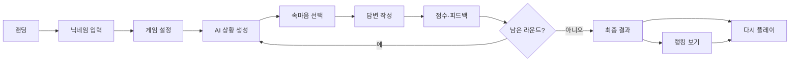

# 연애 디펜스 제품 요구사항 정의서(PRD)

> 생성형 AI 기반 연애 커뮤니케이션 시뮬레이션 게임

## 문서 정보

| 항목 | 내용 |
|---|---|
| 문서 버전 | v1.2 |
| 문서 상태 | Draft / MVP 정합성 보완 |
| 제품명 | 연애 디펜스(가칭) |
| 대상 릴리즈 | Hackathon MVP / v1.0 |
| 대상 플랫폼 | 모바일 우선 반응형 웹 |
| 작성일 | 2026-07-15 |
| 주요 이해관계자 | 기획, 디자인, 프론트엔드, 백엔드, AI/데이터 |

---

## 0. 현재 MVP 기준과 요구사항 정합성

이 문서는 제품의 장기 목표와 현재 심사 대상 MVP를 구분한다. 현재 코드가 실제로 제공하는 기준은 다음과 같다.

| 영역 | 현재 MVP 기준 | 상태 |
|---|---|---|
| 게임 루프 | 5개 Stage, Stage별 6~10턴의 연속 대화 | 구현 |
| 사용자 입력 | 자유 답변 1회 제출, 최대 200자 | 구현 |
| AI 평가 | 감정 인식·욕구 반응·소통 적합성 등 6개 차원 평가 | 구현 |
| 상대방 반응 | 평가 결과와 최근 대화를 반영한 AI 대사 생성 | 구현 |
| 관계 상태 | 관계 HP, 갈등, 안정감, 신뢰도 변화 | 구현 |
| 시나리오 생성 | `generate-stage` provider와 fallback은 존재하나 메인 플레이 연결 전 | Deferred |
| 속마음 선택지 | 현재 화면에는 미노출 | Deferred |
| 골든 데이터셋·E2E | 단위 테스트 중심, 품질 게이트 구축 전 | 미완료 |

따라서 현재 심사 발표에서는 “AI가 매번 새로운 상황을 생성한다”를 완료 기능으로 주장하지 않는다. 현재 Wow Point는 **가상의 연애 갈등 대화에서 사용자의 답변을 AI가 평가하고, 그 결과가 상대 반응과 관계 상태에 반영되는 반복 훈련 루프**로 정의한다. AI 시나리오 생성과 속마음 선택지는 검증을 마친 뒤 다음 MVP 승격 항목으로 관리한다.

---

## 1. 제품 개요

### 1.1 한 줄 정의

**연애 디펜스**는 AI가 생성한 연애 상황에서 상대방의 숨은 감정을 추론하고 적절한 답변을 작성하면, 점수와 맞춤형 피드백을 제공하는 게임형 커뮤니케이션 학습 서비스다.

### 1.2 문제 정의

연애 갈등은 큰 사건보다 짧고 모호한 대화에서 시작되는 경우가 많다. “됐어”, “괜찮아”, “아무것도 아니야” 같은 표현에는 서운함, 기대, 배려 요청 등 여러 의미가 포함될 수 있지만, 상대방은 문자 그대로 받아들이거나 자신의 관점으로 해석하기 쉽다.

특히 메신저 중심의 대화에서는 표정, 억양, 시선 같은 비언어적 정보가 사라진다. 사용자는 상대의 의도를 추측에 의존하게 되고, 이 과정에서 오해와 감정 소모가 반복된다. 기존의 연애 심리 테스트는 정적인 문항과 일회성 결과에 머무르기 때문에 실제 대화 대응 능력을 반복적으로 연습하기 어렵다.

### 1.3 제안 솔루션

사용자는 AI가 생성한 연애 상황을 읽고 다음 두 가지 행동을 수행한다.

1. 상대방의 숨은 감정 또는 의도를 선택지에서 추론한다.
2. 실제로 보낼 법한 답변을 자유롭게 작성한다.

서비스는 의도 이해도, 공감 표현, 대응 적절성을 기준으로 답변을 평가한다. 사용자는 점수, 감점 이유, 잘한 점, 개선 포인트, 추천 답변을 확인하고 새로운 상황에 재도전한다. 게임 종료 후 최고 점수는 랭킹에 반영된다.

### 1.4 제품 비전

연애 상황을 시작점으로 삼되, 장기적으로 친구, 가족, 직장 등 다양한 관계에서 필요한 공감·의도 파악·대화 대응 능력을 연습하는 AI 커뮤니케이션 학습 플랫폼으로 확장한다.

---

## 2. 목표와 범위

### 2.1 사용자 목표

- 다양한 연애 상황에서 상대방의 감정과 의도를 해석하는 연습을 한다.
- 자신의 답변이 상대에게 어떻게 받아들여질지 객관적으로 확인한다.
- 실제 대화에서 활용할 수 있는 공감 표현과 대응 문장을 학습한다.
- 점수, 등급, 랭킹을 통해 반복 플레이 동기를 얻는다.

### 2.2 제품 목표

- 생성형 AI를 통해 반복 플레이마다 다른 상황을 제공한다.
- 사용자의 행동을 단순 심리 유형이 아니라 구체적인 대화 역량으로 피드백한다.
- 게임 완료, 결과 확인, 재도전, 랭킹 조회로 이어지는 짧고 명확한 루프를 만든다.
- AI 모델 및 프롬프트를 교체·개선하기 쉬운 구조를 확보한다.

### 2.3 비목표(Non-goals)

MVP에서는 다음 기능을 제공하지 않는다.

- 실제 카카오톡·인스타그램·문자 대화 내역 분석
- 음성 통화 또는 음성 감정 분석
- 커플 계정 연결 및 상대방 초대
- 심리검사 또는 정신건강 진단
- 실제 연애 상담, 치료 또는 위기 개입
- 사용자 간 실시간 대전·채팅
- 유료 결제 및 구독

### 2.4 MVP 성공 가설

- 사용자는 3개의 짧은 상황으로 구성된 한 게임을 부담 없이 완료할 수 있다.
- 결과 화면에서 구체적인 감점 이유와 추천 문장을 확인하면 재도전 의향이 높아진다.
- 최고 점수 기반 랭킹은 반복 플레이를 유도한다.
- 선택형 의도 추론과 자유 답변 평가를 결합하면 AI 채점의 설명 가능성과 게임성이 함께 향상된다.

---

## 3. 타깃 사용자

### 3.1 핵심 타깃

- 20대 중심의 연애 중이거나 썸 관계를 경험하는 사용자
- 메신저로 소통하는 비중이 높은 사용자
- 상대방의 숨은 의도를 파악하기 어렵거나 자신의 표현이 잘 전달되지 않는다고 느끼는 사용자
- AI 서비스, 심리 테스트, 가벼운 모바일 게임에 익숙한 사용자

### 3.2 대표 페르소나

| 항목 | 김민수 | 이지은 |
|---|---|---|
| 나이·직업 | 23세 대학생 | 26세 마케팅 직장인 |
| 특성 | 논리적으로 판단하지만 상대의 숨은 의도를 파악하는 데 어려움을 느낀다. | 감정 표현은 풍부하지만 상대 반응을 과하게 해석하는 경향이 있다. |
| 목표 | 연인의 속마음을 더 잘 이해하고 반복되는 갈등을 줄이고 싶다. | 자신의 의도를 명확히 전달하고 건강한 대화를 이어가고 싶다. |
| 주요 불편 | 같은 주제로 반복해서 다툰다. | “나는 그런 뜻이 아니었다”는 상황이 자주 발생한다. |
| 서비스 기대 | 정답에 가까운 해석과 실전 답변 예시 | 공감 표현에 대한 구체적 피드백 |

---

## 4. 제품 원칙

1. **평가보다 학습을 우선한다.** 사용자를 비난하거나 성격을 단정하지 않고, 특정 답변의 효과와 개선 방법을 설명한다.
2. **피드백은 구체적이어야 한다.** “공감이 부족합니다”가 아니라 어떤 표현이 부족했고 어떻게 바꾸면 되는지 제시한다.
3. **점수는 일관되고 설명 가능해야 한다.** 선택형 의도 점수는 사전 정의하고, AI가 평가하는 자유 답변에는 명시적인 루브릭을 적용한다.
4. **짧은 플레이 루프를 유지한다.** 한 게임은 기본 3라운드이며, 결과 확인까지 5분 이내 완료를 목표로 한다.
5. **실제 개인 대화를 요구하지 않는다.** MVP에서는 가상의 상황만 사용하여 개인정보 노출 위험을 줄인다.
6. **AI 결과를 절대적 정답으로 표현하지 않는다.** 관계 상황에는 여러 해석이 가능하다는 점을 UI와 피드백 문구에 반영한다.

---

## 5. MVP 범위 및 우선순위

### 5.1 우선순위 정의

| 우선순위 | 의미 |
|---|---|
| P0 | MVP 출시·데모에 필수 |
| P1 | 일정이 허용되면 MVP에 포함하며, 미구현 시 기본값으로 대체 가능 |
| P2 | 후속 버전 후보 |
| 제외 | 현재 제품 범위에서 제공하지 않음 |

### 5.2 기능 우선순위

| 기능 | 우선순위 | 비고 |
|---|---:|---|
| 닉네임 기반 게스트 시작 | P0 | 회원가입 없이 진입 |
| AI 연애 상황 생성 | P0 | 게임당 3라운드 |
| 속마음 추론 선택지 | P0 | 라운드당 4개 선택지 |
| 자유 답변 입력 | P0 | 1~300자 |
| 점수 및 맞춤형 피드백 | P0 | 3개 평가 영역, 총점 100점 |
| 게임 결과 리포트 | P0 | 평균 점수, 등급, 강점, 개선 포인트 |
| 최고 점수 저장 | P0 | 서버 기준으로 저장 |
| 랭킹 페이지 | P0 | 상위 3명 강조, 내 순위 표시 |
| 다시 플레이 | P0 | 새로운 게임 세션 생성 |
| 상황 카테고리 선택 | P1 | 미구현 시 ‘랜덤’ 기본값 |
| 난이도 선택 | P1 | 미구현 시 ‘보통’ 기본값 |
| AI 상대 성향 선택 | P2 | 표현 방식·갈등 성향 설정 |
| 플레이 기록·성장 리포트 | P2 | 로그인 도입 이후 권장 |
| 결과 공유 | P2 | 링크 또는 이미지 카드 |
| 오늘의 연애 미션 | P2 | 일일 재방문 유도 |
| 실제 대화 내역 분석 | 제외 | 개인정보·안전성 이슈 |

### 5.3 MVP 운영 가정

- 사용자는 회원가입 없이 닉네임을 입력하고 시작한다.
- 브라우저 또는 서버에서 생성한 익명 사용자 ID로 동일 사용자를 식별한다.
- 한 게임은 기본 3라운드로 구성하며, 라운드 수는 서버 설정으로 변경할 수 있다.
- 랭킹에는 완료된 게임의 최고 점수만 반영한다.
- AI 모델은 서버 측 서비스 계층을 통해 호출한다. 구체적인 Gemini 모델 버전은 구현 시 확정한다.
- 점수는 클라이언트가 전달하지 않고 서버가 계산·저장한다.

---

## 6. 핵심 사용자 여정



### 6.1 기본 시나리오

1. 사용자가 랜딩 화면에서 닉네임을 입력한다.
2. 카테고리와 난이도를 선택하거나 기본값으로 시작한다.
3. AI가 가상의 연애 상황, 상대방의 메시지, 4개의 속마음 선택지를 생성한다.
4. 사용자가 가장 가능성 높은 속마음을 선택한다.
5. 사용자가 상대에게 보낼 답변을 자유롭게 입력한다.
6. 서버가 선택 결과와 자유 답변을 평가한다.
7. 사용자가 라운드 점수, 감점 이유, 추천 답변을 확인한다.
8. 3라운드 완료 후 최종 점수와 등급을 확인한다.
9. 최고 점수가 자동 저장되고 랭킹에 반영된다.
10. 사용자는 랭킹을 확인하거나 새로운 게임을 시작한다.

---

## 7. 기능 요구사항

### 7.1 게스트 사용자 시작

#### FR-001 닉네임 입력

- **우선순위:** P0
- **설명:** 사용자는 별도 회원가입 없이 닉네임으로 게임을 시작할 수 있다.

##### 요구사항

- 닉네임은 2~12자로 제한한다.
- 앞뒤 공백은 제거한다.
- 빈 값, 제어문자, 금칙어가 포함된 값은 거부한다.
- 중복 닉네임은 허용하되, 내부 식별은 익명 사용자 ID로 수행한다.
- 랭킹에는 닉네임 외 이메일, 전화번호 등 개인정보를 표시하지 않는다.
- 익명 사용자 ID가 없는 경우 서버 또는 클라이언트에서 UUID를 생성한다.

##### 수용 조건

- **Given** 사용자가 유효한 닉네임을 입력한 경우, **When** 시작 버튼을 누르면, **Then** 익명 사용자 레코드가 생성되거나 기존 익명 사용자와 연결되고 게임 설정 화면으로 이동한다.
- **Given** 닉네임이 2자 미만 또는 12자 초과인 경우, **When** 시작을 요청하면, **Then** 게임을 시작하지 않고 입력 규칙을 안내한다.
- **Given** 이미 익명 사용자 ID가 저장된 브라우저인 경우, **When** 다시 접속하면, **Then** 이전 닉네임을 기본값으로 표시한다.

---

### 7.2 게임 설정

#### FR-010 카테고리 선택

- **우선순위:** P1
- **설명:** 사용자는 경험하고 싶은 연애 상황 유형을 선택할 수 있다.

##### 초기 카테고리

- 랜덤
- 썸
- 연애 초기
- 장기 연애
- 일상 갈등
- 기념일·약속

##### 수용 조건

- **Given** 사용자가 카테고리를 선택한 경우, **When** 게임을 시작하면, **Then** 선택한 카테고리가 모든 라운드의 상황 생성 조건에 반영된다.
- **Given** 사용자가 카테고리를 선택하지 않은 경우, **When** 게임을 시작하면, **Then** ‘랜덤’을 기본값으로 사용한다.

#### FR-011 난이도 선택

- **우선순위:** P1
- **설명:** 사용자는 대사의 모호성과 갈등 복잡도를 선택할 수 있다.

| 난이도 | 생성 기준 |
|---|---|
| 쉬움 | 감정 단서가 명확하고 선택지 간 차이가 크다. |
| 보통 | 감정 단서가 일부 생략되고 복수의 해석 가능성이 있다. |
| 어려움 | 맥락 의존성이 높고 표현이 간접적이지만, 정답 근거는 상황 안에 존재한다. |

- 미선택 시 ‘보통’을 기본값으로 사용한다.

---

### 7.3 AI 연애 상황 생성

#### FR-020 라운드 상황 생성

- **우선순위:** P0
- **설명:** AI는 선택 조건에 맞는 새로운 가상 연애 상황을 생성한다.

##### 공개 데이터

클라이언트에는 다음 정보만 전달한다.

- 라운드 번호
- 카테고리와 난이도
- 짧은 상황 설명
- 상대방의 메시지
- 속마음 선택지 4개

##### 비공개 평가 데이터

정답 유출을 막기 위해 다음 정보는 서버에만 저장한다.

- 핵심 감정
- 숨은 의도
- 선택지별 의도 점수
- 좋은 답변에 포함되어야 할 요소
- 피해야 할 표현
- 시나리오 식별용 해시

##### 생성 규칙

- 상황은 실제 개인이나 특정 사건을 식별할 수 없는 가상 내용이어야 한다.
- 선택지는 정확히 4개를 생성한다.
- 선택지 중 하나는 핵심 의도를 가장 잘 설명해야 한다.
- 오답 선택지는 단순히 터무니없는 내용이 아니라 실제로 혼동할 수 있는 해석이어야 한다.
- 지나친 욕설, 명시적 성적 내용, 폭력, 스토킹, 협박, 자해·자살, 범죄 조장 상황은 생성하지 않는다.
- 성별 고정관념이나 특정 성별을 비하하는 설명을 금지한다.
- 최근 10개 시나리오 해시와 동일하거나 유사도가 높은 상황은 재생성한다.
- AI 생성 실패 시 최대 2회 재시도하고, 계속 실패하면 사전 준비된 안전한 기본 시나리오를 제공한다.

##### 수용 조건

- **Given** 게임 세션이 시작된 경우, **When** 라운드 생성 API가 성공하면, **Then** 상황 설명, 상대 메시지, 4개 선택지가 화면에 표시된다.
- **Given** 동일 사용자가 같은 카테고리로 반복 플레이한 경우, **When** 새 라운드를 생성하면, **Then** 최근 제공된 시나리오와 동일한 상황을 제공하지 않는다.
- **Given** AI가 유효하지 않은 JSON을 반환한 경우, **When** 서버가 검증에 실패하면, **Then** 자동 재시도 후에도 실패할 때 기본 시나리오를 반환한다.
- **Given** 비공개 평가 데이터가 생성된 경우, **When** 클라이언트 응답을 구성하면, **Then** 정답·숨은 의도·선택지별 점수는 포함하지 않는다.

---

### 7.4 속마음 추론 및 답변 제출

#### FR-030 속마음 선택

- **우선순위:** P0
- **설명:** 사용자는 4개의 선택지 중 상대방의 숨은 의도를 가장 잘 설명하는 항목을 하나 선택한다.

##### 수용 조건

- 하나의 선택지만 선택할 수 있다.
- 선택 전에는 제출 버튼을 활성화하지 않는다.
- 사용자가 제출한 이후에는 선택을 변경할 수 없다.
- 정답 여부는 제출 전 공개하지 않는다.

#### FR-031 자유 답변 입력

- **우선순위:** P0
- **설명:** 사용자는 실제로 상대에게 보낼 답변을 작성한다.

##### 요구사항

- 답변 길이는 1~300자로 제한한다.
- 앞뒤 공백만 있는 입력은 허용하지 않는다.
- HTML·스크립트는 텍스트로 처리하고 실행하지 않는다.
- 중복 제출을 방지하기 위해 평가 중에는 버튼을 비활성화한다.
- 입력 중 남은 글자 수를 표시한다.

##### 수용 조건

- **Given** 속마음 선택과 자유 답변이 모두 유효한 경우, **When** 제출 버튼을 누르면, **Then** 서버는 하나의 평가 요청만 생성하고 로딩 상태를 표시한다.
- **Given** 자유 답변이 비어 있는 경우, **When** 제출을 시도하면, **Then** 평가 요청을 보내지 않고 답변 입력을 안내한다.
- **Given** 평가 요청이 진행 중인 경우, **When** 사용자가 제출 버튼을 반복해서 누르면, **Then** 중복 평가 레코드가 생성되지 않는다.

---

### 7.5 점수 산정 및 AI 피드백

#### FR-040 라운드 점수 산정

- **우선순위:** P0
- **설명:** 서비스는 속마음 선택과 자유 답변을 합산하여 라운드 총점 0~100점을 계산한다.

##### 평가 체계

| 평가 영역 | 배점 | 산정 방식 | 평가 관점 |
|---|---:|---|---|
| 의도 이해도 | 40점 | 시나리오 생성 시 선택지별 점수를 서버에 사전 정의 | 상대방의 핵심 감정·요청을 얼마나 정확히 파악했는가 |
| 공감 표현 | 30점 | AI 루브릭 평가 | 감정을 인정하고 방어적·공격적 반응을 피했는가 |
| 대응 적절성 | 30점 | AI 루브릭 평가 | 상황에 맞는 질문, 사과, 설명, 행동 제안을 포함했는가 |
| **총점** | **100점** | 세 영역 합산 | 0~100점 정수 |

##### 선택지 점수 규칙

- 각 시나리오는 선택지별 `intent_score`를 0~40 범위 정수로 포함한다.
- 가장 적절한 선택지는 40점이어야 한다.
- 나머지 선택지는 유사도에 따라 예: 0점, 15점, 25점처럼 차등 배점할 수 있다.
- 클라이언트가 선택지 점수를 임의로 변경할 수 없도록 서버 데이터만 사용한다.

##### 자유 답변 평가 루브릭

**공감 표현(0~30점)**

- 0~9점: 감정을 무시하거나 비난·조롱·회피한다.
- 10~19점: 감정을 일부 인정하지만 형식적이거나 자기방어가 중심이다.
- 20~25점: 상대 감정을 구체적으로 인정하고 대화를 이어간다.
- 26~30점: 감정 인정과 배려가 자연스럽고, 상대가 안전하게 설명할 여지를 만든다.

**대응 적절성(0~30점)**

- 0~9점: 갈등을 키우거나 상황과 무관한 대응을 한다.
- 10~19점: 무난하지만 문제 해결을 위한 구체성이 부족하다.
- 20~25점: 확인 질문, 사과, 설명 또는 행동 제안이 상황에 맞다.
- 26~30점: 감정과 사실을 구분하고 실행 가능한 다음 행동까지 제시한다.

##### 점수 계산

```text
round_total = intent_score + empathy_score + response_score
final_score = round(모든 round_total의 산술평균)
```

##### 등급 기준

| 등급 | 최종 점수 |
|---|---:|
| S | 90~100 |
| A | 80~89 |
| B | 70~79 |
| C | 60~69 |
| D | 0~59 |

##### 수용 조건

- **Given** 사용자가 답변을 제출한 경우, **When** 평가가 완료되면, **Then** 의도 이해도, 공감 표현, 대응 적절성, 라운드 총점을 정수로 반환한다.
- **Given** AI가 배점 범위를 벗어난 값을 반환한 경우, **When** 서버가 결과를 검증하면, **Then** 해당 결과를 거부하고 재시도한다.
- **Given** 클라이언트가 임의의 점수를 전송한 경우, **When** 서버가 평가를 처리하면, **Then** 클라이언트 점수를 무시하고 서버 산출값만 저장한다.

#### FR-041 맞춤형 피드백

- **우선순위:** P0
- **설명:** 평가 결과는 점수만 제공하지 않고 사용자가 다음 대화에서 적용할 수 있는 피드백을 포함한다.

##### 필수 피드백 항목

- 상대방의 핵심 감정·의도 해설
- 사용자가 잘 파악한 점
- 감점 또는 개선이 필요한 점
- 사용자의 답변에서 효과적이었던 표현
- 더 적절한 대응 전략
- 추천 답변 1개
- “상황에 따라 다른 해석도 가능하다”는 안내

##### 피드백 작성 원칙

- 2인칭 비난 표현과 성격 단정을 금지한다.
- “공감 능력이 없다” 대신 “이 답변에서는 상대 감정을 직접 인정하는 표현이 부족했다”처럼 행동 단위로 설명한다.
- 추천 답변은 자연스러운 메신저 말투로 1~3문장 이내로 제공한다.
- 관계 종료, 복수, 조종, 위협 등 극단적 행동을 정답처럼 제시하지 않는다.
- 심리 질환이나 애착 유형을 진단하지 않는다.

##### 수용 조건

- **Given** 평가가 성공한 경우, **When** 피드백 화면을 표시하면, **Then** 점수 3종, 총점, 잘한 점, 개선점, 추천 답변을 모두 표시한다.
- **Given** 사용자의 답변이 모욕적이거나 공격적인 경우, **When** 피드백을 생성하면, **Then** 이를 재현·강화하지 않고 갈등을 낮추는 대체 표현을 제안한다.

---

### 7.6 라운드 진행과 게임 완료

#### FR-050 라운드 진행

- **우선순위:** P0
- **설명:** 사용자는 라운드별 피드백을 확인한 후 다음 라운드로 이동한다.

##### 요구사항

- 상단에 현재 라운드와 전체 라운드 수를 표시한다. 예: `2 / 3`.
- 피드백 확인 전에는 자동으로 다음 라운드로 이동하지 않는다.
- 마지막 라운드에서는 버튼 문구를 ‘최종 결과 보기’로 변경한다.
- 중간 이탈한 세션은 완료 상태로 처리하지 않고 랭킹에 반영하지 않는다.

#### FR-051 최종 결과 리포트

- **우선순위:** P0
- **설명:** 모든 라운드가 완료되면 게임 전체 결과를 요약한다.

##### 표시 항목

- 최종 점수와 등급
- 영역별 평균 점수
- 가장 높은 평가 영역
- 우선 개선 영역
- 한 문단 이내의 종합 코멘트
- 라운드별 점수 요약
- 최고 점수 갱신 여부
- ‘랭킹 보기’와 ‘다시 플레이’ 버튼

##### 결과 요약 원칙

- 3라운드 결과만으로 사용자의 고정된 성격이나 관계 능력을 단정하지 않는다.
- “이번 게임에서”라는 범위를 명시한다.
- 강점과 개선점을 각각 최소 1개씩 제공한다.

##### 수용 조건

- **Given** 모든 라운드가 평가된 경우, **When** 최종 결과를 요청하면, **Then** 라운드 평균을 반올림한 0~100점의 최종 점수와 등급을 표시한다.
- **Given** 사용자가 게임을 완료하지 않은 경우, **When** 결과 API를 요청하면, **Then** 완료되지 않은 세션 오류를 반환하고 랭킹을 갱신하지 않는다.

---

### 7.7 랭킹

#### FR-060 최고 점수 저장

- **우선순위:** P0
- **설명:** 완료된 게임의 최종 점수를 익명 사용자별 최고 기록으로 저장한다.

##### 저장 규칙

- 완료된 게임만 랭킹 후보가 된다.
- 동일 사용자가 기존 최고 점수보다 높은 점수를 획득하면 최고 기록을 갱신한다.
- 총점이 같은 경우 다음 순서로 더 우수한 기록을 결정한다.
  1. 의도 이해도 평균이 높은 기록
  2. 공감 표현 평균이 높은 기록
  3. 대응 적절성 평균이 높은 기록
  4. 해당 기록을 먼저 달성한 기록
- 기존 기록보다 낮은 점수는 플레이 기록에는 저장할 수 있지만 랭킹 최고 기록은 변경하지 않는다.
- 랭킹 산정은 트랜잭션 또는 원자적 upsert로 처리한다.

##### 수용 조건

- **Given** 사용자가 처음 게임을 완료한 경우, **When** 최종 점수가 계산되면, **Then** 랭킹 레코드를 생성한다.
- **Given** 기존 최고 점수보다 높은 점수를 얻은 경우, **When** 게임이 완료되면, **Then** 최고 점수와 관련 세부 점수를 갱신한다.
- **Given** 기존 최고 점수보다 낮은 점수를 얻은 경우, **When** 게임이 완료되면, **Then** 랭킹 최고 점수를 유지한다.
- **Given** 두 완료 요청이 동시에 발생한 경우, **When** 랭킹을 갱신하면, **Then** 우수한 기록 하나만 최종 레코드로 남는다.

#### FR-061 랭킹 페이지 조회

- **우선순위:** P0
- **설명:** 사용자는 전체 랭킹과 자신의 현재 순위를 확인할 수 있다.

##### 화면 요구사항

- 총점 내림차순으로 표시한다.
- 상위 3명은 금·은·동 메달 또는 이에 준하는 시각 요소로 강조한다.
- 4위 이하에는 순위, 닉네임, 최고 점수를 표시한다.
- 현재 사용자의 행은 별도로 강조한다.
- 현재 사용자가 상위 목록 밖에 있더라도 ‘내 순위’ 영역에 표시한다.
- 초기 화면은 상위 20명을 표시하고, 최대 100명까지 추가 조회할 수 있다.
- 데이터가 없으면 빈 상태 문구와 ‘첫 기록 만들기’ 버튼을 표시한다.

##### 수용 조건

- **Given** 랭킹 데이터가 존재하는 경우, **When** 랭킹 페이지를 조회하면, **Then** 정의된 동점 처리 규칙에 따라 정렬된 목록을 표시한다.
- **Given** 현재 사용자가 랭킹에 등록된 경우, **When** 페이지를 조회하면, **Then** 사용자의 순위와 최고 점수를 확인할 수 있다.
- **Given** 사용자가 새 최고 점수를 달성한 경우, **When** 결과 화면에서 랭킹으로 이동하면, **Then** 갱신된 점수와 순위를 표시한다.

---

### 7.8 재도전과 피드백 수집

#### FR-070 다시 플레이

- **우선순위:** P0
- **설명:** 사용자는 결과 또는 랭킹 화면에서 새로운 게임을 시작할 수 있다.

- 기존 게임 세션은 변경하지 않고 새 세션을 생성한다.
- 이전 설정을 기본값으로 유지하되 사용자가 변경할 수 있다.
- 최근 시나리오 중복 방지 규칙을 새 세션에도 적용한다.

#### FR-071 AI 결과 유용성 피드백

- **우선순위:** P2
- **설명:** 사용자는 AI 해설이 유용했는지 평가할 수 있다.

- ‘도움이 됐어요’ / ‘아쉬워요’ 2단계 평가를 제공한다.
- 선택적으로 짧은 의견을 남길 수 있다.
- 평가 결과는 프롬프트 및 채점 기준 개선에 활용한다.
- 사용자 피드백이 즉시 점수나 랭킹을 변경하지는 않는다.

---

## 8. 화면 및 UX 요구사항

### 8.1 정보 구조

| 화면 | 핵심 목적 | 주요 구성요소 |
|---|---|---|
| 랜딩 | 가치 제안과 진입 | 서비스 설명, 닉네임 입력, 시작 버튼 |
| 게임 설정 | 상황 조건 선택 | 카테고리, 난이도, 게임 시작 |
| 플레이 | 상황 이해와 답변 | 메신저형 대화, 진행도, 선택지, 답변 입력 |
| 라운드 피드백 | 즉시 학습 | 세부 점수, 해설, 잘한 점, 개선점, 추천 답변 |
| 최종 결과 | 게임 요약 | 최종 점수, 등급, 강점, 개선 영역, CTA |
| 랭킹 | 비교와 재도전 동기 | 상위 3명, 일반 순위, 내 순위, 다시 플레이 |

### 8.2 인터랙션 원칙

- 모바일 화면을 우선 설계하고 데스크톱에서는 중앙 정렬된 콘텐츠 영역을 사용한다.
- 플레이 화면은 익숙한 메신저 형식을 사용하되 특정 서비스의 로고·상표·UI를 그대로 복제하지 않는다.
- 사용자가 해야 할 다음 행동은 한 화면에 하나의 주요 CTA로 명확히 표시한다.
- AI 처리 중에는 로딩 문구 또는 단계 표시를 제공한다.
- 점수는 색상만으로 구분하지 않고 숫자와 텍스트를 함께 제공한다.
- 오류가 발생해도 사용자가 입력한 답변을 유지한다.

### 8.3 반응형 기준

- 최소 지원 너비: 360px
- 모바일 우선 레이아웃
- 데스크톱에서는 플레이 영역 최대 너비를 약 480~640px로 제한한다.
- 터치 대상은 최소 44px 높이를 권장한다.

### 8.4 접근성

- 키보드만으로 주요 기능을 사용할 수 있어야 한다.
- 선택 상태와 포커스 상태를 시각적으로 구분한다.
- 텍스트와 배경은 WCAG AA 수준의 명도 대비를 목표로 한다.
- 메달·점수 등 시각 정보에는 텍스트 레이블을 함께 제공한다.
- 로딩 및 오류 상태는 스크린 리더가 인식할 수 있도록 상태 메시지를 제공한다.

---

## 9. AI 요구사항

### 9.1 AI 역할 분리

AI 서비스 계층은 다음 두 역할을 분리한다.

1. **Scenario Generator:** 상황, 대사, 선택지, 평가 기준을 생성한다.
2. **Answer Evaluator:** 사용자 자유 답변을 루브릭에 따라 평가하고 피드백을 생성한다.

각 요청에는 `prompt_version`, `model_name`, `request_id`를 기록하여 결과를 추적할 수 있어야 한다.

### 9.2 시나리오 생성 응답 계약

```json
{
  "category": "일상 갈등",
  "difficulty": "보통",
  "context": "주말 약속 시간을 정하는 과정에서 답장이 늦어진 상황",
  "partner_message": "응, 네가 편한 대로 해.",
  "choices": [
    {
      "id": "A",
      "text": "정말로 아무 시간이나 괜찮다",
      "intent_score": 10
    },
    {
      "id": "B",
      "text": "자신의 의견을 먼저 물어봐 주길 기대한다",
      "intent_score": 40
    },
    {
      "id": "C",
      "text": "약속 자체를 취소하고 싶다",
      "intent_score": 15
    },
    {
      "id": "D",
      "text": "답장이 늦은 사실을 전혀 신경 쓰지 않는다",
      "intent_score": 0
    }
  ],
  "hidden_intent": "자신의 일정과 마음을 먼저 고려해 주길 바란다",
  "emotion_tags": ["서운함", "기대"],
  "good_response_elements": [
    "답장이 늦은 점을 인정한다",
    "상대가 원하는 시간을 다시 묻는다",
    "구체적인 선택지를 제안한다"
  ],
  "avoid_elements": [
    "말 그대로만 받아들이기",
    "상대가 예민하다고 비난하기"
  ],
  "safety_flags": []
}
```

#### 서버 검증 규칙

- 모든 필수 필드 존재 여부를 검증한다.
- 선택지는 정확히 4개이며 ID가 중복되지 않아야 한다.
- `intent_score`는 각각 0~40 범위 정수여야 한다.
- 하나 이상의 선택지가 40점이어야 하며, 최고점 선택지는 하나만 허용한다.
- 공개 API 응답에서는 `intent_score`, `hidden_intent`, `emotion_tags`, `good_response_elements`, `avoid_elements`를 제거한다.

### 9.3 답변 평가 응답 계약

```json
{
  "empathy_score": 24,
  "response_score": 22,
  "understood_points": [
    "상대방의 서운함을 직접 인정했다"
  ],
  "improvement_points": [
    "답장이 늦어진 이유를 설명하기 전에 먼저 사과하면 방어적으로 들릴 가능성이 줄어든다"
  ],
  "effective_expression": "내가 답을 늦게 해서 서운했을 것 같아",
  "recommended_strategy": "감정을 인정한 뒤 상대가 원하는 시간을 다시 확인한다",
  "recommended_reply": "답 늦어서 미안해. 네 일정도 중요한데 내가 먼저 정하려고 했네. 너는 토요일이랑 일요일 중 언제가 더 편해?",
  "interpretation_note": "실제 의도는 관계와 대화 맥락에 따라 달라질 수 있습니다.",
  "safety_flags": []
}
```

#### 서버 검증 규칙

- `empathy_score`, `response_score`는 각각 0~30 범위 정수여야 한다.
- 추천 답변은 1~3문장, 300자 이하를 권장한다.
- 필수 배열이 비어 있으면 한 번 재생성을 요청한다.
- JSON 파싱 또는 스키마 검증 실패 시 최대 2회 재시도한다.
- 재시도 후 실패하면 점수 대신 오류 상태를 반환하고, 사용자의 원문 답변은 화면에 유지한다.

### 9.4 프롬프트 안전 요구사항

- 사용자 입력을 시스템 지시와 분리하고, 사용자 입력 안의 명령을 모델 지시로 취급하지 않는다.
- 모델은 점수 범위를 변경하거나 평가 기준을 재정의할 수 없다.
- 사용자 입력을 그대로 추천 답변에 복사하지 않는다.
- 욕설·혐오 표현은 필요 이상 재현하지 않는다.
- 정신질환, 성격장애, 애착 유형 등 진단적 표현을 사용하지 않는다.
- 자해·폭력 등 위험 신호가 포함된 경우 일반 게임 피드백 대신 안전 안내 정책을 적용한다.

---

## 10. 데이터 모델

### 10.1 주요 엔터티

#### User

| 필드 | 형식 | 설명 |
|---|---|---|
| id | UUID | 익명 사용자 식별자 |
| display_name | varchar(12) | 랭킹 표시 닉네임 |
| created_at | datetime | 최초 생성 시각 |
| last_seen_at | datetime | 최근 접속 시각 |

#### GameSession

| 필드 | 형식 | 설명 |
|---|---|---|
| id | UUID | 게임 세션 ID |
| user_id | UUID | 사용자 ID |
| category | varchar | 선택 카테고리 |
| difficulty | varchar | 난이도 |
| total_rounds | integer | 기본 3 |
| status | enum | CREATED, IN_PROGRESS, COMPLETED, ABANDONED |
| final_score | integer nullable | 0~100 |
| grade | char nullable | S, A, B, C, D |
| started_at | datetime | 시작 시각 |
| completed_at | datetime nullable | 완료 시각 |

#### Round

| 필드 | 형식 | 설명 |
|---|---|---|
| id | UUID | 라운드 ID |
| session_id | UUID | 게임 세션 ID |
| round_no | integer | 1부터 시작 |
| public_scenario | JSON | 클라이언트 공개 데이터 |
| private_evaluation | JSON | 정답 및 평가 기준 |
| scenario_hash | varchar | 중복 방지용 해시 |
| generated_at | datetime | 생성 시각 |

#### AnswerEvaluation

| 필드 | 형식 | 설명 |
|---|---|---|
| id | UUID | 평가 ID |
| round_id | UUID | 라운드 ID |
| selected_choice_id | varchar | 사용자가 선택한 선택지 |
| response_text | text | 사용자 자유 답변 |
| intent_score | integer | 0~40 |
| empathy_score | integer | 0~30 |
| response_score | integer | 0~30 |
| total_score | integer | 0~100 |
| feedback | JSON | 해설·추천 답변 |
| model_name | varchar | 평가 모델 |
| prompt_version | varchar | 프롬프트 버전 |
| latency_ms | integer | AI 처리 시간 |
| created_at | datetime | 평가 시각 |

#### LeaderboardEntry

| 필드 | 형식 | 설명 |
|---|---|---|
| user_id | UUID, PK | 사용자별 1개 레코드 |
| display_name | varchar(12) | 표시 닉네임 |
| best_score | integer | 최고 최종 점수 |
| intent_avg | numeric | 최고 기록의 평균 의도 점수 |
| empathy_avg | numeric | 최고 기록의 평균 공감 점수 |
| response_avg | numeric | 최고 기록의 평균 대응 점수 |
| best_session_id | UUID | 최고 기록 세션 |
| achieved_at | datetime | 최고 기록 달성 시각 |
| updated_at | datetime | 갱신 시각 |

#### EvaluationFeedback(P2)

| 필드 | 형식 | 설명 |
|---|---|---|
| id | UUID | 피드백 ID |
| evaluation_id | UUID | 대상 평가 |
| user_id | UUID | 사용자 ID |
| rating | enum | HELPFUL, NOT_HELPFUL |
| comment | varchar nullable | 선택 의견 |
| created_at | datetime | 제출 시각 |

### 10.2 데이터 공개 원칙

- 랭킹 공개 데이터는 순위, 닉네임, 최고 점수로 제한한다.
- 사용자 자유 답변과 AI 피드백은 다른 사용자에게 공개하지 않는다.
- 실제 대화 상대의 이름, 연락처 등 제3자 개인정보 입력을 요구하지 않는다.
- 데이터 보존 기간과 삭제 정책은 운영 전 개인정보처리방침과 함께 확정한다.

---

## 11. API 초안

| Method | Endpoint | 목적 |
|---|---|---|
| POST | `/api/users/guest` | 익명 사용자 생성 또는 닉네임 갱신 |
| POST | `/api/games` | 새 게임 세션 생성 |
| POST | `/api/games/{gameId}/rounds` | 다음 라운드 상황 생성 |
| POST | `/api/games/{gameId}/rounds/{roundId}/answers` | 선택·자유 답변 제출 및 평가 |
| GET | `/api/games/{gameId}/result` | 최종 결과 조회 |
| POST | `/api/games/{gameId}/complete` | 게임 완료 및 랭킹 갱신 |
| GET | `/api/leaderboard?limit=20&cursor=...` | 랭킹 목록 조회 |
| GET | `/api/leaderboard/me` | 현재 사용자 순위 조회 |
| POST | `/api/evaluations/{evaluationId}/feedback` | AI 결과 유용성 피드백(P2) |

### 11.1 API 공통 원칙

- 인증이 없는 MVP에서도 익명 사용자 토큰 또는 서명된 세션 토큰을 사용한다.
- 모든 점수 계산과 랭킹 갱신은 서버에서 수행한다.
- 동일 답변 제출에 대한 멱등성 키를 지원한다.
- 오류 응답은 `code`, `message`, `request_id`를 포함한다.
- AI 타임아웃과 일반 서버 오류를 구분한다.
- 클라이언트에는 내부 프롬프트, 모델 키, 비공개 평가 데이터를 반환하지 않는다.

### 11.2 주요 오류 코드 예시

| 코드 | 상황 | 사용자 메시지 |
|---|---|---|
| `INVALID_NICKNAME` | 닉네임 규칙 위반 | 닉네임은 2~12자로 입력해 주세요. |
| `INVALID_ANSWER` | 선택 또는 답변 누락 | 속마음을 선택하고 답변을 작성해 주세요. |
| `AI_GENERATION_TIMEOUT` | 상황 생성 시간 초과 | 상황을 만드는 데 시간이 걸리고 있어요. 다시 시도해 주세요. |
| `AI_EVALUATION_TIMEOUT` | 답변 평가 시간 초과 | 답변을 분석하지 못했습니다. 입력은 유지되니 다시 시도해 주세요. |
| `GAME_NOT_COMPLETED` | 미완료 세션 결과 요청 | 모든 라운드를 완료한 뒤 결과를 확인할 수 있어요. |
| `DUPLICATE_SUBMISSION` | 중복 제출 | 이미 처리 중인 답변입니다. |

---

## 12. 비기능 요구사항

### 12.1 성능 및 안정성

- AI 상황 생성과 답변 평가는 각각 **p95 5초 이내**를 목표로 한다.
- AI 요청 타임아웃은 8초를 기본값으로 하며, 자동 재시도 횟수는 최대 2회로 제한한다.
- 일반 API 응답은 AI 호출을 제외하고 p95 500ms 이내를 목표로 한다.
- 페이지 전환 또는 주요 UI 반응은 1초 이내에 시작되어야 한다.
- 전체 API 성공률은 월 기준 99% 이상을 목표로 한다.
- AI 장애 시 사전 준비된 기본 시나리오를 사용하여 최소 플레이 흐름을 유지한다.

### 12.2 보안

- Gemini 등 외부 AI API Key는 서버 환경변수 또는 비밀 관리 도구에 저장한다.
- 클라이언트 번들, 소스맵, 로그에 API Key를 포함하지 않는다.
- 운영 환경은 HTTPS만 허용한다.
- 입력값 길이, 형식, 허용 문자를 서버에서 재검증한다.
- AI 출력과 사용자 입력은 HTML 이스케이프 처리하여 XSS를 방지한다.
- 랭킹 점수는 서버 평가 결과만 사용하여 클라이언트 조작을 방지한다.
- IP 또는 익명 사용자 기준으로 과도한 AI 호출을 제한한다.
- 운영 로그에는 전체 자유 답변을 기본적으로 남기지 않고, 필요한 경우 마스킹 또는 제한된 샘플링을 적용한다.

### 12.3 개인정보 및 안전

- MVP는 실제 대화 내역 업로드를 지원하지 않는다.
- 사용자가 실명 또는 제3자 개인정보를 입력하지 않도록 안내한다.
- 결과 화면에 “AI 피드백은 가능한 해석 중 하나이며 전문 상담을 대체하지 않는다”는 안내를 제공한다.
- 관계 폭력, 자해, 위협 등 고위험 내용이 감지되면 점수 경쟁보다 안전 안내를 우선한다.
- 데이터 보존 기간, 삭제 요청 방식, 외부 AI 전송 범위는 정식 운영 전 정책으로 확정한다.

### 12.4 확장성 및 유지보수성

- AI 모델 호출은 인터페이스 기반 서비스로 분리하여 모델 교체가 가능해야 한다.
- 카테고리, 난이도, 라운드 수, 점수 배점, 등급 기준은 설정값으로 관리한다.
- 프롬프트는 코드와 분리하고 버전을 기록한다.
- JSON 스키마 검증을 통해 모델별 출력 차이를 흡수한다.
- 향후 친구·가족·직장 관계 유형을 같은 게임 엔진에 추가할 수 있어야 한다.

### 12.5 관측 가능성

- AI 요청별 요청 ID, 모델명, 프롬프트 버전, 응답 시간, 성공 여부를 기록한다.
- JSON 검증 실패율, 재시도율, 폴백 시나리오 사용률을 모니터링한다.
- 점수 분포와 선택지별 선택률을 확인하여 지나치게 쉽거나 어려운 시나리오를 탐지한다.
- 사용자 원문은 최소한으로 수집하고, 분석 시 익명화 원칙을 적용한다.

---

## 13. 분석 이벤트와 성공 지표

### 13.1 핵심 이벤트

| 이벤트 | 발생 시점 | 주요 속성 |
|---|---|---|
| `landing_view` | 랜딩 노출 | referrer |
| `guest_started` | 닉네임으로 시작 | user_id |
| `game_created` | 새 게임 생성 | category, difficulty |
| `scenario_viewed` | 상황 노출 | game_id, round_no, latency_ms |
| `answer_submitted` | 답변 제출 | round_no, answer_length |
| `evaluation_viewed` | 라운드 피드백 확인 | round_score, dimension_scores |
| `game_completed` | 최종 결과 도달 | final_score, grade, duration_sec |
| `leaderboard_viewed` | 랭킹 조회 | my_rank, source_screen |
| `replay_clicked` | 재도전 선택 | source_screen, previous_score |
| `ai_feedback_rated` | AI 결과 평가 | rating, prompt_version |
| `ai_error` | AI 처리 오류 | stage, error_code, retry_count |

### 13.2 KPI 정의 및 초기 목표

> 아래 수치는 해커톤 MVP의 초기 가설이며 실제 테스트 결과에 따라 조정한다.

| KPI | 산식 | 초기 목표 |
|---|---|---:|
| 게임 시작 전환율 | `game_created / landing_view` | 50% 이상 |
| 게임 완료율 | `game_completed / game_created` | 70% 이상 |
| 결과 확인 후 재도전율 | `replay_clicked / game_completed` | 30% 이상 |
| 사용자당 평균 게임 수 | 완료 게임 수 / 완료 사용자 수 | 1.5회 이상 |
| 랭킹 조회율 | `leaderboard_viewed / game_completed` | 40% 이상 |
| AI 평가 성공률 | 성공한 평가 / 전체 평가 요청 | 95% 이상 |
| AI 응답 지연 | 상황 생성·평가 p95 | 5초 이내 |
| 피드백 긍정률(P2) | HELPFUL / 전체 피드백 | 70% 이상 |

### 13.3 가드레일 지표

- AI JSON 검증 실패율 5% 미만
- 기본 시나리오 폴백 사용률 10% 미만
- 공격적·비하적 피드백 신고율 1% 미만
- 중복 제출로 인한 중복 평가 생성 0건
- 클라이언트 조작으로 인한 비정상 점수 반영 0건

---

## 14. 릴리즈 계획

### 14.1 MVP / v1.0

- 닉네임 기반 게스트 진입
- AI 연애 상황 생성
- 속마음 추론 선택지
- 자유 답변 입력
- 의도 이해도·공감 표현·대응 적절성 평가
- 라운드별 맞춤형 피드백
- 3라운드 최종 결과 리포트
- 최고 점수 저장
- 랭킹 페이지
- 다시 플레이
- AI 오류 재시도 및 기본 시나리오 폴백

### 14.2 v1.1

- 카테고리·난이도 고도화
- AI 상대 성향 선택
- 로그인과 기기 간 기록 동기화
- 플레이 기록 및 성장 추이
- AI 결과 유용성 피드백
- 점수 루브릭 보정 도구

### 14.3 v2.0

- 결과 공유 카드
- 오늘의 연애 미션
- 친구·가족·직장 등 관계 유형 확장
- 개인별 약점 기반 추천 시나리오
- 운영자용 시나리오·프롬프트 품질 대시보드

---

## 15. MVP 출시 승인 기준(Definition of Done)

다음 조건을 모두 충족해야 MVP 완료로 판단한다.

- [ ] 사용자가 닉네임을 입력하고 게임을 시작할 수 있다.
- [ ] 게임당 3개의 서로 다른 시나리오가 제공된다.
- [ ] 각 라운드에 4개의 속마음 선택지가 표시된다.
- [ ] 선택과 자유 답변을 제출하면 세부 점수와 총점이 표시된다.
- [ ] 피드백에 잘한 점, 개선점, 추천 답변이 포함된다.
- [ ] 마지막 라운드 후 최종 점수와 등급이 정확히 계산된다.
- [ ] 완료된 게임만 랭킹에 반영된다.
- [ ] 동일 사용자의 최고 점수만 랭킹에 유지된다.
- [ ] 상위 3명, 일반 순위, 내 순위가 정상적으로 표시된다.
- [ ] 새 최고 점수 달성 후 랭킹이 즉시 갱신된다.
- [ ] AI 키가 클라이언트에 노출되지 않는다.
- [ ] AI가 잘못된 JSON을 반환해도 사용자 흐름이 중단되지 않는다.
- [ ] 중복 제출이 중복 점수·평가 레코드를 만들지 않는다.
- [ ] 모바일 360px 너비에서 주요 기능을 사용할 수 있다.
- [ ] 고위험 또는 부적절한 AI 출력에 대한 필터·대체 흐름이 동작한다.

---

## 16. 주요 테스트 시나리오

| ID | 테스트 | 기대 결과 |
|---|---|---|
| QA-01 | 유효한 닉네임으로 시작 | 익명 사용자와 새 게임이 생성된다. |
| QA-02 | 빈 닉네임으로 시작 | 유효성 오류가 표시되고 요청이 전송되지 않는다. |
| QA-03 | 같은 카테고리로 연속 플레이 | 최근 시나리오와 동일한 상황이 나오지 않는다. |
| QA-04 | 선택 없이 제출 | 제출 버튼이 비활성화되거나 오류가 표시된다. |
| QA-05 | 답변 없이 제출 | 평가 API가 호출되지 않는다. |
| QA-06 | 제출 버튼 연속 클릭 | 하나의 평가만 생성된다. |
| QA-07 | AI가 범위 밖 점수 반환 | 서버가 거부하고 재시도한다. |
| QA-08 | AI가 비정형 텍스트 반환 | JSON 재요청 후 실패 시 오류 또는 폴백을 제공한다. |
| QA-09 | 3라운드 완료 | 평균 최종 점수와 등급이 정확하다. |
| QA-10 | 중간 이탈 | 랭킹에 기록되지 않는다. |
| QA-11 | 기존 최고점보다 높은 점수 | 랭킹 레코드가 갱신된다. |
| QA-12 | 기존 최고점보다 낮은 점수 | 기존 랭킹 점수가 유지된다. |
| QA-13 | 총점 동점 | 세부 점수와 달성 시각 규칙에 따라 정렬된다. |
| QA-14 | 클라이언트가 점수 조작 | 서버 산출 점수만 저장된다. |
| QA-15 | AI API 타임아웃 | 입력이 유지되고 재시도 또는 폴백 흐름이 제공된다. |
| QA-16 | 모바일 360px 접속 | 가로 스크롤 없이 플레이 가능하다. |

---

## 17. 위험 요소와 대응

| 위험 | 영향 | 대응 |
|---|---|---|
| AI 채점이 동일 답변에도 흔들림 | 점수 신뢰 하락 | 고정 루브릭, 낮은 생성 변동성, 프롬프트 버전 관리, 회귀 테스트 세트 운영 |
| 시나리오가 반복되거나 진부함 | 재플레이 가치 하락 | 최근 해시 비교, 카테고리 다양화, 실패 시 재생성 |
| AI 응답 지연 | 게임 이탈 증가 | 5초 목표, 로딩 피드백, 타임아웃, 기본 시나리오 폴백 |
| 추천 답변이 과도하게 정답처럼 보임 | 사용자 오해 | 가능한 해석 중 하나임을 명시하고 대안적 관점을 허용 |
| 성별 고정관념·편향 | 신뢰 및 안전 문제 | 금지 기준, 안전 프롬프트, 샘플 리뷰, 신고·피드백 수집 |
| 랭킹 점수 조작 | 게임성 훼손 | 서버 평가, 익명 토큰, rate limit, 원자적 upsert |
| 닉네임 악용 | 다른 사용자 불쾌감 | 길이·금칙어 검사, 운영 시 신고/차단 도입 |
| 실제 위기 상황 입력 | 부적절한 일반 피드백 | 위험 신호 분류 후 안전 안내 우선, 게임 점수 제공 중단 검토 |

---

## 18. 미결정 사항

다음 항목은 구현 착수 전 또는 MVP 테스트 후 확정한다.

1. 최종 서비스명과 브랜드 톤앤매너
2. 실제 사용할 Gemini 모델 버전, 비용 한도, 일일 호출 제한
3. 로그인 도입 시점과 인증 방식
4. 익명 사용자 ID의 보존 방식 및 기기 변경 처리
5. 사용자 답변·AI 결과의 보존 기간과 삭제 정책
6. 카테고리 및 난이도를 P0에 포함할지 여부
7. 의도 선택지 배점 분포의 표준값
8. 동점 처리 규칙을 현재 방식으로 유지할지 공동 순위를 도입할지 여부
9. 고위험 내용 감지 기준과 외부 도움 안내 문구
10. AI 평가 품질 검증용 골든 데이터셋과 사람 평가 절차
11. AI 피드백 이의 제기 또는 신고 기능의 MVP 포함 여부
12. 랭킹 초기화 주기: 전체 누적, 주간, 시즌제 중 선택

---

## 19. 예상 질문

### 기존 연애 심리 테스트와 무엇이 다른가?

정적인 문항으로 사용자를 유형화하는 대신, AI가 생성한 상황에서 사용자가 직접 의도를 추론하고 답변한다. 결과도 성격 유형이 아니라 해당 대화에서의 의도 이해, 공감 표현, 대응 적절성을 중심으로 제공한다.

### AI가 항상 같은 상황을 제공하지 않는가?

카테고리와 난이도를 조건으로 새 시나리오를 생성하고, 최근 시나리오 해시와 비교하여 반복을 줄인다. 생성 실패 시에만 사전 준비된 기본 시나리오를 사용한다.

### 점수는 어떻게 계산되는가?

속마음 선택에 따른 의도 이해도 40점과 AI가 루브릭으로 평가하는 공감 표현 30점, 대응 적절성 30점을 합산한다. 게임 최종 점수는 3개 라운드 총점의 평균이다.

### AI 피드백이 정답인가?

아니다. 관계 대화에는 맥락에 따라 여러 해석이 가능하다. 서비스는 가능한 해석 중 하나와 대화 개선 방향을 제공하며, 전문 상담이나 심리 진단을 대체하지 않는다.

### 랭킹은 어떻게 결정되는가?

완료된 게임의 최고 점수를 사용자별로 저장한다. 총점이 같으면 의도 이해도, 공감 표현, 대응 적절성, 달성 시각 순으로 정렬한다.

---

## 20. 용어 정의

| 용어 | 정의 |
|---|---|
| 게임 | 사용자가 시작하여 최종 결과를 확인하기까지의 전체 세션 |
| 라운드 | 하나의 상황 생성, 속마음 선택, 자유 답변, 평가로 구성된 단위 |
| 의도 이해도 | 상대방의 핵심 감정과 요청을 얼마나 정확히 파악했는지 나타내는 점수 |
| 공감 표현 | 상대의 감정을 인정하고 안전하게 대화를 이어가는 정도 |
| 대응 적절성 | 상황에 맞는 질문, 사과, 설명, 행동 제안을 사용하는 정도 |
| 최고 점수 | 동일 사용자가 완료한 게임 중 랭킹 규칙상 가장 우수한 기록 |
| 폴백 시나리오 | AI 생성 실패 시 제공하는 사전 검수된 기본 상황 |
| 프롬프트 버전 | AI 결과를 재현·비교하기 위한 프롬프트 식별자 |

---

## 21. 심사 대응 보완안

### 21.1 발표에서 전달할 핵심 스토리

1. 문제: 메신저에서는 짧은 말에 담긴 서운함과 요청을 놓치기 쉽다.
2. 기존 대안의 한계: 심리 테스트는 결과를 알려주지만 실제로 답변을 연습시키지 않는다.
3. 해결: 가상의 연애 갈등에서 사용자가 직접 답하고, AI가 상대 반응과 대화 개선점을 보여준다.
4. Wow Point: 답변 결과가 점수에만 머무르지 않고 관계 HP·갈등·신뢰도와 다음 상대 대사에 반영된다.
5. 검증: 고정된 골든 데이터셋과 사람 평가로 AI 피드백의 일관성·안전성을 측정한다.

### 21.2 AI 기술 선택 원칙

현재 MVP는 외부 지식 검색보다 최근 대화, 상대 프로필, 현재 Stage, 관계 상태를 평가에 활용하는 것이 핵심이므로 RAG를 필수 기술로 채택하지 않는다. 대신 다음 구조를 품질 차별화 요소로 삼는다.

- 서버 측 OpenAI 호출과 키 비공개
- 평가자와 상대방 대사 생성기의 역할 분리
- JSON Schema 기반 구조화 출력
- 점수·문장 길이·위험 표현 검증
- 최대 2회 재시도와 규칙 기반 fallback
- `request_id`, 모델, 프롬프트 버전, 지연 시간의 추적

RAG가 필요한 확장 범위는 향후 관계 커뮤니케이션 연구 자료나 승인된 코칭 콘텐츠를 검색해 근거를 제공하는 경우로 제한한다. 검색 근거가 없는 상태에서 RAG를 사용했다고 표현하지 않는다.

### 21.3 골든 데이터셋 품질 게이트

심사 전 최소 30개의 승인된 대화 사례를 구축한다. 정상·모호·공격적·회피·고위험 입력을 포함하며 각 사례에는 다음 기준값을 기록한다.

- 핵심 감정과 욕구
- 기대하는 반응 방향
- 점수 범위와 허용 오차
- 좋은 점·개선점의 필수 키워드
- 안전 처리 여부
- 사람 평가자 2명 이상의 합의 결과

AI 결과는 점수 평균 절대 오차, 반응 방향 일치율, 추천 답변 승인율, 안전 차단 재현율로 평가한다. 기준값은 모델 또는 프롬프트 변경 전후에 동일하게 재실행한다.

### 21.4 MVP 출구 기준 추가

- [ ] 현재 구현 기준과 발표 내용이 5 Stage 자유 답변 루프에 맞게 일치한다.
- [ ] AI 시나리오 생성이 연결되지 않은 상태에서는 생성형 시나리오를 완료 기능으로 홍보하지 않는다.
- [ ] 골든 데이터셋 30건 이상과 사람 평가 결과가 저장되어 있다.
- [ ] 정상·타임아웃·잘못된 JSON·위험 입력에 대한 회귀 테스트 결과가 있다.
- [ ] AI 평가 성공률, p95 지연, fallback률, 안전 차단율을 발표 자료에 제시한다.
- [ ] 팀원별 담당 기능과 발표 파트를 문서화한다.

### 21.5 역할 분담 기록 양식

| 역할 | 담당 범위 | 증거 |
|---|---|---|
| Product/Story | 문제 정의, 사용자 여정, 발표 | PRD, 발표 스크립트 |
| Frontend | 화면, 상태 전이, 입력 검증 | 커밋·PR·E2E |
| AI/Backend | Edge Function, 스키마, fallback | 프롬프트·로그·계약 테스트 |
| QA/Data | 골든 데이터셋, 회귀·성능·안전 평가 | 테스트 결과 보고서 |

## 22. 다크모드 요구사항

### 22.1 목적

저휘도 환경과 OLED 모바일 화면에서 눈부심을 줄이고, 대화와 입력 컨트롤에 집중할 수 있는 다크모드를 제공한다. 다크모드는 단순히 색상을 반전하지 않고 서피스 밝기 차이와 semantic token으로 깊이와 상태를 표현한다.

### 22.2 테마 선택 정책

- 최초 실행 시 브라우저 또는 운영체제의 `prefers-color-scheme`를 기본값으로 사용한다.
- 사용자가 사용자 페이지에서 라이트·다크모드를 직접 선택할 수 있다.
- 수동 선택값은 `localStorage`에 저장하고 다음 실행에도 유지한다.
- 앱 시작 시 React 화면이 렌더링되기 전에 테마를 적용하여 라이트 화면이 잠깐 노출되는 테마 플래시를 방지한다.
- `color-scheme`, 브라우저 상태바, 모바일 시스템 UI가 선택한 테마와 일치하도록 한다.

### 22.3 다크모드 토큰

| 역할 | 값 |
|---|---|
| Canvas | `#000000` |
| Surface 1 | `#171717` |
| Surface 2 | `#262626` |
| Surface 3 | `#2D2D2D` |
| Primary text | `#FAFAFA` |
| Secondary text | `#B3B3B3` |
| Muted / placeholder | `#999999` |
| Disabled | `#6F6F6F` |
| Primary icon | `#F5F5F5` |
| Secondary icon | `#A0A0A0` |
| Subtle border | `rgba(255,255,255,.08)` |
| Accent start/end | `#7330CB` / `#6937CE` |
| Focus | `#4C52DC` |

카드, 입력창, 메시지, 모달, 드롭다운은 위 서피스 계층을 사용하며 무거운 그림자를 사용하지 않는다. 테마별 값은 달라질 수 있지만 token의 역할과 이름은 유지한다.

### 22.4 상태와 접근성

- Hover: 약한 흰색 오버레이
- Pressed: Hover보다 강한 오버레이
- Selected: 브랜드 컬러 또는 한 단계 밝은 서피스
- Focus: 브랜드 컬러 포커스 링
- Disabled: 텍스트·아이콘 명도 감소와 비활성 커서
- Error: 어두운 배경에서 읽히는 밝은 빨강과 텍스트·형태 보조
- Success: 어두운 배경에서 읽히는 밝은 초록과 라벨·아이콘 보조
- Loading: 서피스 명도 차이를 이용한 skeleton/shimmer

상태는 색상만으로 전달하지 않고 아이콘, 라벨, 포커스 링, 형태 변화 중 하나 이상을 함께 사용한다. 아이콘의 그래픽 크기와 터치 영역은 분리하며 주요 컨트롤의 터치 영역은 최소 44px을 확보한다.

### 22.5 다크모드 수용 조건

- 사용자 페이지에서 테마를 전환할 수 있다.
- 새로고침 후 선택한 테마가 유지된다.
- 저장값이 없으면 시스템 테마가 적용된다.
- 최초 렌더링에서 반대 테마가 깜빡이지 않는다.
- 채팅 Canvas, 툴바, 메시지, 입력창이 3단계 이상의 서피스로 구분된다.
- 보낸 메시지는 제한된 보라색 세로 그라데이션을 사용하고 본문은 `#FFFFFF`로 표시한다.
- 본문·보조·placeholder·disabled 텍스트의 명도 위계가 유지된다.
- 키보드 포커스와 오류·성공·로딩 상태가 색상 외 방식으로도 식별된다.
