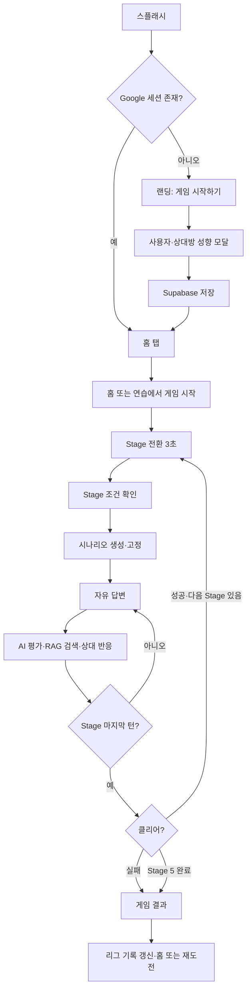

# 연애 디펜스 제품 요구사항 정의서(PRD)

> 생성형 AI와 검색 증강 코칭(RAG)을 활용한 연애 커뮤니케이션 시뮬레이션 게임

## 문서 정보

| 항목 | 내용 |
|---|---|
| 문서 버전 | v2.1 |
| 문서 상태 | Current / 구현 기준 통합본 |
| 기준 문서 | `docs/PRD.md` v1.2 및 2026-07-16 현재 코드 |
| 제품명 | 연애 디펜스 |
| 대상 릴리즈 | Hackathon MVP / Current Build |
| 대상 플랫폼 | 모바일 우선 반응형 웹(Windows·macOS·모바일 브라우저) |
| 작성일 | 2026-07-16 |
| 주요 이해관계자 | 기획, 디자인, 프론트엔드, 백엔드, AI/RAG, QA |

---

## 0. 현재 MVP 기준과 요구사항 정합성

이 문서는 최초 PRD의 장기 구상보다 **현재 실행 가능한 제품**을 우선 기준으로 삼는다. 기존 문서의 3라운드·속마음 4지선다·최고 점수 랭킹은 현재 메인 플레이와 다르며, 아래 표가 최신 기준이다.

| 영역 | 현재 기준 | 상태 |
|---|---|---|
| 진입 | 익명 인증 후 최초 1회 사용자·상대방 성향 저장 | 구현 |
| 재접속 | Google 로그인 세션이 있으면 온보딩을 건너뛰고 홈으로 복원 | 구현 |
| 게임 루프 | 총 5 Stage, Stage 1~5에서 각각 6·7·8·9·10턴 | 구현 |
| 사용자 입력 | 선택지 없는 자유 답변, 사용자 인지 글자 기준 최대 200자 | 구현 |
| AI 평가 | OpenAI Edge Function 평가, 구조 검증·재시도·규칙 fallback | 구현 |
| 상대방 반응 | 평가·프로필·최근 대화·현재 관계 상태를 반영한 대사 | 구현 |
| RAG | 턴 평가 전 승인된 코칭 카드 Top-K 검색 및 근거 메타데이터 노출 | 구현 |
| 관계 상태 | 관계 HP·갈등·안정감·신뢰도 및 해결 상태 변화 | 구현 |
| Stage 시나리오 | Stage 시작 확인 후 1개 생성·고정, Stage 안에서는 유지 | 구현 |
| 시나리오 생성 방식 | 로컬 데이터·규칙 조합이 메인 경로, `generate-stage` Edge Function은 별도 존재 | 부분 구현 |
| 리그 | 점수 합산이 아니라 클리어·연속 클리어·퍼펙트 기록 기반 티어 | 구현 |
| 사용자 공간 | 두 사람 프로필, Google 계정, 테마, 추천 표현 관리 | 구현 |
| 저장 | Supabase + 로컬 저장 + 일부 실패 작업 동기화 큐 | 구현 |
| 테스트 | 게임 규칙·입력·스크롤·RAG·Stage 흐름 중심 Node 단위 테스트 | 구현 |
| 브라우저 E2E·골든셋 | 실제 인증·화면·AI 품질 회귀 자동화 | 구현 |

현재 자동 테스트는 46개이며 모두 통과한다. 실제 Google OAuth 브라우저 E2E와 AI 골든셋 품질 검증은 아직 별도 구축이 필요하다.

발표와 개발에서는 “벡터 DB 기반 RAG”, “실시간 전체 사용자 순위”, “AI가 모든 Stage 시나리오를 원격 생성”을 현재 완료 기능으로 표현하지 않는다.

---

## 1. 제품 개요

### 1.1 한 줄 정의

**연애 디펜스**는 가상의 연애 갈등 대화에서 사용자가 직접 답하면 AI가 상대방의 반응, 관계 상태 변화, 턴별 코칭과 추천 표현을 제공하는 게임형 대화 훈련 서비스다.

### 1.2 문제 정의

메신저 대화에서는 표정과 억양이 사라져 짧은 문장의 감정과 욕구를 오해하기 쉽다. 기존 심리 테스트는 사용자를 유형화하지만 실제 답변을 반복해서 작성하고 결과를 경험하게 하지는 못한다. 사용자는 자신의 말이 상대에게 어떻게 들리는지, 어떤 표현이 갈등을 낮추는지 안전한 가상 환경에서 연습할 필요가 있다.

### 1.3 제안 솔루션

1. 사용자와 상대방의 닉네임·성별·MBTI·자유 성향을 설정한다.
2. Stage별로 장소, 갈등 배경, 숨은 감정과 욕구가 포함된 시나리오를 시작한다.
3. 사용자가 상대방 메시지에 자유롭게 답한다.
4. AI가 6개 평가 차원과 승인된 코칭 지식을 참고해 답변을 평가한다.
5. 점수에 따라 상대방 대사와 관계 HP·갈등·안정감·신뢰도가 바뀐다.
6. 사용자는 턴별 AI 피드백과 추천 표현을 확인·저장한다.
7. 5개 Stage의 클리어 기록을 통해 리그 티어를 높인다.

### 1.4 제품 비전

연애를 시작점으로 친구, 가족, 직장 등 다양한 관계에서 감정 확인, 욕구 명료화, 경계 존중, 갈등 복구를 반복 훈련하는 개인화 AI 커뮤니케이션 코치로 확장한다.

---

## 2. 목표와 범위

### 2.1 사용자 목표

- 실제 메시지를 보내기 전에 안전한 환경에서 답변을 연습한다.
- 자신의 표현이 관계 상태와 상대 반응에 미치는 영향을 확인한다.
- 턴별 강점·약점·추천 표현과 RAG 참고 근거를 학습한다.
- 사용자와 상대방의 성향을 반영한 일관된 대화를 경험한다.
- 클리어와 티어 성장을 통해 반복 연습 동기를 얻는다.

### 2.2 제품 목표

- 5 Stage 동안 난이도가 점진적으로 높아지는 완결된 게임 루프를 제공한다.
- AI 실패 시에도 검증·재시도·fallback으로 플레이 가능성을 유지한다.
- 점수보다 관계 HP와 갈등의 변화를 중심으로 결과를 이해시킨다.
- 승인된 내부 코칭 카드만 검색해 턴별 피드백의 일관성을 높인다.
- 익명 진입과 Google 재접속을 모두 지원한다.

### 2.3 비목표(Non-goals)

- 실제 카카오톡·인스타그램·문자 대화 업로드 및 분석
- 음성 통화·음성 감정 분석
- 심리검사, 정신건강 진단 또는 전문 상담 대체
- 실제 상대방 초대와 커플 계정 공유
- 사용자 간 실시간 대전·채팅
- 결제·구독
- 현재 단계의 벡터 DB·임베딩 기반 검색
- 현재 단계의 전체 사용자 실시간 챌린저 순위 산정

### 2.4 MVP 성공 가설

- 관계 상태가 즉시 변하면 사용자는 추상적인 점수보다 답변의 영향을 쉽게 이해한다.
- 같은 Stage에서 동일한 갈등 맥락을 유지하면 대화 학습의 연속성이 높아진다.
- 추천 표현과 근거가 함께 제공되면 피드백의 신뢰성과 재사용률이 높아진다.
- Google 로그인 사용자의 재접속 마찰을 제거하면 재방문율이 높아진다.

---

## 3. 타깃 사용자

### 3.1 핵심 타깃

- 메신저 소통 비중이 높은 20대 연애·썸 경험자
- 감정 확인보다 해명이나 해결책을 먼저 제시하는 사용자
- 답장 지연, 사과, 거리 두기, 경계, 데이트 시간 등의 갈등을 연습하려는 사용자
- 심리 테스트와 가벼운 모바일 게임에 익숙한 사용자

### 3.2 대표 페르소나

| 항목 | 김민수 | 이지은 |
|---|---|---|
| 나이·직업 | 23세 대학생 | 26세 마케팅 직장인 |
| 특성 | 해결책을 빨리 찾지만 감정 확인을 놓친다. | 감정 표현은 풍부하지만 답장과 거리 변화에 불안을 느낀다. |
| 목표 | 갈등을 키우지 않는 구체적 표현을 익힌다. | 불안을 비난 없이 요청으로 바꾸는 연습을 한다. |
| 서비스 기대 | 관계 상태 변화와 개선 문장 | 성향을 반영한 상대 반응과 코칭 근거 |

---

## 4. 제품 원칙

1. **학습을 우선한다.** 사용자를 비난하거나 성격을 단정하지 않는다.
2. **상황을 유지한다.** 새로운 시나리오는 Stage가 바뀌고 사용자가 확인한 뒤에만 시작한다.
3. **여러 해석을 허용한다.** 추천 표현을 절대적 정답이 아닌 가능한 예시로 제시한다.
4. **관계 변화를 설명한다.** 턴 점수와 함께 HP·갈등·안정감·신뢰도 변화를 제공한다.
5. **개인화하되 진단하지 않는다.** MBTI와 자유 성향은 참고 맥락으로만 사용한다.
6. **AI 실패를 제품 실패로 만들지 않는다.** 재시도와 규칙 기반 fallback을 유지한다.
7. **근거를 추적한다.** RAG 적용 여부, 지식 버전, 검색 출처를 메타데이터로 남긴다.
8. **입력 환경을 존중한다.** 한글 IME, 이모지, 특수문자, 데스크톱과 모바일 차이를 처리한다.

---

## 5. MVP 범위 및 우선순위

### 5.1 우선순위 정의

| 우선순위 | 의미 |
|---|---|
| P0 | 현재 플레이와 저장에 필수 |
| P1 | 구현되어 있으나 운영 검증 또는 서버 일원화가 필요한 기능 |
| P2 | 후속 확장 후보 |
| 제외 | 현재 제품 범위 밖 |

### 5.2 기능 우선순위

| 기능 | 우선순위 | 현재 상태 |
|---|---:|---|
| 익명 인증과 스플래시·랜딩 | P0 | 구현 |
| 최초 두 사람 성향 온보딩 | P0 | 구현 |
| Google 로그인·로그아웃·세션 복원 | P0 | 구현 |
| 홈·연습·리그·사용자 탭 | P0 | 구현 |
| 5 Stage, 6~10턴 진행 | P0 | 구현 |
| Stage 시나리오 고정과 전환 안내 | P0 | 구현 |
| 자유 답변·OpenAI 평가·상대 대사 | P0 | 구현 |
| 턴별 RAG 피드백과 추천 표현 | P0 | 구현 |
| 관계 HP·갈등·안정감·신뢰도 | P0 | 구현 |
| 최근 완료 대화·진행 중 대화 복원 | P0 | 구현 |
| 클리어 기반 로컬 리그 티어 | P0 | 구현 |
| 다크모드·반응형 채팅 | P0 | 구현 |
| 서버 게임·Stage 결과 저장 | P1 | 구현, 실패 시 일부 로컬 보존 |
| 원격 `generate-stage` 메인 경로 연결 | P1 | Deferred |
| 전체 사용자 챌린저 Top 10 | P2 | Deferred |
| 성장 리포트·RAG 장기 분석 | P2 | 문서화, UI 미구현 |

### 5.3 MVP 운영 가정

- Supabase가 구성된 경우 앱 시작 시 세션을 복원하거나 익명 사용자를 생성한다.
- 최초 사용자는 성향 저장을 완료해야 하단 탭을 사용할 수 있다.
- Google 로그인 세션은 새로고침과 재접속 시 유지되며 온보딩을 다시 표시하지 않는다.
- 현재 메인 게임 모드는 `practice`, 난이도 저장값은 `normal`을 사용한다.
- 최근 완료 대화와 리그 진행은 현재 브라우저 로컬 저장이 기준이다.

---

## 6. 핵심 사용자 여정

### 6.1 재접속 시나리오

1. 앱이 Supabase 세션을 확인한다.
2. Google 사용자라면 랜딩과 성향 모달을 건너뛴다.
3. Supabase 사용자·상대방 프로필과 저장 표현을 불러온다.
4. 진행 중 대화가 로컬에 있으면 홈에서 이어하기를 제공한다.
5. 로그아웃 후 재접속한 사용자는 다시 익명 진입 흐름을 따른다.

---

## 7. 기능 요구사항

### 7.1 인증·온보딩

#### FR-001 최초 진입과 성향 저장

- 랜딩에는 `게임 시작하기` CTA만 표시한다.
- CTA 선택 시 홈 화면 위에 차단형 중앙 모달을 표시한다.
- 모달은 사용자 탭의 프로필 입력 카드와 같은 필드를 재사용한다.
- 사용자와 상대방 각각 닉네임(2~20자), 성별, MBTI, 자유 성향을 입력한다.
- 저장 성공 전에는 모달을 닫거나 하단 탭을 조작할 수 없다.
- 사용자 정보는 `profiles`, 상대방 정보는 `partner_profiles`에 저장한다.

#### FR-002 Google 계정과 세션 복원

- 익명 사용자는 사용자 탭에서 Google 로그인을 시작할 수 있다.
- Google 로그인 상태와 로그아웃 CTA를 명확히 표시한다.
- Google 세션이 있는 상태에서 새로고침하거나 다시 접속하면 바로 홈 탭을 표시한다.
- 인증 상태 이벤트가 초기 부트스트랩보다 늦게 도착해도 열린 온보딩 모달을 닫고 홈으로 전환한다.
- 로그아웃 성공 후 앱을 다시 초기화한다.

### 7.2 홈·연습 설정

#### FR-010 홈

- 진행 중 대화가 있으면 Stage, Turn, HP와 최근 메시지를 표시하고 이어하기를 제공한다.
- 진행 중 대화가 없으면 오늘의 대화 시작 CTA를 제공한다.
- 최근 완료 대화는 최대 7건까지 읽기 전용으로 열 수 있다.

#### FR-011 연습 카테고리

- 연락, 감정 공감, 데이트와 시간, 사과/화해, 갈등과 거리, 경계 존중의 6개 카테고리를 제공한다.
- 복수 선택을 허용하며 게임 세션과 Stage 결과의 태그로 전달한다.

### 7.3 Stage 시나리오 생성

#### FR-020 Stage별 시나리오 생성과 고정

- 총 Stage 수는 5개다.
- 각 Stage의 안내를 사용자가 확인한 후에만 시나리오를 생성한다.
- 장소, 시간, 갈등 원인, 숨은 감정·욕구, 트리거, 상대 성향을 Stage 스냅샷으로 고정한다.
- 같은 Stage의 모든 턴은 같은 `scenarioId`와 배경을 사용한다.
- 갈등이 일찍 해결되어도 남은 턴은 새 사건이 아니라 같은 상황의 정리·회복 대화로 진행한다.
- 최근 게임의 동일한 3요소 조합과 반복 대사를 회피한다.

#### FR-021 Stage 난이도

| Stage | 턴 | 종료 요구 HP | 허용 갈등 | 상대 민감도 |
|---:|---:|---:|---:|---|
| 1 | 6 | 35 이상 | 75 이하 | 낮음 |
| 2 | 7 | 45 이상 | 65 이하 | 약간 높음 |
| 3 | 8 | 55 이상 | 55 이하 | 중간 |
| 4 | 9 | 65 이상 | 45 이하 | 높음 |
| 5 | 10 | 75 이상 | 35 이하 | 매우 높음 |

- 높은 Stage일수록 감점 피해가 커지고 회복량이 작아진다.
- 관계 HP가 진행 중 0이 되면 즉시 실패한다.

### 7.4 자유 답변 입력

#### FR-030 입력 유효성

- 공백만 있는 입력은 거부한다.
- CRLF를 LF로 정규화하고 앞뒤 공백을 제거한다.
- `Intl.Segmenter`를 우선 사용하여 이모지 조합도 사용자에게 보이는 한 글자로 센다.
- 최대 길이는 200자다.
- 쉼표, 마침표, 줄바꿈, 특수문자, 이모지를 허용한다.

#### FR-031 키보드·IME 전송

- Windows·macOS·Linux 데스크톱에서는 Enter로 전송하고 Shift+Enter로 줄바꿈한다.
- 한글·일본어 IME 조합 확정 중 Enter는 전송으로 처리하지 않는다.
- 모바일·터치 중심 환경에서는 Enter를 강제 전송하지 않고 보내기 버튼을 사용한다.
- 평가 중에는 입력과 중복 제출을 잠근다.

### 7.5 AI 평가·상대방 반응·RAG

#### FR-040 턴 평가

- `evaluate-turn` Edge Function의 `evaluate_and_generate_turn` 요청을 기본 경로로 사용한다.
- 평가 입력에는 현재 Stage, 시나리오, 최근 메시지, 사용자·상대방 프로필, 관계 상태, 과거 추천 표현을 포함한다.
- 감정 인식, 욕구 반응, 소통 적합성, 갈등 완화, 관계 복구 등 구조화된 차원 점수를 검증한다.
- Stage 민감도 보정 후 0~100 점수를 산출한다.
- 요청 제한 시간은 20초이며 최대 2회 시도한다.
- OpenAI 실패·비정상 구조 시 규칙 기반 평가와 안전한 상대 대사 fallback을 사용한다.

#### FR-041 턴별 RAG

- 평가 전에 사용자·상대방 성향, 현재 갈등, 숨은 감정·욕구, 최근 6개 메시지, 사용자 입력을 검색 질의로 구성한다.
- 승인된 코칭 지식 카드 12개에서 메타데이터·키워드 중첩 방식으로 Top 3을 검색한다.
- 검색 지식에는 감정 확인, 욕구 명료화, 비난 없는 관찰, 구체적 요청, 사과·복구, 거리 존중, 경계, 금전, 답장 지연, 안전, 진정, 균형 있는 경청이 포함된다.
- 검색 결과의 `guidance`와 `avoid`를 평가 프롬프트에 추가한다.
- 응답에는 적용 여부, 전략명, 지식 버전, 질의 fingerprint, 출처와 관련도를 기록한다.
- 사용자 원문은 공개 검색 메타데이터에 포함하지 않는다.
- AI 피드백 버블에서 RAG 참고 근거와 관련도를 확인할 수 있다.

#### FR-042 AI 피드백과 추천 표현

- 사용자는 각 처리된 턴에 대해 AI 피드백을 한 번 추가할 수 있다.
- 피드백은 점수·판정, 잘한 부분, 아쉬운 부분, 가능한 답변 예시를 포함한다.
- 추천 표현은 절대적 정답이 아님을 문구로 알린다.
- 추천 표현을 저장하거나 중복 저장 여부를 확인할 수 있다.

### 7.6 관계 상태와 Stage 완료

#### FR-050 관계 상태 반영

- 턴 점수에 따라 관계 HP와 갈등 수치를 증감한다.
- AI 평가의 결과로 안정감과 신뢰도를 갱신한다.
- 상태는 `unresolved`, `improving`, `resolved`, `worsened`로 구분한다.
- 점수·Stage 난이도에 따른 증감량은 턴별 상한을 적용한다.

#### FR-051 Stage 전환

- 마지막 상대방 반응 뒤 현재 시나리오 종료 시스템 메시지를 표시한다.
- Stage 결과를 저장한 후 다음 Stage 전환 오버레이를 3초간 표시한다.
- 다음 Stage 조건 모달에서 턴 수, 요구 HP, 허용 갈등, 민감도를 안내한다.
- 확인 전에는 입력과 시나리오 생성을 차단한다.
- 확인 버튼 연속 클릭으로 시나리오가 중복 생성되지 않아야 한다.
- 확인 후 새 시나리오 시작 메시지, 상황 요약, 상대방 첫 발화 순으로 표시한다.

#### FR-052 게임 종료

- HP 0, Stage 종료 조건 미달 또는 Stage 5 완료 시 결과 화면으로 이동한다.
- 실패 원인은 HP 0, 요구 HP 미달, 갈등 초과, 두 조건 동시 실패로 구분한다.
- 성공은 Stage 1~5를 모두 클리어한 경우다.
- 결과 화면은 최종 HP, 갈등, 성공·실패 이유, 홈과 재도전 CTA를 제공한다.

### 7.7 리그와 티어

#### FR-060 티어 산정

- 리그는 턴 점수 누적이 아니라 완료 게임의 클리어 기록으로 산정한다.

| 티어 | 현재 산정 조건 |
|---|---|
| 배치 중 | 클리어 0회 |
| 브론즈 | 누적 클리어 1회 이상 |
| 실버 | 현재 연속 클리어 3회 이상 |
| 골드 | 현재 연속 클리어 5회 이상 |
| 플래티넘 | 현재 연속 클리어 7회 이상 |
| 다이아 | HP 100 퍼펙트 연속 3회 이상 |
| 마스터 | HP 100 퍼펙트 연속 5회 이상 |
| 그랜드 마스터 | 누적 퍼펙트 클리어 10회 이상 |
| 챌린저 | UI 설명만 존재하며 서버 Top 10 산정은 Deferred |

- 실패하면 현재 연속 클리어와 퍼펙트 연속 기록을 0으로 초기화한다.
- 최고 티어는 하락하지 않는다.
- 현재 리그 진행은 로컬 브라우저 저장을 기준으로 한다.

### 7.8 사용자 탭

#### FR-070 프로필 관리

- 사용자와 상대방 요약 카드를 표시한다.
- 수정하기를 누르면 온보딩과 동일한 입력 필드를 펼친다.
- 두 프로필을 로컬과 Supabase에 저장하며 일반 수정은 서버 실패 시 로컬 보존과 동기화 큐를 사용한다.
- 서버 상대방 데이터의 성별·MBTI·성향은 현재 `notes` JSON에 저장한다.

#### FR-071 계정·테마·추천 표현

- Google 로그인 상태, 로그인·로그아웃 CTA를 제공한다.
- 라이트·다크 테마를 전환하고 선택값을 다음 실행에도 유지한다.
- 저장한 추천 표현을 출처·저장일과 함께 표시하고 복사·삭제할 수 있다.

### 7.9 채팅 스크롤과 읽기 전용 기록

#### FR-080 최신 메시지 동작

- 새 답장이 추가되면 즉시 최신 메시지 위치로 이동한다.
- 자동 이동 직후 `최신 메시지로` 버튼을 표시하지 않는다.
- 사용자가 과거 메시지를 보기 위해 직접 위로 스크롤했고 끝에서 24px 이상 떨어졌을 때만 버튼을 표시한다.
- 버튼 선택 시 즉시 끝으로 이동하고 버튼을 숨긴다.

#### FR-081 완료 대화 열람

- 최근 완료 대화는 읽기 전용 화면으로 제공한다.
- 읽기 전용 화면에서는 대화 내용을 변경하거나 새 메시지를 보낼 수 없다.

---

## 8. 화면 및 UX 요구사항

### 8.1 정보 구조

| 화면 | 주요 책임 |
|---|---|
| 스플래시 | 초기 인증·데이터 로딩 |
| 랜딩 | 신규 익명 사용자의 게임 시작 |
| 성향 모달 | 최초 사용자·상대방 정보의 필수 저장 |
| 홈 | 새 게임, 진행 중 게임, 최근 완료 대화 |
| 연습 | 6개 상황 카테고리 선택 |
| 채팅 | Stage·관계 상태·메시지·자유 답변·AI 피드백 |
| Stage 안내 | 난이도와 클리어 조건 확인 |
| 결과 | 성공·실패 이유와 재도전 |
| 리그 | 클리어 기반 티어와 연속 기록 |
| 사용자 | 프로필, 계정, 테마, 추천 표현 |

### 8.2 인터랙션 원칙

- 모달 뒤 화면은 `inert`와 `aria-hidden`으로 조작을 차단한다.
- 장시간 AI 처리에는 로딩 라벨과 비활성 상태를 함께 제공한다.
- 오류가 발생해도 사용자가 작성한 입력과 현재 시나리오를 보존한다.
- 시스템 메시지는 일반 대화와 시각·텍스트로 구분한다.
- 주요 터치 영역은 44px 이상을 목표로 한다.

### 8.3 반응형 기준

- 모바일 우선으로 설계하고 360px 너비에서 핵심 흐름을 사용할 수 있어야 한다.
- 데스크톱에서는 하단 탭이 앱 컨테이너 너비 안에 정렬되어야 한다.
- 모바일 키보드와 safe area가 채팅 입력창을 가리지 않아야 한다.
- 프로필 2열 폼은 620px 이하에서 1열로 전환한다.

### 8.4 접근성

- 모든 주요 버튼에 이름 또는 `aria-label`을 제공한다.
- 모달은 `role="dialog"`, `aria-modal="true"`, 제목 연결을 사용한다.
- 상태와 오류는 색상 외 텍스트·아이콘·형태로도 구분한다.
- 키보드 포커스 링과 충분한 대비를 제공한다.
- 애니메이션 감소 설정에서는 불필요한 모션을 줄인다.

---

## 9. AI 및 RAG 요구사항

### 9.1 역할 분리

| 역할 | 책임 |
|---|---|
| Stage Builder | 관계 패턴 라이브러리에서 Stage 시나리오를 조합하고 고정한다. |
| Turn Evaluator | 사용자 답변을 구조화된 차원으로 평가한다. |
| Partner Dialogue Generator | 평가·최근 대화·관계 상태에 맞는 상대방 반응을 생성한다. |
| RAG Retriever | 승인된 코칭 지식에서 현재 턴에 맞는 근거를 검색한다. |
| Rule Fallback | OpenAI 실패 시 점수·피드백·대사를 안전하게 대체한다. |

### 9.2 요청·응답 계약

- 클라이언트는 Supabase Edge Function만 호출하며 OpenAI 키를 보유하지 않는다.
- 요청에는 고유 `requestId`를 포함한다.
- Edge Function은 동일 요청을 캐시하여 중복 AI 처리를 줄인다.
- 응답은 `result`, `provider`, `model`, `retrieval` 메타데이터를 포함한다.
- 점수 범위, 필수 배열, 상대 대사 길이와 구조를 클라이언트에서 재검증한다.

### 9.3 RAG 범위와 표현 원칙

- 현재 구현은 `curated_metadata_keyword_rag_v1`이며 벡터 검색이 아니다.
- 지식 베이스 버전은 코드로 관리한다.
- RAG는 턴 평가·추천 표현의 코칭 일관성을 높이는 데 사용한다.
- 검색 출처와 관련도는 사용자 UI와 평가 메타데이터에서 확인 가능해야 한다.
- 발표에서는 “승인된 코칭 카드 검색을 턴별 평가 프롬프트에 주입한다”고 설명한다.

### 9.4 안전 요구사항

- 폭력, 위협, 통제, 위험 상황은 일반 갈등 점수보다 안전 안내를 우선한다.
- 프롬프트 내부 지침이나 시스템 정보를 상대방 대사로 노출하지 않는다.
- 성별·MBTI를 근거로 사람 전체를 단정하지 않는다.
- 추천 표현은 조작, 감시, 과도한 확답 강요를 정상화하지 않는다.

---

## 10. 데이터 모델

### 10.1 주요 엔터티

| 엔터티 | 주요 데이터 | 저장 위치 |
|---|---|---|
| Profile | 닉네임, MBTI, 성별, 성향, 관계 기간, 대화 다양성 | Supabase `profiles` + localStorage |
| PartnerProfile | 표시 이름, 성향 축, 자유 프로필 JSON | Supabase `partner_profiles` + localStorage |
| ActiveConversation | Stage, Turn, 시나리오, 메시지, 관계 상태, 평가 기록 | localStorage |
| GameSession | 모드, 난이도, 카테고리, 시작·종료, 총점, 완료 여부 | Supabase `game_sessions` |
| StageResult | Stage 시나리오, 점수 차원, HP, 피드백, payload | Supabase `stage_results` |
| SavedExpression | 추천 문장, 시나리오, 세션·Stage 출처 | Supabase `saved_expressions` + localStorage |
| ScenarioHistory | 시나리오 fingerprint와 중복 회피 정보 | Supabase `scenario_history` |
| LeagueProgress | 클리어·연속·퍼펙트·티어 | localStorage |
| LeaderboardEntry | 최고 점수와 최고 Stage | Supabase, 현재 리그 UI와 미연결 |
| UserBadge | 배지 코드·이름·획득 시각 | Supabase, 현재 UI 미노출 |

### 10.2 공개·보호 원칙

- 모든 사용자 소유 테이블은 `auth.uid() = user_id` RLS를 적용한다.
- OpenAI 비밀 키와 시스템 프롬프트는 Edge Function에만 둔다.
- 완료 대화와 프로필 스냅샷에는 이메일·OAuth 토큰을 포함하지 않는다.
- RAG 공개 근거에는 사용자 답변 원문 대신 안정적인 fingerprint를 사용한다.

---

## 11. API 및 Edge Function 초안

| 경로·함수 | 용도 | 현재 상태 |
|---|---|---|
| Supabase Auth | 익명 인증, Google OAuth, 로그아웃, 세션 복원 | 구현 |
| `evaluate-turn` | 턴 평가, RAG 검색, 상대 대사 통합 생성 | 구현·메인 연결 |
| `generate-stage` | OpenAI Stage 생성·중복 검사 | 구현, 메인 플레이 미연결 |
| Profile Repository | 사용자 프로필·대화 다양성 CRUD | 구현 |
| PartnerProfile Repository | 상대방 프로필 CRUD | 구현 |
| Game Repository | 세션 생성·Stage 결과·완료 저장 | 구현 |
| Expression Repository | 추천 표현 저장·조회·삭제 | 구현 |
| `update_leaderboard_best` RPC | 최고 기록 원자적 갱신 | 구현, 현재 리그와 별도 |

### 11.1 공통 원칙

- 저장소 계층을 통해 Supabase를 호출하고 화면에서 SDK를 직접 다루지 않는다.
- 모든 AI 호출은 시간 제한, 구조 검증, 재시도, fallback을 가진다.
- 네트워크 실패 시 가능한 로컬 데이터를 보존한다.
- 중복 저장은 사용자·세션·Stage·표현 단위 unique key로 방지한다.

### 11.2 주요 오류 처리

| 오류 | 사용자 동작 |
|---|---|
| Supabase 미설정 | 오프라인 안내, 필수 온보딩 서버 저장은 완료하지 않음 |
| 프로필 저장 실패 | 모달 유지, 오류 표시, 재시도 허용 |
| AI 평가 실패 | 최대 재시도 후 규칙 fallback |
| Stage 생성 실패 | 같은 Stage 번호에서 재시도, 입력 차단 유지 |
| 입력 초과·공백 | 서버 요청 없이 입력 오류 표시 |
| Google OAuth 실패 | 사용자 탭 상태 영역에 오류 표시 |

---

## 12. 비기능 요구사항

### 12.1 성능 및 안정성

- 초기 스플래시는 최소 1.5초 동안 브랜드 로딩을 표시한다.
- AI 요청 타임아웃은 20초다.
- 동일 턴과 Stage 확인의 중복 요청을 잠금과 상태 검사로 차단한다.
- 새 메시지 추가 후 레이아웃 시점에 최신 위치로 이동한다.

### 12.2 보안

- 공개용 Supabase 키만 클라이언트에 사용한다.
- RLS로 타 사용자 데이터 접근을 차단한다.
- 점수·평가의 OpenAI 처리와 민감 프롬프트는 서버에서 수행한다.
- 사용자 입력은 React 텍스트로 렌더링하고 HTML로 실행하지 않는다.

### 12.3 개인정보 및 안전

- 실제 대화 내역 업로드를 요구하지 않는다.
- 프로필은 대화 개인화를 위한 최소 정보만 받는다.
- OAuth 상태와 사용자 데이터는 콘솔·RAG 공개 근거에 노출하지 않는다.
- 심리 진단이나 전문 상담으로 오해할 표현을 피한다.

### 12.4 유지보수성

- Stage 난이도, 상태 흐름, 입력 검증, 키보드, 스크롤, RAG 검색을 순수 모듈로 분리한다.
- 데이터 라이브러리와 생성 서비스, 저장소, UI의 책임을 구분한다.
- 스키마 변경은 기존 데이터를 보존하는 비파괴적 SQL을 사용한다.

### 12.5 관측 가능성

- AI 응답에는 provider, model, 요청 시도 횟수, fallback 이유를 기록한다.
- RAG에는 전략, 지식 버전, query fingerprint, Top-K 출처를 기록한다.
- Stage 결과 payload에 턴 기록과 난이도 스냅샷을 저장한다.

---

## 13. 분석 이벤트와 성공 지표

### 13.1 권장 핵심 이벤트

| 이벤트 | 주요 속성 |
|---|---|
| `onboarding_opened` | 익명 여부, 기기 유형 |
| `profile_saved` | 서버 성공 여부, 필드 완성도 |
| `game_started` | 선택 카테고리, 프로필 존재 여부 |
| `stage_started` | Stage, scenarioId, 민감도 |
| `turn_submitted` | Stage, Turn, 입력 글자 수 |
| `turn_evaluated` | 점수, HP·갈등 delta, AI/fallback, RAG 적용 여부 |
| `feedback_opened` | Stage, Turn, 추천 표현 존재 여부 |
| `expression_saved` | 지식 출처, 시나리오 |
| `stage_completed` | 클리어 결과, 최종 HP·갈등 |
| `game_completed` | 성공 여부, 도달 Stage, 티어 변화 |
| `session_resumed` | Google/익명, 진행 중 게임 여부 |

현재 분석 수집기는 구현 전이며 사용자 답변 원문은 분석 이벤트에 포함하지 않는다.

### 13.2 KPI 초기 목표

| 지표 | 정의 | 초기 목표 |
|---|---|---:|
| 온보딩 완료율 | 모달 노출 대비 프로필 저장 성공 | 80% 이상 |
| Stage 1 완료율 | 게임 시작 대비 Stage 1 결과 도달 | 70% 이상 |
| 게임 완주율 | 게임 시작 대비 Stage 5 성공·실패 결과 도달 | 35% 이상 |
| AI 성공률 | fallback 없이 평가된 턴 비율 | 95% 이상 |
| RAG 적용률 | 평가 턴 중 코칭 카드가 첨부된 비율 | 95% 이상 |
| 추천 표현 저장률 | 피드백 열람 대비 표현 저장 | 15% 이상 |
| 로그인 재접속 성공률 | 유효 Google 세션 중 모달 없이 홈 도달 | 99% 이상 |

### 13.3 가드레일 지표

- AI p95 지연과 fallback률
- 동일 Stage 내 scenarioId 변경률 0%
- 중복 턴 처리율 0%
- 위험 표현 일반 코칭 오분류율
- 모바일 입력 실패율과 IME 오전송률
- 프로필 저장 실패 후 모달 이탈률

---

## 14. 릴리즈 계획

### 14.1 Current MVP

- 최초 두 사람 성향 온보딩과 Supabase 저장
- 익명 인증, Google 로그인·로그아웃·재접속 복원
- 홈·연습·리그·사용자 4개 탭
- 5 Stage, 6~10턴 자유 대화
- Stage 시나리오 고정·조건 안내·시스템 메시지
- OpenAI 턴 평가·상대 반응과 규칙 fallback
- 턴별 메타데이터 RAG, 근거 표시, 추천 표현 저장
- 관계 HP·갈등·안정감·신뢰도
- 클리어 기반 리그 티어
- 특수문자·이모지·IME·데스크톱 Enter 처리
- 최신 답장 자동 스크롤과 조건부 최신 메시지 버튼
- 라이트·다크 테마와 반응형 채팅 UI

### 14.2 v1.1

- 원격 `generate-stage`를 메인 Stage 시작 경로에 연결
- 프로필과 완료 대화의 완전한 기기 간 동기화
- 브라우저 E2E와 실제 Google OAuth 회귀 테스트
- 리그 서버 동기화와 시즌 정책
- 골든 대화 데이터셋·사람 평가 기반 AI 품질 게이트

### 14.3 v2.0

- 임베딩·벡터 검색 기반 확장 RAG
- 장기 성장 리포트와 약점 기반 추천 Stage
- 전체 사용자 챌린저 Top 10
- 친구·가족·직장 관계 유형
- 결과 공유 카드와 일일 미션

---

## 15. MVP 출시 승인 기준(Definition of Done)

- [x] 최초 사용자가 두 사람의 성향을 저장해야 앱 탭을 사용할 수 있다.
- [x] Google 로그인 사용자는 새로고침·재접속 시 온보딩을 건너뛴다.
- [x] 총 5 Stage와 Stage별 6~10턴이 적용된다.
- [x] 같은 Stage에서 시나리오와 갈등 배경이 유지된다.
- [x] Stage 확인 전 입력과 중복 생성을 차단한다.
- [x] 자유 답변의 특수문자·줄바꿈·이모지가 정상 처리된다.
- [x] 데스크톱 Enter 전송과 IME 예외가 동작한다.
- [x] AI 평가 결과가 관계 상태와 상대 대사에 반영된다.
- [x] AI 실패 시 규칙 fallback이 동작한다.
- [x] 턴별 RAG 검색 결과가 프롬프트와 피드백 근거에 연결된다.
- [x] 추천 표현을 저장·복사·삭제할 수 있다.
- [x] 새 답장 도착 시 최신 메시지가 바로 보인다.
- [x] 사용자가 과거 대화를 볼 때만 최신 메시지 버튼이 표시된다.
- [x] 클리어·연속·퍼펙트 기록으로 티어가 계산된다.
- [x] 다크모드에서 채팅 입력 UI가 읽히고 조작 가능하다.
- [x] 현재 자동 테스트·린트·빌드가 통과한다.
- [ ] 실제 Google OAuth 재접속 브라우저 E2E가 자동화되어 있다.
- [ ] OpenAI 골든 데이터셋과 안전 회귀 기준을 통과한다.
- [ ] 리그·완료 대화가 서버 기준으로 완전히 동기화된다.

---

## 16. 주요 테스트 시나리오

| ID | 테스트 | 기대 결과 |
|---|---|---|
| QA-01 | 신규 익명 사용자 게임 시작 | 성향 모달이 표시되고 저장 전 탭이 차단된다. |
| QA-02 | 프로필 서버 저장 실패 | 오류가 표시되고 모달이 유지된다. |
| QA-03 | Google 로그인 후 새로고침 | 랜딩·모달 없이 홈 탭으로 이동한다. |
| QA-04 | 같은 Stage에서 여러 턴 진행 | scenarioId, 장소, 갈등 원인이 유지된다. |
| QA-05 | Stage 안내 확인 전 입력 | 입력·턴 증가·시나리오 중복 생성이 없다. |
| QA-06 | Stage 확인 연속 클릭 | 시나리오와 첫 발화가 각각 한 번만 생성된다. |
| QA-07 | 특수문자·마침표·이모지 답변 | 유효 답변으로 전송된다. |
| QA-08 | 한글 IME 확정 Enter | 조합 중 메시지가 잘못 전송되지 않는다. |
| QA-09 | 데스크톱 Enter·Shift+Enter | Enter는 전송, Shift+Enter는 줄바꿈이다. |
| QA-10 | 200자 초과·공백 답변 | 평가 요청 없이 오류를 표시한다. |
| QA-11 | AI 두 번 실패 | 규칙 평가와 안전한 상대 대사로 계속 진행한다. |
| QA-12 | 답장 지연 갈등 RAG | 답장 지연·안심 관련 코칭 카드가 우선 검색된다. |
| QA-13 | 금전 갈등 RAG | 금액·일정 합의 지식이 우선 검색된다. |
| QA-14 | 새 상대 메시지 도착 | 최신 위치로 이동하고 버튼은 숨겨진다. |
| QA-15 | 사용자가 위로 스크롤 | 끝 화면이 아니면 최신 메시지 버튼이 표시된다. |
| QA-16 | HP 0 | 다음 Stage 없이 즉시 게임 실패 결과로 이동한다. |
| QA-17 | Stage 5 클리어 | 새 Stage 없이 최종 성공 결과로 이동한다. |
| QA-18 | 게임 성공·실패 | 리그 연속 기록과 티어가 규칙대로 갱신된다. |
| QA-19 | 다크모드 모바일 채팅 | 입력·버튼·글자·키보드 영역이 깨지지 않는다. |
| QA-20 | Stage 도중 새로고침 | 같은 Stage, scenarioId, Turn, 관계 상태가 복원된다. |

---

## 17. 위험 요소와 대응

| 위험 | 영향 | 대응 |
|---|---|---|
| AI 점수 변동 | 평가 신뢰 하락 | 구조 검증, Stage 보정, 골든셋 계획, fallback |
| 키워드 RAG의 의미 검색 한계 | 관련 코칭 누락 | 승인 카드 확장 후 임베딩 검색 비교 |
| 로컬 리그와 서버 leaderboard 이원화 | 사용자 혼란 | UI 명칭 분리, 서버 리그 통합 계획 |
| Google 로그인 시 익명 데이터 소유권 전환 | 기록 분리 가능 | 계정 연결·데이터 이전 정책 확정 |
| 완료 대화의 로컬 의존 | 기기 변경 시 기록 손실 | v1.1 서버 복원 구현 |
| `generate-stage`와 메인 로컬 Builder 이원화 | 발표·운영 불일치 | 메인 경로 연결 전 기능 상태 명시 |
| 대형 단일 `App.jsx` | 변경 충돌·회귀 위험 | 화면·상태 훅·서비스 단위 분리 |
| 장시간 AI 응답 | 이탈 증가 | 타임아웃, 로딩, 재시도, fallback |
| MBTI 과잉 해석 | 사용자 오해 | 참고 정보 문구와 비진단 원칙 유지 |
| 위험 대화의 일반 점수화 | 안전 문제 | 안전 우선 카드·차단 규칙·회귀 테스트 |

---

## 18. 미결정 사항

1. 익명 계정에서 기존 Google 계정 로그인 시 프로필·게임 데이터 이전 방식
2. 온보딩 완료 판단을 인증 상태만으로 할지 서버 프로필 존재까지 확인할지 여부
3. 완료 대화·리그의 Supabase 단일 기준 전환 시점
4. `generate-stage` Edge Function을 메인 플레이에 연결할 시점과 fallback 우선순위
5. 리그와 기존 `leaderboard_entries`를 통합할지 별도 시스템으로 유지할지 여부
6. 챌린저 Top 10의 모집단, 기간, 동점 규칙
7. RAG 카드의 검수 주체, 출처 표기 수준, 업데이트 승인 절차
8. 키워드 RAG에서 임베딩 RAG로 전환할 품질·규모 기준
9. 사용자 답변과 AI 결과의 서버 보존 기간·삭제 정책
10. 골든 데이터셋 규모와 사람 평가자 합의 기준
11. 분석 이벤트 수집 도구와 개인정보 필터
12. 성장 리포트의 점수 축과 사용자 탭 노출 방식

---

## 19. 예상 질문

### 기존 연애 심리 테스트와 무엇이 다른가?

성격 유형 결과를 보여주는 데 그치지 않고 사용자가 가상의 갈등에 직접 답한다. 답변은 상대 대사와 관계 HP·갈등·신뢰도에 반영되며 개선 문장을 다시 사용할 수 있다.

### RAG는 실제로 어디에 쓰이는가?

매 턴 평가 전에 현재 프로필·갈등·최근 대화·사용자 입력과 관련된 승인 코칭 카드 Top 3을 검색한다. 검색된 권장·금지 지침을 평가 프롬프트에 넣고, 결과 근거를 AI 피드백에 표시한다.

### 벡터 데이터베이스를 사용하는가?

현재는 사용하지 않는다. 메타데이터·키워드 기반 로컬 지식 검색이며, 전략명과 지식 버전을 기록한다. 벡터 검색은 후속 확장이다.

### 점수와 티어는 어떻게 다른가?

턴 점수는 해당 답변이 관계 상태에 미치는 영향을 계산한다. 리그 티어는 점수 합계가 아니라 완료 게임의 클리어, 연속 클리어, HP 100 퍼펙트 기록으로 정한다.

### Google 로그인 사용자가 다시 성향을 저장해야 하는가?

아니다. 유효한 Google 세션이 복원되면 랜딩과 온보딩 모달을 건너뛰고 홈 탭으로 이동한다. 프로필은 Supabase와 로컬 데이터에서 불러온다.

### AI가 같은 Stage 중간에 다른 사건을 만드는가?

아니다. Stage 확인 후 생성한 시나리오 스냅샷을 마지막 턴까지 유지한다. 새 시나리오는 다음 Stage 전환과 사용자 확인 후에만 생성한다.

---

## 20. 용어 정의

| 용어 | 정의 |
|---|---|
| 게임 | Stage 1 시작부터 성공·실패 결과까지의 전체 세션 |
| Stage | 하나의 고정 시나리오와 정해진 수의 턴으로 구성된 난이도 단위 |
| Turn | 상대 메시지, 사용자 답변, 평가, 상대 반응의 1회 교환 |
| 관계 HP | 관계를 유지할 수 있는 현재 여력, 0이면 즉시 실패 |
| 갈등 수치 | 현재 갈등의 강도, Stage 종료 허용값 이하가 필요 |
| 안정감·신뢰도 | AI 평가 결과로 변하는 보조 관계 상태 |
| 해결 상태 | unresolved·improving·resolved·worsened 상태 |
| RAG | 생성 전에 관련 코칭 지식을 검색해 프롬프트에 추가하는 방식 |
| 코칭 카드 | 권장 표현, 피해야 할 표현, 주제·키워드, 출처를 가진 승인 지식 단위 |
| 추천 표현 | AI가 제안하는 가능한 답변 예시이며 절대적 정답이 아님 |
| 퍼펙트 클리어 | 게임 성공 시 최종 관계 HP가 100인 기록 |
| fallback | OpenAI 실패 시 사용하는 규칙 기반 평가·대사 |
| 시나리오 스냅샷 | Stage 동안 고정되는 장소·배경·감정·욕구·트리거 데이터 |

---

## 21. 심사 대응 보완안

### 21.1 발표에서 전달할 핵심 스토리

1. 메신저에서는 짧은 말 속 감정과 욕구를 놓치기 쉽다.
2. 연애 디펜스는 사용자가 직접 답하게 하고 그 말의 영향을 관계 상태로 보여준다.
3. AI는 프로필과 현재 Stage만 보는 것이 아니라 승인된 코칭 지식을 턴마다 검색한다.
4. 검색 근거가 추천 표현과 피드백에 연결돼 “왜 이 조언인가”를 설명한다.
5. 5 Stage의 점진적 난이도와 클리어 기반 티어가 반복 훈련을 만든다.

### 21.2 RAG 발표 문구

권장:

> “사용자·상대방 성향과 현재 갈등, 최근 대화를 질의로 구성하고, 승인된 코칭 카드 Top 3을 검색해 턴 평가와 추천 표현 생성에 주입합니다.”

> “현재는 작고 검수 가능한 지식 베이스에 적합한 메타데이터·키워드 RAG이며, 지식 버전과 검색 출처를 결과에 남깁니다.”

피해야 할 표현:

- “인터넷의 모든 연애 지식을 실시간 검색한다.”
- “벡터 DB로 개인의 실제 대화를 학습한다.”
- “RAG가 심리학적으로 정답인 답변을 보장한다.”
- “사용할수록 모델이 자동으로 사용자의 성격을 학습한다.”

### 21.3 품질 증거

- 현재 자동 테스트는 입력 특수문자·IME, 최신 메시지 스크롤, 대화 다양성, RAG 검색, Stage 난이도·흐름, AI 재시도·fallback을 포함한다.
- 발표 전 실제 Google 로그인 재접속, 모바일 가상 키보드, 다크모드, Supabase 저장 실패를 수동 또는 브라우저 E2E로 추가 검증한다.
- AI 품질은 정상·모호·공격적·회피·위험 입력을 포함한 골든셋으로 별도 평가한다.

### 21.4 역할 분담 기록 양식

| 역할 | 담당 범위 | 증거 |
|---|---|---|
| Product/Story | 문제 정의, 사용자 여정, 발표 | PRD, 발표 가이드 |
| Frontend | 온보딩, 탭, 채팅, 테마, 입력·스크롤 | 커밋, 단위·E2E 테스트 |
| AI/RAG | 평가, 대사, 지식 검색, fallback | Edge Function, 지식 카드, RAG 테스트 |
| Backend | 인증, RLS, 프로필·게임·표현 저장 | SQL, 저장소, 인증 테스트 |
| QA/Data | 회귀, 골든셋, 성능·안전 | 테스트 결과 보고서 |

---

## 22. 다크모드 요구사항

### 22.1 목적

저휘도 환경과 OLED 모바일 화면에서 눈부심을 줄이고 채팅과 입력에 집중할 수 있는 테마를 제공한다. 단순 색상 반전이 아니라 Canvas와 3단계 Surface의 명도 차이로 깊이를 표현한다.

### 22.2 테마 선택 정책

- 최초 실행은 `prefers-color-scheme`을 따른다.
- 사용자 탭에서 라이트·다크모드를 전환한다.
- 수동 선택은 `localStorage`에 저장한다.
- 앱 렌더링 전 테마를 적용하여 반대 테마 플래시를 줄인다.
- `color-scheme`과 브라우저 theme color를 함께 갱신한다.

### 22.3 다크모드 토큰

| 역할 | 기준값 |
|---|---|
| Canvas | `#000000` |
| Surface 1 | `#171717` |
| Surface 2 | `#262626` |
| Surface 3 | `#2D2D2D` |
| Primary text | `#FAFAFA` |
| Secondary text | `#B3B3B3` |
| Muted / placeholder | `#999999` |
| Accent | `#7638FA` 중심 보라색 |
| Focus | `#4C52DC` |
| Error | 어두운 배경에서 읽히는 밝은 빨강 |
| Success | 어두운 배경에서 읽히는 밝은 초록 |

### 22.4 채팅 입력 요구사항

- 입력 패널은 Canvas와 구분되는 Surface를 사용한다.
- textarea, 글자 수, 안내 문구, 보내기 버튼이 작은 화면에서도 겹치지 않는다.
- caret와 placeholder가 배경에서 식별되어야 한다.
- 비활성·평가 중·오류 상태를 색상과 문구로 함께 표시한다.
- 모바일 safe area와 가상 키보드가 보내기 버튼을 가리지 않아야 한다.

### 22.5 다크모드 수용 조건

- 새로고침 후 선택 테마가 유지된다.
- 채팅 Canvas, 툴바, 메시지, 입력창이 명확히 구분된다.
- 사용자 메시지는 보라색 계열 배경과 흰색 본문을 사용한다.
- AI·상대방 메시지와 RAG 근거 칩이 읽을 수 있는 대비를 가진다.
- 프로필 모달과 입력 필드가 다크모드에서도 깨지지 않는다.
- 키보드 포커스, 오류, 성공, 로딩 상태가 색상 외 방식으로 식별된다.
